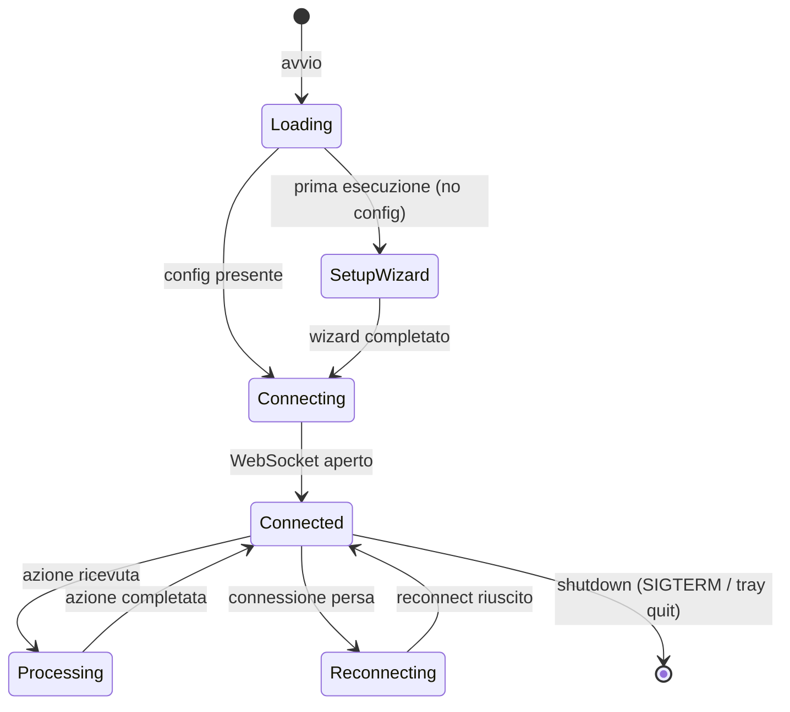
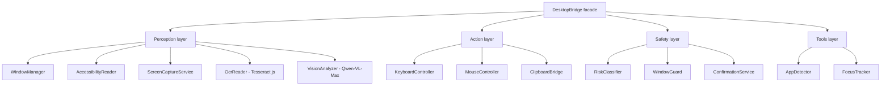
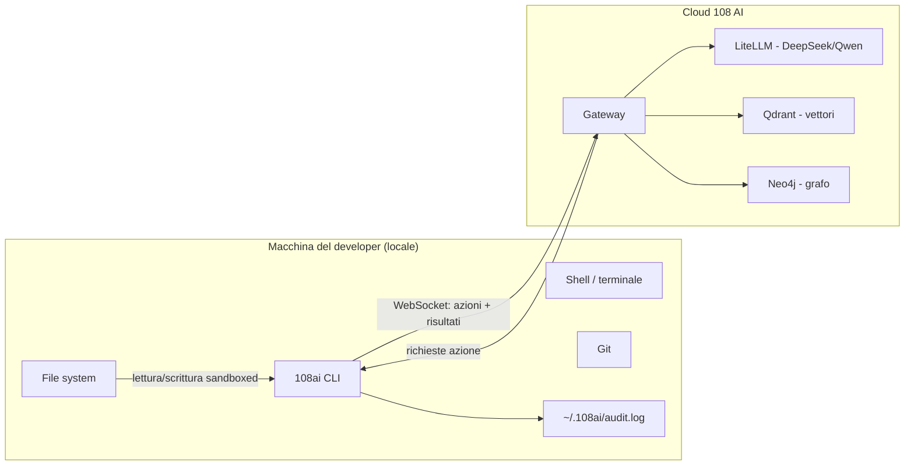
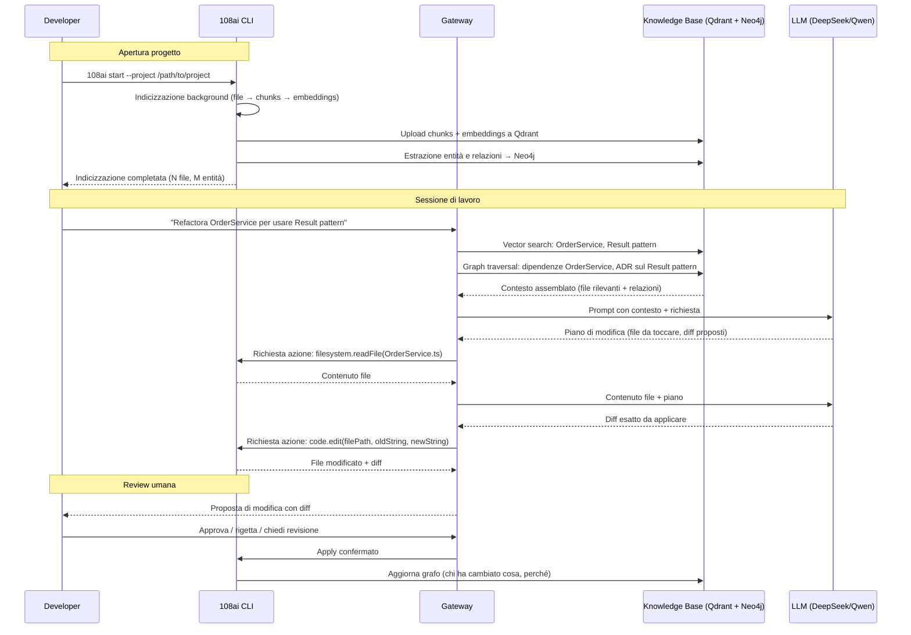
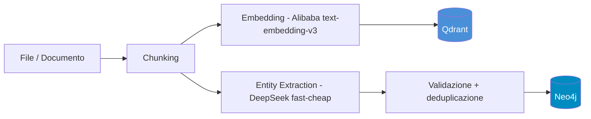
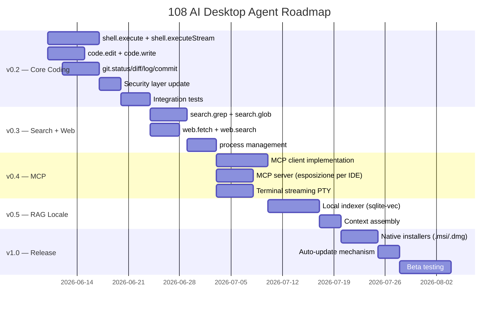

# 108 AI come Coding Agent

*Documento tecnico — versione 1.0, giugno 2026*

---

## Indice

1. [Visione: 108 AI come Coding Agent](#1-visione-108-ai-come-coding-agent)
2. [Architettura del Desktop Agent](#2-architettura-del-desktop-agent)
3. [Capabilities attuali](#3-capabilities-attuali)
4. [MCP — Model Context Protocol](#4-mcp--model-context-protocol)
5. [Knowledge Base come Contesto di Progetto](#5-knowledge-base-come-contesto-di-progetto)
6. [Flusso di lavoro tipico](#6-flusso-di-lavoro-tipico)
7. [Caricamento documenti su Neo4j](#7-caricamento-documenti-su-neo4j)
8. [Confronto con alternative](#8-confronto-con-alternative)
9. [Limitazioni attuali e Roadmap](#9-limitazioni-attuali-e-roadmap)

---

## 1. Visione: 108 AI come Coding Agent

### Cosa significa "coding agent"

Un coding agent non è un autocomplete avanzato. È un assistente che opera sul codebase come lo farebbe un collaboratore senior: legge file, capisce la struttura, propone modifiche, esegue comandi, verifica i risultati. L'interazione non è "scrivi questo codice" ma "risolvi questo problema".

Le capabilities fondamentali di un coding agent sono:

| Capability | Descrizione |
|---|---|
| **Analisi del repository** | Esplorazione struttura, lettura file, ricerca pattern, comprensione dipendenze |
| **Generazione codice** | Nuovi file, nuove funzioni, implementazione di specifiche |
| **Refactoring** | Rename, estrazione funzioni, ristrutturazione moduli, riduzione coupling |
| **Code review** | Identificazione bug, violazioni di pattern, debito tecnico |
| **Esecuzione comandi** | Build, test, linting, git operations |
| **Debugging assistito** | Analisi errori, tracce, log |

### Claude Code vs 108 AI: confronto del modello

Claude Code (il CLI di Anthropic) è l'implementazione di riferimento del paradigma "coding agent in terminale". Funziona con tool use diretto: il modello riceve una lista di tool (`Read`, `Write`, `Edit`, `Bash`, `Grep`, `Glob`) e li chiama in sequenza costruendo un reasoning loop.

Il modello architetturale di 108 AI è deliberatamente diverso:

```
Claude Code (locale):                    108 AI (distribuito):
┌─────────────────────────┐              ┌──────────────┐     ┌─────────────────┐
│  Claude model           │              │ LLM (cloud)  │────▶│ Gateway (cloud) │
│  + Tool use diretto     │              │ DeepSeek/    │     │ Hono API        │
│  + Filesystem locale    │              │ Qwen         │     │ Action dispatch │
└─────────────────────────┘              └──────────────┘     └────────┬────────┘
                                                                        │ WebSocket
                                                               ┌────────▼────────┐
                                                               │ 108ai CLI       │
                                                               │ (locale)        │
                                                               │ esegue azioni   │
                                                               └─────────────────┘
```

La differenza strutturale è che in 108 AI l'intelligenza (il modello LLM) gira nel cloud, ma l'esecuzione avviene sempre in locale sul desktop del developer. Il client locale è un executor sandboxed, non un modello. Questo ha conseguenze importanti:

- **Il codice sorgente non va mai al cloud integralmente** — solo i chunk rilevanti selezionati dal RAG
- **Il gateway decide cosa fare, il client decide se farlo** — il veto locale è strutturale
- **Multi-tenant by design** — più team possono usare la stessa infrastruttura con isolamento totale

### Vantaggio competitivo: la knowledge persistente

La differenza più rilevante rispetto a Claude Code non riguarda le capabilities di editing (lì Claude Code è attualmente superiore per maturità) ma riguarda il **contesto persistente e strutturato**.

Claude Code legge i file nel momento in cui ne ha bisogno, senza memoria tra sessioni. Ogni conversazione ricomincia da zero.

108 AI costruisce e mantiene due rappresentazioni persistenti del progetto:

- **Qdrant (vettoriale):** contenuto dei file, documentazione, commit messages — accessibile via semantic search
- **Neo4j (grafo):** struttura del codice, relazioni tra entità, decisioni architetturali (ADR), dipendenze — accessibile via graph traversal

Quando un developer chiede "perché usiamo Redis invece di memcached?", il grafo trova la decisione architetturale correlata. Quando chiede "dove sono tutti i punti che dipendono da `OrderService`?", il grafo percorre le relazioni in O(hop) invece di fare grep sull'intero repository.

---

## 2. Architettura del Desktop Agent

### Come funziona il `108ai` CLI

Il desktop agent (`@108ai/desktop`) è un processo Node.js che gira in background sul computer del developer. Si avvia con:

```bash
108ai --gateway-url wss://api.108ai.dev --tenant-id <UUID> --token <token>
```

Al primo avvio, se i parametri non sono forniti, un wizard interattivo configura la connessione e salva in `~/.108ai/config.json`.

Il lifecycle del processo:



Una volta connesso, l'agent registra le sue capabilities presso il gateway inviando un messaggio di tipo `register` con la lista delle azioni supportate. Da quel momento riceve messaggi di tipo `request` e risponde con `response`.

### Desktop Bridge: le capabilities native

Il package `@aia/desktop-bridge` fornisce l'accesso al sistema operativo tramite binding nativi. È strutturato in quattro layer:



Per la lettura del contenuto di una finestra, il bridge implementa una strategia a tre livelli con fallback progressivo:

1. **Accessibility tree** (prioritario): usa Win32 UIA o macOS AXUIElement — veloce, preciso, strutturato
2. **OCR** (fallback): Tesseract.js applicato sullo screenshot della finestra — per app che non espongono accessibilità
3. **Vision LLM** (ultimo resort): screenshot inviato a Qwen-VL-Max — per contenuto visuale non testuale

Il provider è specifico per piattaforma: `windows.ts` usa `koffi` per binding Win32 (EnumWindows, GetWindowText, UIAutomation); `macos.ts` usa le Accessibility API tramite `@nut-tree-fork/nut-js`.

### Comunicazione: WebSocket verso il gateway cloud

Il protocollo di comunicazione è WebSocket (`wss://api.108ai.dev/ws/local-agent`) con autenticazione Bearer token.

Il formato dei messaggi:

```typescript
interface AgentMessage {
  id: string;           // nanoid(21) — univoco per request/response matching
  type: 'request'       // gateway → client: esegui questa azione
       | 'response'     // client → gateway: risultato dell'azione
       | 'event'        // client → gateway: notifica asincrona (es. file changed)
       | 'heartbeat'    // ping/pong ogni 30s
       | 'register';    // client → gateway: annuncia capabilities
  action?: string;      // es. 'filesystem.readFile'
  params?: Record<string, unknown>;
  result?: unknown;
  error?: string;
  capabilities?: string[];
}
```

La connessione implementa auto-reconnect con exponential backoff (1s → 2s → 4s → max 30s). Il heartbeat ogni 30 secondi garantisce la detection tempestiva di disconnessioni silenziose.

### Sicurezza: cosa gira in locale vs cosa va al cloud

Il principio fondamentale è: **il codice sorgente non lascia mai la macchina locale tranne per i chunk selezionati dal RAG**.



Cosa rimane in locale:
- Il file system completo (solo i path in `allowedDirectories` sono accessibili all'agent)
- L'esecuzione dei comandi shell
- I log di audit (`~/.108ai/audit.log` in formato JSONL)
- Le credenziali (config file con permessi 600)

Cosa va al cloud:
- I chunk di codice selezionati dal RAG (non il repository intero)
- Il testo delle richieste dell'utente
- I risultati delle azioni (stdout, file content letto) — per consentire al LLM di ragionare sul risultato
- Screenshot (solo se `desktopEnabled: true` e `desktopVisionEnabled: true`)

Il layer di sicurezza locale (`security.ts`) applica cinque controlli su ogni azione in arrivo:
1. **Action allowlist**: solo le azioni registrate in `ACTION_RISK_LEVELS` sono eseguibili
2. **Rate limiting**: max `maxActionsPerMinute` azioni per finestra di 60 secondi
3. **Path sandboxing**: i path filesystem vengono risolti a assoluto e confrontati con `allowedDirectories`
4. **System path protection**: blocco esplicito di `/etc`, `/usr`, `C:\Windows`, ecc.
5. **Desktop risk level**: le azioni `high-risk` richiedono `_approved: true` iniettato dal gateway dopo conferma utente

---

## 3. Capabilities attuali

### Stato implementato (v0.2.0)

Le capabilities attualmente implementate sono organizzate in quattro namespace.

#### `filesystem.*` — Accesso al filesystem

| Azione | Descrizione | Risk |
|---|---|---|
| `filesystem.readFile` | Legge un file di testo (max 10MB, no binari) | read-only |
| `filesystem.writeFile` | Scrive contenuto su file, crea directory se necessario | low-risk |
| `filesystem.listDirectory` | Lista file e cartelle (esclude hidden, ordina dir prima) | read-only |
| `filesystem.searchFiles` | Cerca file per pattern glob (max 1000 risultati, depth 10) | read-only |
| `filesystem.watchDirectory` | Watch su directory, eventi via WebSocket | read-only |
| `filesystem.getFileInfo` | Metadata file (size, mime, date) senza leggere il contenuto | read-only |

Tutti gli accessi al filesystem sono validati contro la lista `allowedDirectories` in config. Il path traversal (`../../`) è prevenuto risolvendo sempre il path assoluto prima del confronto.

#### `clipboard.*` — Gestione clipboard

| Azione | Descrizione | Risk |
|---|---|---|
| `clipboard.read` | Legge il testo corrente dalla clipboard di sistema | read-only |
| `clipboard.write` | Scrive testo nella clipboard | low-risk |

Implementato via `clipboardy` (cross-platform: xclip/xsel su Linux, pbcopy/pbpaste su macOS, win32 API su Windows).

#### `system.*` — Utilità di sistema

| Azione | Descrizione | Risk |
|---|---|---|
| `system.openUrl` | Apre URL nel browser predefinito (http/https/mailto) | low-risk |
| `system.openFile` | Apre file con l'applicazione predefinita | low-risk |
| `system.showNotification` | Mostra notifica OS tramite `node-notifier` | low-risk |
| `system.getSystemInfo` | Ritorna OS, memoria, CPU, disco per contesto AI | read-only |

#### `desktop.*` — Automazione desktop

Richiede `desktopEnabled: true` (opt-in esplicito, default off).

**Read-only (auto-approvate):**

| Azione | Descrizione |
|---|---|
| `desktop.listWindows` | Lista tutte le finestre visibili con handle, titolo, processo, bounds |
| `desktop.readWindow` | Legge contenuto testuale di una finestra (accessibility → OCR → vision) |
| `desktop.readFocused` | Legge la finestra attualmente in focus |
| `desktop.screenshot` | Cattura screenshot di una finestra o dello schermo intero |
| `desktop.analyzeScreen` | Screenshot + analisi LLM vision (Qwen-VL-Max) |
| `desktop.getUITree` | Albero accessibilità UI (elementi, ruoli, bounds, automation IDs) |

**Low-risk:**

| Azione | Descrizione |
|---|---|
| `desktop.focusWindow` | Porta una finestra in primo piano |
| `desktop.scrollWindow` | Scrolla in una finestra (up/down/left/right) |

**High-risk (richiedono `_approved: true` dal gateway):**

| Azione | Descrizione |
|---|---|
| `desktop.typeText` | Digita testo nel campo input corrente |
| `desktop.clickElement` | Clicca un elemento UI per nome accessibile |
| `desktop.pressHotkey` | Preme una combinazione di tasti |
| `desktop.mouseClick` | Click del mouse a coordinate assolute |

Per ogni azione high-risk, se `screenshotBeforeAction: true` (default), viene catturato uno screenshot pre-azione incluso nel risultato per audit.

### Sistema di tray

Il processo espone un'icona nel system tray (Windows/macOS) con:
- Indicatore di stato (connesso / disconnesso / in elaborazione)
- Toggle "Desktop Access" (abilita/disabilita `desktopEnabled` a runtime con persist)
- Link al dashboard web
- Pausa / riprendi / esci

---

## 4. MCP — Model Context Protocol

### Cos'è MCP

Model Context Protocol (MCP) è uno standard aperto per connettere LLM a strumenti e fonti di dati. Definisce come un client AI può scoprire e invocare tool esposti da un server esterno, in modo standardizzato e indipendente dal provider LLM.

Il protocollo distingue tre primitive:
- **Tools**: funzioni eseguibili dal modello (con side effect)
- **Resources**: dati leggibili dal modello (URI addressable)
- **Prompts**: template riutilizzabili

Il transport è stdio (per server locali) o HTTP/SSE (per server remoti).

### Come 108 AI espone MCP server per IDE

108 AI può esporre un server MCP locale che gli IDE (VS Code, JetBrains, Cursor, ecc.) possono consumare come se fosse qualsiasi altro tool provider. Questo consente di usare il contesto di 108 AI direttamente dall'editor.

```
VS Code / JetBrains
        │ MCP client
        ▼
108ai MCP Server (locale, porta 3333)
        │
        │ traduce MCP calls in AgentMessages
        ▼
108ai CLI (WebSocket) ──▶ Gateway ──▶ LLM + KB
```

Gli strumenti esposti via MCP rifletteranno le capabilities dell'agent: `readFile`, `editFile`, `searchCode`, `queryKnowledgeBase`, `getDecisionContext`, ecc.

La configurazione lato VS Code (`.vscode/mcp.json`):

```json
{
  "servers": {
    "108ai": {
      "type": "stdio",
      "command": "108ai",
      "args": ["--mcp-server", "--port", "3333"]
    }
  }
}
```

### Come 108 AI consuma MCP tools esterni

Nella direzione opposta, l'agent può essere configurato per invocare MCP server di terze parti. Questo è pianificato nella v0.4 (`mcp.*` capability):

```typescript
// Configurazione in ~/.108ai/config.json
{
  "mcpServers": {
    "github": {
      "command": "npx",
      "args": ["-y", "@modelcontextprotocol/server-github"],
      "env": { "GITHUB_TOKEN": "ghp_..." }
    },
    "postgres": {
      "command": "npx",
      "args": ["-y", "@modelcontextprotocol/server-postgres"],
      "env": { "DATABASE_URL": "postgresql://..." }
    }
  }
}
```

Le azioni pianificate per il namespace `mcp.*`:

| Azione | Risk |
|---|---|
| `mcp.listServers` | read-only |
| `mcp.listTools` | read-only |
| `mcp.callTool` | high-risk |
| `mcp.listResources` | read-only |
| `mcp.readResource` | read-only |

### Differenza con Claude Code

Claude Code usa **tool use diretto**: il modello Claude riceve gli strumenti come parte del suo contesto di sistema e li chiama tramite il protocollo Anthropic (blocchi `tool_use` / `tool_result` nel formato delle API). Non c'è intermediario: il CLI intercetta le chiamate e le esegue localmente.

108 AI usa un approccio **gateway-mediated**: il modello LLM (DeepSeek/Qwen su LiteLLM) genera richieste di azione che il gateway traduce in messaggi WebSocket verso il client locale. MCP è uno strato aggiuntivo che può essere esposto sopra questo sistema.

Il vantaggio dell'approccio 108 AI: il gateway può aggiungere logica trasversale (logging centralizzato, billing, audit, permission checks lato cloud) prima che un'azione raggiunga il client locale. Lo svantaggio: latenza di round-trip aggiuntiva per ogni azione.

---

## 5. Knowledge Base come Contesto di Progetto

### Il problema del contesto nei coding agent

Quando un modello LLM deve rispondere a una domanda su un codebase, ha tre opzioni:
1. **Leggere tutto** (context window stuffing): costoso, lento, supera facilmente i limiti di contesto per repository grandi
2. **Leggere solo il file corrente**: veloce ma cieco alle dipendenze
3. **Recuperare il contesto rilevante** (RAG): equilibrio tra costo e completezza

108 AI usa la terza opzione con un RAG ibrido: vettoriale (Qdrant) + grafo (Neo4j).

### Come Neo4j memorizza la struttura del codice

Il grafo modella le relazioni tra entità del codebase:

```cypher
// Struttura di un progetto TypeScript
(:File {path: "src/services/order.service.ts", language: "typescript"})
  -[:CONTAINS]->
(:Function {name: "createOrder", signature: "createOrder(dto: CreateOrderDto): Promise<Result<Order>>"})
  -[:CALLS]->
(:Function {name: "validateInventory"})

(:Function {name: "createOrder"})
  -[:DEPENDS_ON]->
(:Interface {name: "IOrderRepository"})

(:File {path: "src/services/order.service.ts"})
  -[:IMPORTS_FROM]->
(:File {path: "src/repositories/order.repository.ts"})
```

Oltre alla struttura sintattica, il grafo memorizza le **decisioni architetturali** (ADR):

```cypher
(:Decision {
  id: "ADR-003",
  title: "Usa Redis per session cache",
  status: "accepted",
  date: "2026-03-15",
  reason: "Memcached non supporta pub/sub per invalidazione distribuita"
})
  -[:APPLIES_TO]->
(:Component {name: "SessionManager"})

(:Decision {id: "ADR-003"})-[:SUPERSEDES]->(:Decision {id: "ADR-001"})
```

### Come Qdrant memorizza il contenuto

Qdrant riceve i chunk di testo dei file insieme ai loro embedding vettoriali. Il chunking è fatto per funzione (con tree-sitter parsing) quando possibile, per paragrafo nei file documentali.

Ogni chunk memorizza metadati che permettono il reranking e il filtro:

```json
{
  "id": "chunk-abc123",
  "vector": [0.023, -0.15, ...],
  "payload": {
    "tenantId": "tenant-uuid",
    "filePath": "src/services/order.service.ts",
    "language": "typescript",
    "functionName": "createOrder",
    "startLine": 45,
    "endLine": 89,
    "content": "async createOrder(dto: CreateOrderDto)...",
    "lastModified": "2026-06-10T14:30:00Z"
  }
}
```

### Come il RAG ibrido offre contesto migliore

Una ricerca puramente vettoriale trova chunk simili semanticamente ma non capisce le relazioni strutturali. Il grafo le capisce ma non sa fare semantic search su testo libero. La fusione dei due approcci supera i limiti di ciascuno.

Il flusso di retrieval per una query di coding:

```mermaid
graph TD
    Q[Query: "refactora createOrder per usare Result pattern"] --> VS[Vector Search - Qdrant]
    Q --> GS[Graph Search - Neo4j]

    VS --> V1["chunk: createOrder function body"]
    VS --> V2["chunk: OrderDto definition"]
    VS --> V3["chunk: Result pattern docs"]

    GS --> G1["ADR: Result pattern decision"]
    GS --> G2["funzioni che dipendono da createOrder"]
    GS --> G3["IOrderRepository interface"]

    V1 --> FUSION[Fusion + Rerank]
    V2 --> FUSION
    V3 --> FUSION
    G1 --> FUSION
    G2 --> FUSION
    G3 --> FUSION

    FUSION --> CTX[Contesto assemblato per LLM]
    CTX --> LLM[DeepSeek R1 / Qwen3]
    LLM --> RESP[Risposta con modifiche proposte]
```

### Esempio concreto: la domanda "perché Redis?"

```
Dev: "Perché usiamo Redis invece di memcached per le sessioni?"

Vector search (Qdrant):
  → trova chunk dal README con menzione di Redis
  → trova configurazione Redis in docker-compose.yml
  → trova commenti in SessionManager.ts

Graph traversal (Neo4j):
  → trova ADR-003 "Usa Redis per session cache" (status: accepted)
  → ADR-003 contiene: "Redis supporta pub/sub per invalidazione distribuita"
  → ADR-003 supersedes ADR-001 "Usa Memcached"
  → ADR-003 links to: Decision "Usa microservizi" (perché l'invalidazione distribuita è necessaria)

Risposta AI: cita l'ADR, spiega il trade-off documentato, collega la decisione al contesto
architetturale più ampio (microservizi → cache distribuita → Redis vs Memcached).
```

Questo è possibile solo con il grafo. Una ricerca vettoriale troverebbe forse una menzione di Redis nel README, ma non il ragionamento strutturato e tracciato dietro la scelta.

---

## 6. Flusso di lavoro tipico

### Dal progetto alla risposta contestuale



### Indicizzazione incrementale

L'indicizzazione non avviene solo all'apertura del progetto. Il watcher di directory (`filesystem.watchDirectory`) rileva modifiche in tempo reale e re-indicizza i file cambiati senza ricominciare da zero. Il grafo viene aggiornato incrementalmente: solo le entità dei file modificati vengono estratte di nuovo.

### Tracciamento delle modifiche nel grafo

Ogni modifica applicata via `code.edit` o `git.commit` (roadmap v0.2) viene registrata come nodo `Change` nel grafo:

```cypher
(:Change {
  timestamp: "2026-06-13T10:30:00Z",
  author: "tenant:user-123",
  type: "refactor",
  description: "Apply Result pattern to OrderService.createOrder",
  requestedBy: "conversation-456"
})
  -[:MODIFIES]->
(:Function {name: "createOrder"})

(:Change)-[:MOTIVATED_BY]->(:Decision {id: "ADR-005"})
```

Questo costruisce nel tempo una storia delle modifiche correlata al reasoning che le ha prodotte — non solo "chi ha cambiato cosa" (git blame) ma "perché" (conversazione + ADR).

---

## 7. Caricamento documenti su Neo4j

### Pipeline di ingestion

Ogni documento caricato (file di codice, documentazione, PDF, commit messages) passa attraverso la stessa pipeline:



L'estrazione del grafo è **non-blocking**: se Neo4j è irraggiungibile o l'estrazione LLM fallisce, i documenti restano disponibili via ricerca vettoriale. Il grafo è supplementare, mai critico per la disponibilità.

### Formati supportati

| Formato | Chunking strategy | Note |
|---|---|---|
| `.ts`, `.js` | Per funzione (tree-sitter) | Estrae anche import/export |
| `.java`, `.kt` | Per metodo (tree-sitter) | Estrae classi, interfacce |
| `.py` | Per funzione/classe | |
| `.cs` | Per metodo/classe | |
| `.md`, `.txt` | Per paragrafo (heading-based) | |
| `.pdf` | Per pagina / sezione | Estrazione testo con pdfjs |
| `.docx` | Per paragrafo | Estrazione testo con mammoth |
| `.json`, `.yaml` | Per oggetto top-level | |
| `.sql` | Per statement | |

### Schema del grafo per il codice

Il grafo collega le entità strutturali del codebase:

```cypher
// Struttura gerarchica
(:File)-[:CONTAINS]->(:Class | :Function | :Interface | :Enum)
(:Class)-[:CONTAINS]->(:Method)

// Dipendenze
(:Function)-[:CALLS]->(:Function)
(:File)-[:IMPORTS_FROM]->(:File)
(:Class)-[:IMPLEMENTS]->(:Interface)
(:Class)-[:EXTENDS]->(:Class)

// Dipendenze da librerie
(:File)-[:DEPENDS_ON]->(:ExternalPackage)

// Decisioni architetturali
(:ADR)-[:APPLIES_TO]->(:Component | :Pattern)
(:ADR)-[:SUPERSEDES]->(:ADR)

// Modifiche
(:Change)-[:MODIFIES]->(:Function | :File)
(:Change)-[:MOTIVATED_BY]->(:ADR | :Issue)
```

### Caricare il repository TicketOne come contesto permanente

Per caricare la knowledge base del monorepo `C:\Code` come contesto permanente:

```bash
# Crea un tenant dedicato per la knowledge base di TicketOne
curl -X POST https://api.108ai.dev/api/tenants \
  -H "Authorization: Bearer $ADMIN_TOKEN" \
  -d '{"name": "TicketOne-KB", "plan": "enterprise"}'

# Configura l'agent per il progetto
108ai config set --project "C:\Code" \
  --tenant-id "<TicketOne-KB UUID>" \
  --include "*.ts,*.java,*.cs,*.md,*.sql" \
  --exclude "node_modules,dist,bin,obj,target"

# Avvia indicizzazione completa (prima volta: ore, dipende da dimensione)
108ai index --directory "C:\Code" --full-scan

# Verifica stato indicizzazione
108ai index status
```

Dopo l'indicizzazione, il grafo conterrà le relazioni tra tutti i servizi (SPORT, SETA, MAI), le decisioni architetturali documentate in `Documents/`, e le dipendenze tra i componenti. Una query come "quali componenti dipendono da MAI-Fiscale?" diventa una semplice traversata del grafo invece di un grep manuale.

### Costo dell'indicizzazione (stime)

| Dimensione repository | File indicizzati | LLM calls (estrazione) | Costo stimato (DeepSeek) |
|---|---|---|---|
| Piccolo (< 100 file) | ~80 | ~160 | ~$0.08 |
| Medio (100-500 file) | ~350 | ~700 | ~$0.35 |
| Grande (500-2000 file) | ~1.500 | ~3.000 | ~$1.50 |
| Monorepo (> 2000 file) | ~5.000 | ~10.000 | ~$5.00 |

L'indicizzazione incrementale (solo file modificati) costa tipicamente < $0.01 per sessione di lavoro.

---

## 8. Confronto con alternative

| Feature | Claude Code | GitHub Copilot | Cursor | **108 AI Agent** |
|---|---|---|---|---|
| **Costo** | ~$20/mese (Pro) | $10-19/mese | $20/mese | Pay-per-token (~$5-15/mese uso tipico) |
| **Knowledge persistente** | No (sessione) | No | Codebase indicizzato | Codebase + Docs + KB aziendale + ADR |
| **Multi-model** | Solo Claude | Solo Copilot/GPT-4 | Multi | DeepSeek + Qwen (5-10x più economici) |
| **Self-hosted** | No | No | No | Sì (Docker + VPS Hetzner) |
| **MCP support** | Nativo (consumatore) | No | Parziale | Consumatore + espositore (roadmap v0.4) |
| **Graph context** | No | No | No | Neo4j — relazioni strutturali + ADR |
| **Desktop automation** | No | No | No | Sì (click, type, screenshot, OCR) |
| **Audit log** | No | No | No | JSONL locale + cloud |
| **Multi-tenant** | No | No | No | Sì, nativo |
| **Shell execution** | Sì (nativo) | No | Sì (IDE) | Sì (roadmap v0.2) |
| **Permission system** | Granulare | Basico | Basico | 3-tier risk (read-only / low / high) + veto locale |
| **IDE integration** | CLI / terminale | VS Code / JetBrains | IDE proprietario | MCP server (qualsiasi IDE compatibile) |
| **Target utente** | Developer senior | Developer | Developer | PMI (developer + non-developer) |
| **Streaming output** | Sì | Sì | Sì | Roadmap v0.2 (shell stream) |
| **Tool use maturity** | Eccellente (produzione) | N/A | Buona | In sviluppo (v0.2) |

**Dove 108 AI è superiore oggi:** knowledge persistente strutturata (grafo), desktop automation, multi-tenant, self-hosted, costo per token.

**Dove 108 AI è attualmente inferiore:** maturità del tool use per coding (shell/git non ancora implementati), streaming dell'output, integrazione nativa IDE.

---

## 9. Limitazioni attuali e Roadmap

### Cosa è implementato in v0.2.0

Attualmente implementate e funzionanti:

- Connessione WebSocket con auto-reconnect e heartbeat
- Filesystem sandboxed: lettura, scrittura, listing, search, watch
- Clipboard: lettura e scrittura
- System: openUrl, openFile, notifiche, system info
- Desktop automation completa (perception + action) — opt-in
- System tray con toggle runtime Desktop Access
- Audit log JSONL locale
- Setup wizard interattivo alla prima esecuzione
- Security layer: allowlist, rate limit, path sandboxing, risk levels

### Cosa manca rispetto a Claude Code

Claude Code è uno strumento maturo con anni di sviluppo. Le differenze principali al giugno 2026:

| Gap | Impatto | Roadmap |
|---|---|---|
| **Shell execution** | Impossibile eseguire comandi, build, test | v0.2 (3 settimane) |
| **Code editing differenziale** | Nessun `code.edit` / `code.write` | v0.2 |
| **Git operations** | No status, diff, commit | v0.2 |
| **Search avanzata (ripgrep)** | Solo glob base, no regex search | v0.3 |
| **Streaming output** | Shell output non è streaming ma batch | v0.2 |
| **Abort di azione in corso** | Non implementato | v0.3 |
| **Token streaming UI** | La risposta LLM non fa streaming al client | v0.3 |
| **Web fetch** | Nessun accesso a URL esterni | v0.3 |
| **MCP consumer** | Non ancora implementato | v0.4 |
| **Indicizzazione locale** | Dipende da cloud, no offline | v0.5 |

### Roadmap di sviluppo



**Target v1.0: fine agosto 2026.**

### Priorità decisionali

Le decisioni di build vs buy più rilevanti che restano aperte:

**Shell execution (v0.2):** implementazione nativa Node.js (`child_process`) vs integrazione con un runtime esistente. La scelta è nativa per mantenere il controllo del sandboxing.

**Indicizzazione locale (v0.5):** `@xenova/transformers` (embedding locale, no cloud per il codice) + `sqlite-vec` per storage locale degli embedding. La motivazione: per repository grandi o team con policy di sicurezza strette, inviare tutto il codice al cloud anche solo per l'embedding è un rischio. L'indicizzazione locale risolve questo eliminando la necessità di mandare il codebase al cloud — solo le query di retrieval (testo breve) viaggiano verso Qdrant.

**Electron vs Tauri (v1.0):** la scelta per la GUI opzionale è Tauri — ~10MB vs ~150MB, Rust backend, WebView nativo. Electron resta l'alternativa se l'ecosistema npm è vincolante.

### Metriche di successo per v1.0

| Metrica | Target |
|---|---|
| Azioni supportate | ≥ 35 |
| Latenza mediana azione (no shell) | < 200ms |
| Crash rate | < 0.1% delle sessioni |
| Auto-reconnect entro 60s | > 99% |
| Install size (binary) | < 50MB |
| Memory footprint idle | < 100MB |
| Audit coverage | 100% delle azioni |

---

*Fine documento. Versione successiva prevista dopo il rilascio di v0.2 con shell + code + git implementati.*
