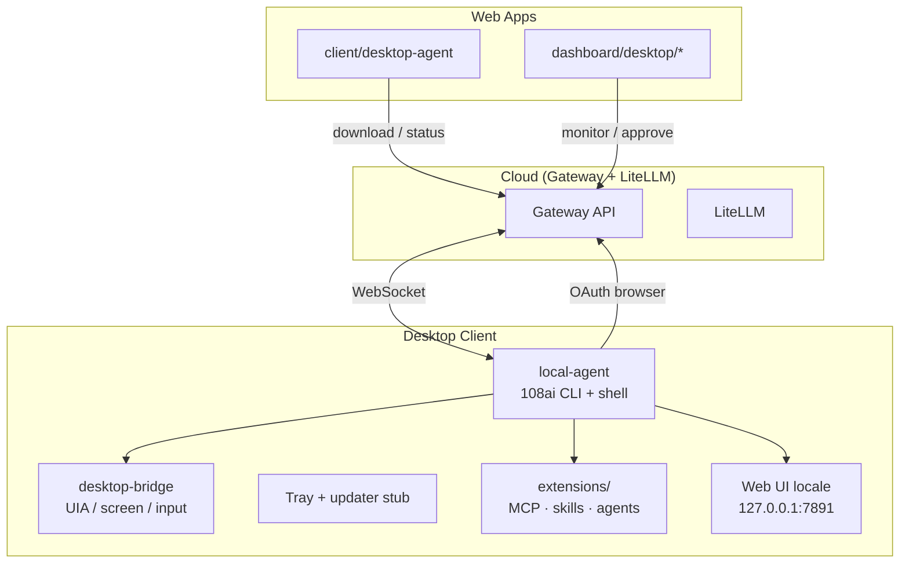

# 108 AI — Desktop Client Master Plan

> **Documento unificato** · Ultima revisione: **2026-06-16**  
> Consolida e allinea: `desktop-agent-roadmap-complete.md`, `phase-5-desktop-agent-v2.md`, `desktop-agent-installer-plan.md`, `tracks/108-ai/108AI-Desktop-Bridge.md`  
> **Stato codice verificato** su `aia-platform/apps/local-agent`, `packages/desktop-bridge`, `apps/client`, `apps/dashboard`

---

## 1. Executive Summary

Il **Desktop Client 108 AI** non è un singolo binario: è un **sistema a 4 layer** che lavorano insieme.

| Layer | Package / App | Ruolo |
|-------|---------------|-------|
| **L1 — Agent runtime** | `apps/local-agent` (`@108ai/desktop` v0.3.0) | CLI, shell REPL, WebSocket verso gateway, triage/jobs, extensions |
| **L2 — Native bridge** | `packages/desktop-bridge` | Percezione/azione OS (Windows primario, macOS parziale) |
| **L3 — Control plane web** | `apps/client` + `apps/dashboard` | Download, monitor connessione, approvazioni consulente |
| **L4 — Cloud** | `apps/gateway` + LiteLLM | Decisioni AI, billing multi-tenant, policy |

**Principio architetturale** (invariato):

> L'intelligenza vive nel cloud. Il desktop esegue localmente.  
> Il gateway decide **cosa** fare; il client decide **se** farlo (veto + permission system).

**Maturità complessiva stimata:** ~**75–80%** del piano funzionale agent/CLI · ~**40%** del piano prodotto installabile · ~**85%** del piano coding assistant (Phase 5 / Fase B chiusa) · ~**70%** del bridge nativo Windows.

---

## 2. Architettura (vista unificata)

---

## 3. Matrice stato reale (codice vs piano)

Legenda: ✅ implementato e wired · 🟡 parziale / stub · ❌ non iniziato · 📄 solo in documentazione

### 3.1 Agent runtime — Sprint roadmap (`local-agent`)

| Area | Piano (roadmap) | Stato codice | Evidenza |
|------|-----------------|--------------|----------|
| Sprint 1 Fondamenta | ✅ | ✅ | `local-router`, `script-store`, `local-cache`, `shell.ts` REPL |
| Sprint 2 Browser/Email/Calendar | ✅ | ✅ | `integrations/chrome`, `gmail`, `calendar`, `imap-client` |
| Sprint 3 Office/OCR/Keys | ✅ | ✅ | `office-*`, `vision-llm`, `provider-keys` |
| Sprint 4 Desktop + Multi-agent | ✅ | ✅ | `capabilities/desktop.ts`, `multi-agent/` |
| Sprint 4b Messaging | ✅ | ✅ | `telegram-bot`, `whatsapp-*` |
| Sprint 5 Business Italia | ❌ | 🟡 | Solo entry: `fatture-in-cloud.ts` + triage billing |
| Sprint 6 Hardening | ✅ | ✅ | `hardening/*`, SSE, token budget, rate limit tenant |
| Sprint 7 Documentazione | 🟡 | 🟡 | `USER-GUIDE`, `SECURITY-RUNBOOK`, ADR-001; manca set ADR completo |
| Sprint 8 Triage | ✅ | ✅ | `triage/engine`, `scheduler`, CLI in shell |
| Sprint 9 Jobs | ✅ | ✅ | `jobs/*` (store, executor, scheduler, templates) |
| Sprint 10 Resources | ✅ | ✅ | `resources/monitor`, `auto-healer` |
| Sprint 11 Extensibility | ✅ | 🟡 | `extensions/*` completo; gap residui sotto |
| TS strict `tsc --noEmit` | — | ✅ | Verificato 2026-06-16 |
| Vitest | — | ✅ | 65 test |

**Gap Sprint 11 (residui verificati):**

| Item | Stato | Note |
|------|-------|------|
| MCP stdio + SSE/HTTP | ✅ | `extensions/mcp/` |
| MCP tools in agent loop | ✅ | `extensions/agents/mcp-tools.ts` |
| `mcp install` | ✅ | npm/git/preset in `extensions/mcp/install.ts` |
| MCP usage metrics | ✅ | `extensions/mcp/usage.ts` |
| Store catalog locale | ✅ | `extensions/ui/store/catalog.ts` |
| Store catalog **online fetch** | ✅ | `storeCatalogOnlineUrl` + cache JSON |
| Store **install da online** | ✅ | `store/installer.ts` + API web |
| Install wizard | 🟡 | `config.ts` `runSetupWizard()` — campi base |
| Agent switcher | 🟡 | CLI + web API `/api/agent/use`; no Electron/Tauri |
| Sandbox shell in jobs | ✅ | `jobs/executor.ts` + `shell-security` |
| `/triage`, `/job` come YAML commands | ✅ | `builtin:` in `~/.108ai/commands/` |

### 3.2 Coding capabilities — Phase 5 (`phase-5-desktop-agent-v2.md`)

| Capability | Piano | Stato codice | Note |
|------------|-------|--------------|------|
| `shell.execute` | v0.2 | ✅ | `capabilities/shell.ts` + registry |
| `shell.executeStream` | v0.2 | ✅ | `capabilities/shell.ts` + `shell-process.ts` + WS `shell.stream` |
| `shell.terminate` / `getRunning` | v0.2 | ✅ | `capabilities/shell.ts` |
| `code.edit` / `code.editMulti` | v0.2 | ✅ | `capabilities/code.ts` (alias su filesystem) |
| `code.write` / `readRange` | v0.2 | ✅ | `capabilities/code.ts` |
| `git.*` | v0.2 | ✅ | `capabilities/git.ts` (push/reset gated) |
| `search.grep` / `glob` / `find` | v0.3 | ✅ | `capabilities/search.ts` |
| `web.fetch` / `web.search` | v0.3 | ✅ | `capabilities/web.ts` + SSRF guard |
| `process.*` | v0.3 | ✅ | `capabilities/process.ts` |
| `mcp.*` (capability WS) | v0.4 | 🟡 | Implementato come **extension** `/mcp`, non action `mcp.callTool` |
| PTY / terminal streaming | v0.4 | ❌ | |
| `index.*` local RAG | v0.5 | 🟡 | `embeddings-cache.ts` + `extensions/knowledge/` (lite, no sqlite-vec) |
| `context.assemble` | v0.5 | ❌ | |
| Rebranding `@108ai/desktop` | v1.0 | ✅ | `package.json` v0.3.0 |
| Tray icon / splash | v1.0 | 🟡 | `tray.ts` usa fallback; no icona nativa Win |
| Installer MSI/DMG/deb | ❌ | Beta: `pnpm package:beta` + `install-108ai.ps1` (Fase E: MSI/Tauri) |
| Tauri/Electron shell | v1.0 opt | ❌ Decisione: Tauri v2; Fase E |

**Azioni registrate oggi** (`capabilities/index.ts`): include `shell.*`, `git.*`, `code.*`, `search.*`, `web.*`, `process.*` + filesystem/desktop. Target ≥35: **raggiunto** `[verificato]`.

### 3.3 Installer & prodotto installabile (`desktop-agent-installer-plan.md`)

| Feature | Piano v1.0 | Stato codice | File |
|---------|------------|--------------|------|
| Binary compilato (esbuild) | ✅ | ✅ | `scripts/build.mjs` |
| `108ai --install` PATH | ✅ | ✅ | `cli.ts` `handleInstall()` |
| CLI one-shot / pipe | ✅ | ✅ | `cli.ts` |
| Shell REPL | ✅ | ✅ | `shell.ts` |
| Background agent + WS | ✅ | ✅ | `index.ts`, `connection.ts` |
| OAuth browser login | ✅ | ✅ | `auth.ts` |
| Installer idempotente (Repair/Update/Uninstall UI) | Target | 🟡 | `--install` copia; no menu primo avvio |
| `autostart.ts` OS startup | Target | ❌ | Non esiste |
| System tray menu completo | Target | 🟡 | `tray.ts` — stati OK; menu limitato, `node-notifier` non tray nativa |
| Auto-update funzionale | Target | 🟡 | `updater.ts` presente; `CURRENT_VERSION` hardcoded `0.2.0` (drift vs package `0.3.0`) |
| Download da gateway | Target | ✅ | `gateway/routes/desktop-agent-download.ts` |
| Raccomandazione Electron-less v1 | ADR implicita | ✅ | Nessun Electron in repo |

### 3.4 Desktop Bridge (`108AI-Desktop-Bridge.md`)

| Area | Piano | Stato |
|------|-------|-------|
| 12 azioni desktop (click, type, screenshot…) | Fase 3.5 | ✅ Windows via `@aia/desktop-bridge` |
| Window guard + confirmation | Sicurezza | ✅ `desktop-bridge/safety/` |
| Dashboard consulente (monitor, screenshot) | Fase 3.5 | ✅ `dashboard/.../desktop/*` |
| Client download page | — | ✅ `client/routes/desktop-agent.tsx` |
| macOS client nativo | Fase 8 | ❌ Pianificato |
| Multi-monitor avanzato | Roadmap | 🟡 Limitazioni documentate |

### 3.5 UI React — Triage & Jobs (gap cross-doc)

| Componente | Dove nel piano | Stato |
|------------|----------------|-------|
| Triage panel React | roadmap Sprint 8/9 | ✅ `TriagePanel.tsx` |
| Job list/detail React | roadmap Sprint 9 | ✅ `JobListPanel.tsx` |
| Web UI locale agent | Sprint 11 | ✅ `extensions/ui/server.ts` :7891 |
| Dashboard desktop monitor | Bridge doc | ✅ `DesktopMonitor`, `DesktopActionCard` |

---

## 4. Registro drift documentale

Documenti che **non riflettono** lo stato codice al 2026-06-16 — da aggiornare o trattare questo file come fonte di verità.

| Documento | Drift | Azione |
|-----------|-------|--------|
| `desktop-agent-roadmap-complete.md` | Header Sprint 6/11 ✅ ma sezione gap Sprint 11 ancora lista item già fatti (MCP metrics, online catalog) | Allineare tabella gap o linkare qui |
| `phase-5-desktop-agent-v2.md` | Stato reale aggiornato: v0.2/v0.3 implementati, MCP come extension | Allineato (2026-06-17) |
| `desktop-agent-installer-plan.md` | Dice "updater stub non funzionale" — codice ha `updater.ts` quasi completo ma non wired + version drift | Aggiornare §Stato Attuale |
| `local-agent/README.md` | Elenca `code.*`, `git.*`, `web.*` come se esistessero | Allineare a `capabilities/index.ts` |
| `updater.ts` | `CURRENT_VERSION = '0.2.0'` vs `package.json` `0.3.0` | Fix tecnico minore |

---

## 5. Roadmap unificata per fasi

### Fase A — Beta PMI · **CHIUSA** (2026-06-17)

> Obiettivo: *"installa, login, triage mattutino, job automatici, consulente vede tutto"* — **go/no-go beta soddisfatto**.

| # | Deliverable | Track | Stato |
|---|-------------|-------|-------|
| A1 | Installer idempotente + autostart Win/Mac/Linux | Installer | ✅ `installer.ts`, `autostart.ts`, `paths.ts` |
| A2 | Tray nativa (`systray2`) + menu Shell/Dashboard/Pause/Settings/Quit/Update | Installer | ✅ `tray.ts` + fallback `node-notifier` |
| A3 | Wire auto-update + sync versione package | Installer | ✅ `version.ts`, `updater.ts` + menu "Riavvia per aggiornare" |
| A4 | First-run: triage schedulato lun-ven 07:00 + notify desktop | Installer | ✅ `first-run.ts` |
| A5 | Schedulers triage/job in `108ai agent` (non solo shell) | Runtime | ✅ `index.ts` |
| A6 | UI React: Triage summary panel (dashboard) | UI | ✅ `TriagePanel.tsx` + gateway `/triage` |
| A7 | UI React: Job list panel (dashboard) | UI | ✅ `JobListPanel.tsx` + gateway `/jobs` |
| A8 | Pacchetto beta Windows (exe + `install-108ai.ps1`) | Packaging | ✅ `scripts/package-beta.mjs` |

**Go/no-go beta:** `tsc` verde · test Vitest · installer Win10+ · OAuth OK · triage schedulato in agent mode · audit JSONL.

**Fuori scope Fase A (Fase E):** MSI firmato / DMG notarized — distribuzione via zip + PowerShell installer per beta PMI.

### Fase B — Coding assistant competitivo (6–8 settimane) ✅ **CHIUSA** (2026-06-16)

Obiettivo: parità funzionale con Claude Code su shell/git/search.

| # | Deliverable | Stato |
|---|-------------|-------|
| B1 | `git.*` (status/diff/log/commit/branch/stash/blame + policy push/reset) | ✅ `capabilities/git.ts` |
| B2 | `shell.executeStream` + process registry + terminate/getRunning | ✅ `shell-process.ts` |
| B3 | Namespace `code.*` (readRange/edit/editMulti/write) | ✅ `capabilities/code.ts` |
| B4 | `web.fetch` con blocklist IP privati + `web.search` (Brave) | ✅ `capabilities/web.ts` |
| B5 | `search.*` unificato (grep/glob/find) | ✅ `capabilities/search.ts` |
| B6 | Slash `/model` + `/clear` in shell REPL | ✅ `shell.ts` |

**Config:** `shellEnabled`, `gitEnabled`, `gitAllowPush`, `gitAllowDestructive` in `~/.108ai/config.json`.  
**Security:** tutte le azioni registrate in `security.ts` + SSRF su `web.fetch`.  
**Streaming:** eventi `shell.stream` via WebSocket quando agent mode attivo.

### Fase C — Extensibility & store (3–4 settimane) ✅ **CHIUSA** (2026-06-16)

| # | Deliverable | Stato |
|---|-------------|-------|
| C1 | `mcp install` generico npm/git | ✅ `extensions/mcp/install.ts` |
| C2 | Store online → install flow end-to-end | ✅ `store/installer.ts` + `/api/store/install` |
| C3 | Migrazione `/triage`, `/job` → YAML commands | ✅ (già in Fase A/B) |
| C4 | Sandbox shell enforcement in `jobs/executor.ts` | ✅ `validateShellCommand` + permissions |
| C5 | Firma autore pacchetti store | ✅ `security/store-signature.ts` (HMAC) |

**Store install:** CLI `/ui store install <id>` · Web UI tab Store · firma HMAC con `AIA_STORE_SIGNING_KEY`.  
**MCP install:** `/mcp install npm <pkg>` · `/mcp install git <url> --command node --args dist/index.js`.

### Fase D — Business Italia completo (Sprint 5)

| # | Deliverable |
|---|-------------|
| D1 | PSD2 / open banking adapter |
| D2 | Tracking corrieri (BRT/GLS/SDA) |
| D3 | WooCommerce / Shopify |
| D4 | Firma digitale + PEC automatica |

### Fase E — GUI nativa v2 (opzionale, post-feedback)

Decisione documentata: **Tauri** (non Electron) per chat locale, permission dialog, terminal integrato.

Riferimento: `phase-5-desktop-agent-v2.md` §5.15, `desktop-agent-installer-plan.md` Opzione B v2.0.

### Fase F — macOS & bridge (Fase 8 Bridge doc)

Parità Windows su percezione/azione; LaunchAgent autostart; notarization.

---

## 6. Metriche di successo (consolidate)

| Metrica | Target v1.0 | Stato attuale |
|---------|-------------|---------------|
| Azioni WS registrate | ≥ 35 | ~28 `[verificato]` |
| `tsc --noEmit` | 0 errori | ✅ |
| Test Vitest | ≥ 30 | 34 ✅ |
| Crash rate sessioni | < 0.1% | `[ignoto]` — no telemetria prod |
| Install size binary | < 50 MB | `[non verificato]` — misurare post-build |
| Memory idle | < 100 MB | `[non verificato]` |
| Auto-reconnect 60s | > 99% | Implementato in `connection.ts` `[probabile]` |
| Audit coverage azioni | 100% | ✅ `security.ts` auditLog |

---

## 7. Mappa documenti sorgente

| Documento | Scope | Usare per |
|-----------|-------|-----------|
| **Questo file** | Stato unificato + priorità | Decisioni prodotto, sprint planning |
| `desktop-agent-roadmap-complete.md` | Sprint 1–11 dettaglio ore/costi | Storia implementazione, task granulari |
| `phase-5-desktop-agent-v2.md` | Coding assistant API design | Spec `shell.*` `git.*` `mcp.*` |
| `desktop-agent-installer-plan.md` | Prodotto installabile | Tray, autostart, updater, shell UX |
| `tracks/108-ai/108AI-Desktop-Bridge.md` | Visione business + bridge | Vendita PMI, casi d'uso, macOS |
| `coding-agent-capabilities.md` | Capabilities reference | Gateway ↔ agent contract |
| `apps/local-agent/docs/USER-GUIDE.md` | Operatività utente | Beta esterni |
| `apps/local-agent/docs/SECURITY-RUNBOOK.md` | Incident response | Compliance |

---

## 8. Prossimi 3 passi consigliati (decisione Elios)

1. **Fase A1–A3** — Rendere il prodotto installabile senza competenze tecniche (ROI immediato per PMI).  
2. **Fix drift** — `updater.ts` version + README capabilities + snellire gap table in roadmap.  
3. **Fase A6–A7** — Due pannelli React in dashboard (triage + jobs): sbloccano il consulente senza Tauri.

---

## 9. Changelog documento

| Data | Revisione |
|------|-----------|
| 2026-06-16 | Creazione master plan; verifica codice local-agent v0.3.0, bridge, client, dashboard |

---

*108 Vision — Costruiamo la direzione, non solo il codice.*
