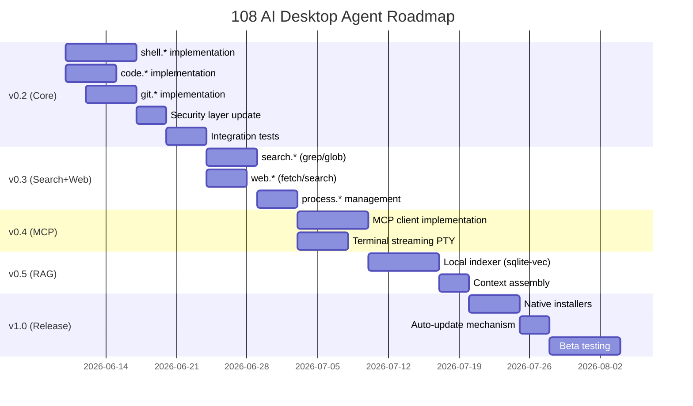

# Phase 5 — 108 AI Desktop Agent v0.2-v1.0

## Obiettivo

Trasformare il desktop agent da un semplice bridge filesystem/clipboard in un **coding assistant completo** competitivo con Claude Code, Cursor e Windsurf — con il vantaggio unico dell'automazione desktop e del billing multi-tenant integrato.

## Principio architetturale

> L'intelligenza vive nel cloud (Gateway + LiteLLM). Il desktop agent esegue localmente.
> Il gateway decide COSA fare, il client decide SE farlo (veto locale + permission system).

---

## Piano di Implementazione

### v0.2 — Core Coding Capabilities (P0)

**Deadline target:** 3 settimane

#### 5.1 Shell Execution (`shell.*`)

**File:** `src/capabilities/shell.ts`

| Action | Params | Risk | Descrizione |
|--------|--------|------|-------------|
| `shell.execute` | `command`, `cwd?`, `timeout?`, `env?` | high-risk | Esegue comando, ritorna stdout/stderr/exitCode |
| `shell.executeStream` | `command`, `cwd?`, `timeout?` | high-risk | Comando long-running, output via WS events |
| `shell.terminate` | `processId` | low-risk | Kill processo attivo |
| `shell.getRunning` | — | read-only | Lista processi attivi lanciati dall'agent |

**Sicurezza (non negoziabile):**

```typescript
interface ShellSecurityConfig {
  // Comandi sempre bloccati (regex patterns)
  commandBlocklist: RegExp[];
  // Working directory deve essere in allowedDirectories
  enforceWorkingDirectory: boolean;
  // Timeout in ms (default 120_000, max 600_000)
  defaultTimeout: number;
  maxTimeout: number;
  // Max output size in bytes (default 1MB)
  maxOutputSize: number;
  // No sudo/admin elevation
  blockElevation: boolean;
  // No interactive commands (require stdin)
  blockInteractive: boolean;
}

// Blocklist hardcoded (non configurabile dall'utente)
const ALWAYS_BLOCKED = [
  /^rm\s+(-rf?|--recursive).*\//,       // rm -rf /
  /^format\s/i,                           // format (Windows)
  /^del\s+\/s/i,                          // del /s (Windows)
  /^mkfs\./,                              // mkfs (Linux)
  /^dd\s+.*of=\/dev/,                     // dd to device
  /:\(\)\{.*\};:/,                        // fork bomb
  />\s*\/dev\/sd/,                        // write to disk device
  /^shutdown|^reboot|^halt/i,             // system shutdown
  /^sudo\s|^runas\s/i,                    // elevation
  /^powershell.*-enc/i,                   // encoded PS (obfuscation)
];
```

**Implementazione streaming:**

```typescript
// Il client spawna il processo e invia output incrementale via WebSocket
// Il gateway riceve gli eventi e li inoltra all'AI assistant
interface ShellStreamEvent {
  type: 'stdout' | 'stderr' | 'exit' | 'error';
  data?: string;
  exitCode?: number;
  processId?: string;
}
```

#### 5.2 Code Editing (`code.*`)

**File:** `src/capabilities/code.ts`

| Action | Params | Risk | Descrizione |
|--------|--------|------|-------------|
| `code.edit` | `filePath`, `oldString`, `newString`, `replaceAll?` | low-risk | Diff-based edit (exact string match) |
| `code.editMulti` | `filePath`, `edits[]` | low-risk | Multiple edits atomiche |
| `code.write` | `filePath`, `content` | low-risk | Scrivi file intero |
| `code.readRange` | `filePath`, `startLine?`, `endLine?` | read-only | Leggi con numeri di riga |

**Logica edit:**

```typescript
interface CodeEdit {
  oldString: string;
  newString: string;
}

// 1. Leggi file
// 2. Verifica che oldString esista e sia unico
// 3. Sostituisci
// 4. Scrivi file
// 5. Ritorna diff per audit

// Gestione conflitto: se oldString non è unico → errore con contesto
// (mostra le N occorrenze con line numbers)
```

#### 5.3 Git Operations (`git.*`)

**File:** `src/capabilities/git.ts`

| Action | Params | Risk | Descrizione |
|--------|--------|------|-------------|
| `git.status` | `cwd?` | read-only | Working tree status |
| `git.diff` | `cwd?`, `staged?`, `file?` | read-only | Diff (staged/unstaged/file) |
| `git.log` | `cwd?`, `count?`, `format?` | read-only | Commit history |
| `git.commit` | `message`, `files?`, `cwd?` | low-risk | Stage + commit |
| `git.branch` | `action`, `name?`, `cwd?` | low-risk | list/create/switch/delete |
| `git.stash` | `action`, `cwd?` | low-risk | push/pop/list |
| `git.blame` | `filePath`, `startLine?`, `endLine?` | read-only | Line blame |

**Operazioni bloccate (high-risk, richiede `_approved`):**

- `git push` (specialmente `--force`)
- `git reset --hard`
- `git checkout .` (discard all)
- `git clean -f`

#### 5.4 Aggiornamento Security Layer

**File:** `src/security.ts` — estendere `ACTION_RISK_LEVELS`:

```typescript
// Shell
['shell.execute',       'high-risk'],
['shell.executeStream', 'high-risk'],
['shell.terminate',     'low-risk'],
['shell.getRunning',    'read-only'],

// Code
['code.edit',           'low-risk'],
['code.editMulti',      'low-risk'],
['code.write',          'low-risk'],
['code.readRange',      'read-only'],

// Git
['git.status',          'read-only'],
['git.diff',            'read-only'],
['git.log',             'read-only'],
['git.commit',          'low-risk'],
['git.branch',          'low-risk'],
['git.stash',           'low-risk'],
['git.blame',           'read-only'],
['git.push',            'high-risk'],
['git.reset',           'high-risk'],
```

#### 5.5 Config Update

Aggiungere a `AgentConfig`:

```typescript
interface AgentConfig {
  // ... existing ...

  // Shell config
  shellEnabled: boolean;           // default: false (opt-in come desktop)
  shellBlocklist: string[];        // additional user-defined blocked patterns
  shellDefaultTimeout: number;     // default: 120000
  shellMaxOutputSize: number;      // default: 1048576 (1MB)

  // Git config
  gitEnabled: boolean;             // default: true
  gitAllowPush: boolean;           // default: false (require manual approval)
  gitAllowDestructive: boolean;    // default: false
}
```

---

### v0.3 — Search, Web & Process (P1)

**Deadline target:** 2 settimane dopo v0.2

#### 5.6 Search Capabilities (`search.*`)

**File:** `src/capabilities/search.ts`

| Action | Params | Risk |
|--------|--------|------|
| `search.grep` | `pattern`, `path`, `glob?`, `contextLines?`, `maxResults?` | read-only |
| `search.glob` | `pattern`, `path?` | read-only |
| `search.find` | `path`, `name?`, `type?`, `maxDepth?` | read-only |

**Implementazione:** wrappa `ripgrep` (se installato) con fallback a regex nativa Node.js su `fs.readFile`. Output max 500 matches.

#### 5.7 Web Capabilities (`web.*`)

**File:** `src/capabilities/web.ts`

| Action | Params | Risk |
|--------|--------|------|
| `web.fetch` | `url`, `method?`, `headers?`, `body?`, `maxSize?` | low-risk |
| `web.search` | `query`, `count?` | read-only |

**Sicurezza:**
- URL allowlist/blocklist (no `localhost`, no `192.168.*`, no `10.*` by default)
- Max response size: 5MB
- Timeout: 30s
- No cookies/auth forwarding
- User-Agent: `108AI-Desktop/0.3`

**Search backend:** Brave Search API o SearXNG self-hosted (configurabile).

#### 5.8 Process Management (`process.*`)

**File:** `src/capabilities/process.ts`

| Action | Params | Risk |
|--------|--------|------|
| `process.start` | `command`, `cwd?`, `detached?` | high-risk |
| `process.stop` | `processId` | low-risk |
| `process.list` | — | read-only |
| `process.logs` | `processId`, `tail?` | read-only |

Per dev server, build watcher, test runner — processi che vivono oltre la singola azione.

---

### v0.4 — MCP Client & Advanced (P1)

**Deadline target:** 2 settimane dopo v0.3

#### 5.9 MCP Client (`mcp.*`)

**File:** `src/capabilities/mcp.ts`

| Action | Params | Risk |
|--------|--------|------|
| `mcp.listServers` | — | read-only |
| `mcp.listTools` | `server` | read-only |
| `mcp.callTool` | `server`, `tool`, `params` | high-risk |
| `mcp.listResources` | `server` | read-only |
| `mcp.readResource` | `server`, `uri` | read-only |

**Config:**

```json
{
  "mcpServers": {
    "github": {
      "command": "npx",
      "args": ["-y", "@modelcontextprotocol/server-github"],
      "env": { "GITHUB_TOKEN": "..." }
    },
    "postgres": {
      "command": "npx",
      "args": ["-y", "@modelcontextprotocol/server-postgres"],
      "env": { "DATABASE_URL": "..." }
    }
  }
}
```

**Transport:** stdio per server locali, HTTP/SSE per server remoti.

#### 5.10 Terminal Streaming Avanzato

Evoluzione di `shell.executeStream`:
- PTY completo (supporta colori, progress bar)
- Resize terminale
- Input interattivo (per comandi come `npm init`)
- Session multiplexing (più terminali attivi)

---

### v0.5 — Local RAG & Intelligence (P2)

**Deadline target:** 2 settimane dopo v0.4

#### 5.11 Local Codebase Indexing (`index.*`)

**File:** `src/capabilities/indexer.ts`

| Action | Params | Risk |
|--------|--------|------|
| `index.build` | `directory`, `patterns?` | read-only |
| `index.search` | `query`, `topK?` | read-only |
| `index.status` | — | read-only |
| `index.clear` | `directory?` | low-risk |

**Implementazione:**
- Embedding locale via `@xenova/transformers` (no cloud dependency per indexing)
- Storage: SQLite + sqlite-vec (zero deps, portable, file-based)
- Chunking: per-function con tree-sitter parsing
- Incremental: re-index solo file modificati (watch + git status)
- Index path: `~/.108ai/indexes/{project-hash}/`

#### 5.12 Context Assembly

Il gateway può richiedere contesto locale senza mandare tutto il codebase al cloud:

```typescript
// Il gateway chiede: "dammi il contesto rilevante per questa query"
// Il client fa RAG locale e ritorna solo i chunk rilevanti
'context.assemble' → read-only
```

---

### v1.0 — Production Ready

**Deadline target:** 2 settimane dopo v0.5

#### 5.13 Rebranding & Packaging

- [x] Rename `@aia/local-agent` → `@108ai/desktop`
- [x] Binary: `aia-agent` → `108ai`
- [x] Config dir: `~/.108visionai/` → `~/.108ai/`
- [x] Identifiers: `108visionai` → `108ai`
- [x] Domain: `api.108vision.ai` → `api.108ai.dev`
- [ ] Logo/icon per system tray
- [ ] Splash screen al primo avvio
- [ ] npm publish `@108ai/desktop` (o GitHub Releases per binary)

#### 5.14 Installer Nativo

- **Windows:** `.msi` installer con WiX o NSIS
- **macOS:** `.dmg` con drag-to-Applications
- **Linux:** `.deb` + `.rpm` + AppImage

Auto-update via GitHub Releases + semver check.

#### 5.15 Electron Shell (opzionale)

Per chi vuole una GUI oltre al tray:
- Chat interface locale (offline-capable con modello locale via Ollama)
- Permission dialog visuale (mostra comando prima di eseguirlo)
- Terminal integrato con output streaming
- File browser con diff viewer

**Decisione:** Tauri (più leggero) vs Electron (ecosistema più maturo).
Raccomandazione: **Tauri** — Rust backend, WebView nativo, ~10MB vs ~150MB.

---

## Dipendenze Tecniche

| Capability | Dipendenza runtime | Note |
|---|---|---|
| shell.* | `node:child_process` | Built-in Node.js |
| code.* | `node:fs` | Built-in |
| git.* | `git` CLI | Deve essere installato sulla macchina |
| search.grep | `ripgrep` (opzionale) | Fallback a Node.js native |
| web.* | `node:https` | Built-in |
| mcp.* | `@modelcontextprotocol/sdk` | npm package |
| index.* | `@xenova/transformers`, `better-sqlite3`, `sqlite-vec` | npm packages |
| process.* | `node:child_process` | Built-in |
| desktop.* | `@108ai/desktop-bridge` | Workspace package (native bindings) |

---

## Sicurezza — Threat Model

### Vettori di attacco

| Threat | Mitigazione |
|--------|------------|
| Prompt injection via file letto | Gateway sanitizza output LLM; client valida action prima di eseguire |
| Exfiltration via shell | Blocklist network commands (`curl`, `wget` verso IP esterni) se non in allowlist |
| Path traversal | `validatePath()` già implementato — estendere a shell `cwd` |
| Token theft | Token in config file con permessi 600; mai in env visibili |
| Runaway agent | Rate limit + timeout + max concurrent actions |
| Desktop automation abuse | Risk levels + screenshot pre-action + audit log |

### Principio di difesa in profondità

```
[Gateway decides] → [Client validates] → [Security layer checks] → [Handler executes]
         ↓                    ↓                     ↓                       ↓
   AI model output     Local allowlist       Path/rate/risk          Sandboxed exec
                       + veto power          validation
```

---

## Metriche di Successo

| Metrica | Target v1.0 |
|---------|------------|
| Azioni supportate | ≥ 35 |
| Latenza mediana azione | < 200ms (escluso shell) |
| Crash rate | < 0.1% delle sessioni |
| Auto-reconnect success | > 99% entro 60s |
| Install size (binary) | < 50MB |
| Memory footprint idle | < 100MB |
| Audit coverage | 100% delle azioni (log JSONL) |

---

## Confronto Competitivo Finale

| Feature | Claude Code | Cursor | Windsurf | **108 AI** |
|---------|-------------|--------|----------|-----------|
| Shell execution | CLI only | IDE only | IDE only | Desktop + Web + API |
| Desktop automation | - | - | - | **Full** (click, type, screenshot) |
| Multi-model | Solo Claude | Multi | Multi | **DeepSeek + Qwen** (5-10x cheaper) |
| Multi-tenant billing | - | - | - | **Native** |
| Knowledge Base | - | Codebase | Codebase | **Codebase + Docs + KB aziendale** |
| MCP support | Native | Partial | Partial | Native |
| Permission system | Granular | Basic | Basic | **3-tier risk + audit** |
| Self-hosted option | - | - | - | **Docker + VPS** |
| Target user | Developer | Developer | Developer | **PMI (dev + non-dev)** |
| Pricing model | Subscription | Subscription | Subscription | **Pay-per-token** |

---

## Roadmap Timeline



**Total estimated time:** ~10-12 settimane da oggi (2026-06-09) → target release v1.0: **fine agosto 2026**.
