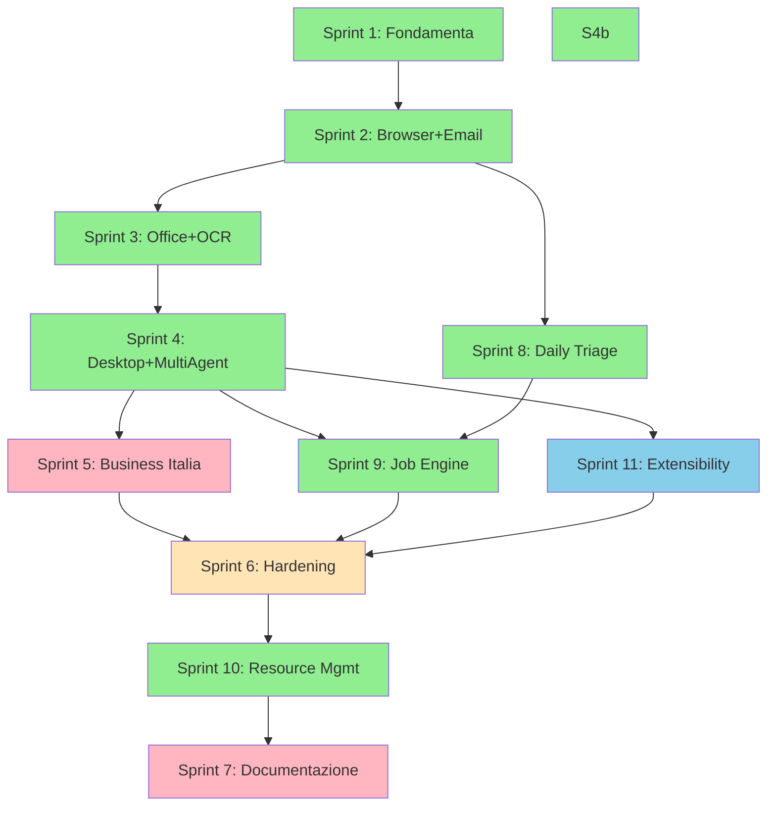

# Desktop Agent 108ai — Roadmap Completa

> Ultima revisione: **2026-06-16** — Sprint 1–4b, 8–10 **COMPLETATI** · Sprint 11 **✅** · Sprint 6 **✅** · Sprint 7 **min+API ref ✅** · Sprint 5 **entry point 🟡** (local-agent)

---

## Overview Sprint

| Sprint | Focus | Stato | Ore (plan) | Ore (fatto*) | Costo Token (Mix) |
|--------|-------|-------|------------|--------------|-------------------|
| **1** | Fondamenta + Clipboard | ✅ FATTO | 3h | 3h | ~$1.50 |
| **2** | Browser + Email + Calendar | ✅ FATTO | 26h | 26h | ~$14 |
| **3** | Office + OCR + Multi-Provider Keys | ✅ FATTO | 23h | 23h | ~$12 |
| **4** | Desktop Automation + Multi-Agent | ✅ FATTO | 39h | 39h | ~$20 |
| **4b** | Messaging (Telegram + WA Business + Baileys) | ✅ FATTO | 23h | 23h | ~$9 |
| **5** | Business Italia | ❌ Da fare | 35h | 0h | ~$13 |
| **6** | Hardening (security/perf/token) | ✅ FATTO | 56h | ~31h | ~$7 |
| **7** | Documentazione + Principi | 🟡 Minimo | 29h | ~6h | ~$3 |
| **8** | Daily Triage + Morning Briefing | ✅ FATTO | 28h | 28h | ~$8 |
| **9** | Job Execution Engine | ✅ FATTO | 42h | 42h | ~$12 |
| **10** | Resource Management & Resilience | ✅ FATTO | 24h | 24h | ~$5 |
| **11** | Extensibility: Commands/Skills/Agents/MCP | ✅ FATTO | 48h | ~46h | ~$14 |
| **TOTALE** | | **~82% piano ore** | **376h** | **~241h** | **~$119** |

\*Ore "fatto" = stima implementazione codice in `aia-platform/apps/local-agent/` (non include doc Sprint 7).

**Legenda stato:** ✅ completato · 🟡 CLI/core fatto, gap residui sotto · ❌ non iniziato

**Costo umano totale (a 50 EUR/h): 17.650 EUR** · **Token sviluppo (mix): ~110$** · **Efficienza vs dev tradizionale: ~160x**

---

## Cosa manca — Gap Analysis (chiaro)

### ❌ Sprint non iniziati

| Sprint | Cosa manca | Impatto business |
|--------|------------|------------------|
| **5 — Business Italia** | Fatture in Cloud adapter + triage billing | PSD2, tracking corrieri, WooCommerce, firma digitale + PEC automatica |
| **7 — Documentazione** | CLAUDE.md agent, **INTEGRATIONS-API.md**, playbook multi-agent, ADR-001 | ADR set completo, onboarding Electron |

### ✅ Sprint 11 — Extensibility (chiuso)

| Area | ✅ Fatto (codice) | ❌ Manca |
|------|------------------|---------|
| **Commands** | `extensions/commands/*`, `/command`, seed `summarize-email` + **triage/job/morning/standup/schedule** (`builtin:`), **hooks before/after**, **`/command create`** | Store online: publisher verification + rating/installs reali |
| **Skills** | `extensions/skills/*`, trigger implicito, `email-writer` seed, **`tools_required`**, **`knowledge:`** | — |
| **Agents** | `extensions/agents/*`, MCP tool loop, **`knowledge:`** path RAG-lite | — |
| **MCP** | stdio + **SSE/HTTP**, `mcp.yml`, `/mcp list\|add\|install\|start\|tools\|test` | `mcp.*` come capability WS (rimane in Phase 5 v0.4) |
| **Security ext.** | `permissions.yml`, sandbox path, `${ENV}`, rate limit MCP, lock file, **firma autore store (HMAC)** | — |
| **Import/Export** | `/import claude\|n8n\|chatgpt\|restore`, `/export backup\|restore`, lock file | — |
| **CLI unificato** | `/ext status\|reload\|permissions\|audit` | Wizard install, `108ai` subcommand standalone |
| **UI** | ✅ Terminal panels + web dashboard `127.0.0.1:7891`, `/ui`, `/palette`, **store catalog online fetch + install flow** | Agent switcher Electron/Tauri (Fase E) |

**Path codice Sprint 11:** `aia-platform/apps/local-agent/src/extensions/` (54 file)

### ✅ Sprint 6 — Hardening (chiuso)

| Task | Stato | Note |
|------|-------|------|
| Input sanitization LLM | ✅ | `hardening/llm-sanitize.ts` → `callLLM`, `callGatewayChat` |
| API key encryption at rest | ✅ | `hardening/key-vault.ts` AES-256-GCM → `providers.json` |
| Audit log append-only + rotation | ✅ | `security.ts` + `hardening/audit-rotation.ts` (5 MB) |
| Output PII guardrails | ✅ | `hardening/pii-guard.ts` → output agent/LLM |
| Lazy loading integrazioni | ✅ | `lazy-loader.ts` wired in `triage/engine.ts` |
| Prompt compression | ✅ | `prompt-compress.ts` → agent `context_window: summarize` |
| Token budget / model downgrade | ✅ | trackTokens + livelli emergency/hard-stop + enforcement in gateway/shell/jobs |
| Rate limiting per-tenant | ✅ | scoping tenantId + rate limit su gateway chat |
| JWT rotation + refresh | ✅ | `token-refresh.ts` proattivo + refresh su 401 in shell |
| Streaming SSE dedicato | ✅ | modulo SSE unificato (`hardening/sse-stream.ts`) |
| Connection pooling PG+Redis | ❌ | Scope **gateway/server**, non local-agent |
| Parallel LLM calls | ✅ | `multi-agent/orchestrator.ts` |
| Response compression | ✅ | `response-compress.ts` → cache/history |
| Semantic cache (embeddings) | ✅ | embeddings cache + ranking semantic in knowledge loader |
| Conversation summarization | ✅ | Strategy `summarize` in `agents/context.ts` |
| Batch request coalescing | ✅ | `llm-coalesce.ts` in `gateway-llm.ts` |

**Path codice Sprint 6 (local-agent):** `aia-platform/apps/local-agent/src/hardening/`

### 🔧 Debito tecnico trasversale

| Item | Severità | Dettaglio |
|------|----------|-----------|
| Errori TS pre-esistenti | Media | ✅ Allineamento strict: `jobs/*`, `triage/*`, `integrations/messaging-cli`, `resources/*`, `extensions/*`, `desktop-bridge`; `tsc --noEmit` verde |
| Test coverage extensions | Bassa | **65** test Vitest (incl. store signature, mcp install, phase-b/c) |
| Built-in → extension migration | ✅ | `/triage`, `/job`, `/morning`, `/standup`, `/schedule` → YAML `builtin:` in `~/.108ai/commands/` |
| `pnpm install` monorepo | Ops | `blockExoticSubdeps` su `@whiskeysockets/baileys` |

### Priorità consigliata (ordine)

1. **Sprint 5 (Business Italia)**: partire da entry point ad alto ROI (Fatture in Cloud + billing)  
2. **Sprint 5 entry point:** Fatture in Cloud (fatture scadute nel triage)  
3. **Sprint 7:** guida utente + security runbook (sblocca beta esterna)  
4. **Phase 5 v0.4 (nice-to-have)**: MCP come capability WS `mcp.*` (oggi è extension)  
5. **Packaging Phase A** — MSI/DMG + code signing (vedi `desktop-agent-installer-plan.md`)

---

## Sprint 1: FONDAMENTA (FATTO)

| Task | Stato |
|------|-------|
| Local router (intent detection) | FATTO |
| Script store (riusabili) | FATTO |
| Local cache (LLM responses) | FATTO |
| Smart chunking | FATTO |
| Shell interattiva REPL | FATTO |
| Clipboard bridge avanzato (history + hotkey) | FATTO |

---

## Sprint 2: BROWSER + EMAIL + CALENDAR (FATTO)

| Task | Effort |
|------|--------|
| Chrome DevTools Protocol adapter | 8h |
| Google OAuth2 flow | 4h |
| Gmail adapter (list, search, read, send) | 4h |
| Google Calendar adapter (events, create, move) | 5h |
| IMAP/PEC generico | 5h |

---

## Sprint 3: OFFICE + OCR LOCALE (FATTO)

| Task | Effort | Stato |
|------|--------|-------|
| Excel COM Automation | 6h | FATTO — `integrations/office-excel.ts` (8 operazioni) |
| Word COM Automation | 5h | FATTO — `integrations/office-word.ts` (9 operazioni) |
| Outlook COM | 4h | FATTO — `integrations/office-outlook.ts` (12 operazioni) |
| Tesseract OCR locale | 4h | GIA' ESISTENTE — `desktop-bridge/perception/ocr.ts` |
| Multi-Provider API Keys | 4h | FATTO — `provider-keys.ts` + shell `/providers` |

**Token stimati: ~1.2M totali | ~$12 mix**

---

## Sprint 4: DESKTOP AUTOMATION + MULTI-AGENT (FATTO)

| Task | Effort | Stato |
|------|--------|-------|
| Windows UI Automation API | 12h | FATTO — `integrations/ui-automation.ts` (12 operazioni: listWindows, getElementTree, findElement, click, type, readValue, focus, setState, wait, capture, sendKeys, listChildren) |
| Vision/OCR con LLM (fallback) | 4h | FATTO — `integrations/vision-llm.ts` (6 operazioni: analyzeScreen, captureFullScreen, askAboutScreen, findOnScreen, extractText, diffScreenshots) |
| Telegram Bot integration | 5h | RIMANDATO — vedi Sprint 4b (Messaging) |
| WhatsApp Business API | 6h | RIMANDATO — vedi Sprint 4b (Messaging) |
| WhatsApp (Baileys / non-Business) | 6h | NUOVO — vedi Sprint 4b |
| Multi-Agent Orchestration | 12h | FATTO — `multi-agent/orchestrator.ts` (7 agent roles, fluent plan builder, 5 merge strategies, 3 quick helpers) |

**Token stimati: ~2M totali | ~$20 mix**
**Stato: CORE COMPLETATO (3/5 task originali). Messaging spostato in Sprint 4b dedicato.**

---

## Sprint 4b: MESSAGING (Telegram + WhatsApp) — ✅ FATTO

### Overview

| Canale | Libreria | Costo API | Effort | Token dev |
|--------|----------|-----------|--------|-----------|
| **Telegram Bot** | `node-telegram-bot-api` (MIT) | GRATIS (Bot API illimitata) | 5h | ~$2 |
| **WhatsApp Business** | Meta Cloud API (ufficiale) | ~$0.05-0.15/messaggio (template) + €0/conversazione user-initiated (prime 1000/mese free) | 6h | ~$3 |
| **WhatsApp (non-Business)** | `@whiskeysockets/baileys` (MIT) | GRATIS (reverse-engineering WA Web) | 8h | ~$4 |

### Telegram Bot (`node-telegram-bot-api`)

**Costo infrastruttura: ZERO**
- Bot API di Telegram e' completamente gratuita, illimitata
- Unico requisito: creare un bot via @BotFather (istantaneo)

**Cosa puo' fare:**
- Ricevere messaggi dall'utente → inoltrare all'agent 108ai
- Inviare notifiche (triage, job completati, alert sistema)
- Comandi inline (/triage, /morning, /job run X)
- Inline keyboard per azioni rapide
- File/immagini bidirezionali

**Effort: 5h**

| Task | Ore |
|------|-----|
| Bot setup + webhook/polling | 1h |
| Message handler (receive → agent pipeline) | 1.5h |
| Notification sender (agent → Telegram) | 1h |
| Inline commands + keyboards | 1h |
| Config + auth (token in ~/.108ai/integrations/telegram.json) | 0.5h |

### WhatsApp Business (Meta Cloud API)

**Costo infrastruttura:**
- Account Meta Business: GRATIS
- WhatsApp Business Platform: GRATIS (setup)
- Messaggi:
  - **User-initiated conversations**: prime 1.000/mese GRATIS, poi ~€0.03-0.08/conversazione
  - **Business-initiated (template)**: ~€0.04-0.15/messaggio (varia per paese)
  - **Utility templates** (conferme, notifiche): ~€0.04/msg
  - **Marketing templates**: ~€0.10-0.15/msg
- Phone number: serve un numero dedicato (SIM o virtual number ~€5-10/mese)

**Pro:**
- API ufficiale, stabile, supportata
- Template messages pre-approvati (professionale)
- Webhook per ricevere messaggi
- Multi-device nativo

**Contro:**
- Richiede approvazione Meta (1-7 giorni)
- Template messages devono essere approvati singolarmente
- Costo per messaggio (anche se basso)
- Non puoi inviare messaggi "liberi" senza che l'utente scriva prima (24h window)

**Effort: 6h**

| Task | Ore |
|------|-----|
| Meta App setup + webhook registration | 1.5h |
| Message receive handler | 1.5h |
| Template message sender | 1.5h |
| Media handling (immagini, documenti) | 1h |
| Config (app ID, token, phone number in config) | 0.5h |

### WhatsApp NON-Business (`@whiskeysockets/baileys`)

**Libreria:** `@whiskeysockets/baileys` (ex `adiwajshing/Baileys`)
- Repository: github.com/WhiskeySockets/Baileys
- ~12k stars, MIT license, TypeScript nativo
- Implementa il protocollo WhatsApp Web Multi-Device (Signal Protocol)
- **Non richiede Business API** — usa il tuo numero personale

**Costo infrastruttura: ZERO**
- Nessun costo API (e' il tuo WhatsApp personale)
- Nessuna approvazione Meta necessaria
- Nessun template message — puoi inviare qualsiasi messaggio

**Pro:**
- Completamente gratuito
- Nessuna restrizione su contenuto messaggi
- Accesso a gruppi, status, reactions
- Funziona col numero personale (no SIM extra)
- Evento-driven (ricevi in real-time)

**Contro:**
- **Rischio ban**: Meta puo' bannare l'account se rileva automazione (rischio medio-basso con uso moderato)
- **Non ufficiale**: potrebbe rompersi ad ogni aggiornamento WA (storicamente stabile pero')
- **Single device session**: il Desktop Agent "occupa" una sessione WA Web (il telefono continua a funzionare)
- **No template approvati**: non adatto per comunicazioni marketing massivo
- **Auth via QR code**: prima volta richiede scan QR dal telefono

**Effort: 8h** (piu' complesso perché il protocollo è più articolato)

| Task | Ore |
|------|-----|
| Baileys setup + QR auth + session persistence | 2h |
| Message handler (receive → agent pipeline) | 2h |
| Message sender (text, media, reply, react) | 1.5h |
| Group support (list groups, send to group) | 1h |
| Connection management (reconnect, multi-device) | 1h |
| Config + session storage (~/.108ai/integrations/wa-session/) | 0.5h |

### Confronto Costi Mensili (uso tipico PMI)

| Scenario | Telegram | WA Business | WA Baileys |
|----------|----------|-------------|------------|
| 10 notifiche/giorno (220/mese) | €0 | ~€9-15/mese | €0 |
| 50 notifiche/giorno (1100/mese) | €0 | ~€30-50/mese | €0 |
| Ricezione messaggi clienti (100/mese) | €0 | €0 (free tier) | €0 |
| Setup iniziale | €0 | €0 + 3-7gg approvazione | €0 |
| **Rischio** | Nessuno | Nessuno (ufficiale) | Ban account (basso) |

### Raccomandazione

| Caso d'uso | Soluzione raccomandata |
|------------|----------------------|
| Notifiche interne (triage, job, alert) | **Telegram** (gratis, istantaneo, zero rischi) |
| Comunicazione con clienti (professionale) | **WA Business** (ufficiale, template, tracciabile) |
| Automazione personale (leggere/rispondere WA) | **WA Baileys** (gratis, ma con rischio ban accettabile per uso moderato) |
| Prodotto SaaS (per i clienti 108ai) | **WA Business** (unico legale per uso commerciale) |

### Task Sprint 4b

| Task | Effort | Stato |
|------|--------|-------|
| Telegram Bot adapter | 5h | FATTO — `integrations/telegram-bot.ts` (send/receive/poll, inline keyboard, photo/doc, 0 deps) |
| WhatsApp Business adapter | 6h | FATTO — `integrations/whatsapp-business.ts` (Meta Cloud API v21, templates, interactive, webhook, media) |
| WhatsApp Baileys adapter | 8h | FATTO — `integrations/whatsapp-baileys.ts` (multi-device, QR auth, session persist, groups, auto-reconnect) |
| Shell integration (/telegram, /whatsapp, /notify) | 2h | FATTO — `integrations/messaging-cli.ts` (3 handler, ~20 sub-comandi totali) |
| Notification channel unificato | 2h | FATTO — `notifications/channel.ts` (7 canali, routing rules, quiet hours, history) |

**Totale Sprint 4b: 23h | Costo umano: 1.150 EUR | Token: ~$9 mix (sviluppo)**
**Costo running mensile: Telegram €0 | WA Business €10-50 | Baileys €0**
**Stato: COMPLETATO (5/5 task).**

---

## Sprint 5: BUSINESS ITALIA — ❌ Da fare

| Task | Effort | Dettaglio |
|------|--------|-----------|
| Fatture in Cloud API | 8h | Crea/cerca fatture, clienti, scadenze |
| Open Banking PSD2 (sola lettura) | 10h | API banca, movimenti, pagamenti ricevuti |
| Tracking spedizioni (BRT/GLS/SDA) | 4h | REST API tracking multi-corriere |
| WooCommerce/Shopify ordini | 5h | REST API, ordini da spedire, statistiche |
| Firma digitale + invio PEC | 8h | Aruba/InfoCert SDK, firma PDF, invio automatico |

**Token stimati: ~1.75M totali | ~$13 mix**

---

## Sprint 6: HARDENING (Sicurezza, Prestazioni, Token Optimization) — 🟡 Parziale (~35%)

| Task | Effort | Area | Stato |
|------|--------|------|-------|
| Rate limiting per-tenant | 3h | Sicurezza | ❌ Gateway/tenant — solo rate limit azioni locali |
| Input sanitization LLM (OWASP LLM Top 10) | 4h | Sicurezza | ✅ `hardening/llm-sanitize.ts` |
| API key encryption at rest (AES-256-GCM) | 3h | Sicurezza | ✅ `hardening/key-vault.ts` |
| JWT rotation + refresh | 3h | Sicurezza | 🟡 Refresh su 401 shell; rotazione proattiva no |
| Audit log (append-only) | 4h | Sicurezza | ✅ `security.ts` + rotazione 5MB |
| Output guardrails (PII detection) | 3h | Sicurezza | ✅ `hardening/pii-guard.ts` |
| Streaming response (SSE) | 4h | Prestazioni | 🟡 Shell stream gateway; modulo unificato no |
| Connection pooling (PG + Redis) | 2h | Prestazioni | ❌ Scope gateway, non local-agent |
| Parallel LLM calls | 3h | Prestazioni | ✅ `multi-agent/orchestrator.ts` |
| Response compression | 2h | Prestazioni | ❌ |
| Lazy loading integrazioni | 2h | Prestazioni | 🟡 `lazy-loader.ts` — non wired |
| Semantic cache (embeddings) | 6h | Token | ❌ Solo cache hash testuale |
| Prompt compression | 4h | Token | 🟡 Utility pronta, non in `callLLM` |
| Token budget enforcement | 3h | Token | 🟡 Jobs + `auto-healer` |
| Model auto-downgrade | 3h | Token | 🟡 `resources/auto-healer.ts` |
| Conversation summarization | 4h | Token | ❌ Agent `summarize` strategy no |
| Batch request coalescing | 3h | Token | ❌ |

**Totale: 56h plan | ~20h fatto | ~$7 mix**

---

## Sprint 7: DOCUMENTAZIONE — ❌ Da fare

| Task | Effort |
|------|--------|
| Aggiornare CLAUDE.md piattaforma | 2h |
| Guida utente Desktop Agent | 4h |
| API Reference integrazioni | 3h |
| Playbook Multi-Agent | 3h |
| Security Runbook | 4h |
| ADR (Architecture Decision Records) | 3h |
| Principi cardine aggiornati | 3h |
| CHANGELOG | 1h |
| README piattaforma | 2h |
| Manuale Consulente (track 108-AI) | 4h |

**Totale: 29h | ~$3 mix**

---

## Sprint 8: DAILY TRIAGE + MORNING BRIEFING (NUOVO)

### Concetto

Il **Triage Giornaliero** e' la funzionalita' piu' impattante per la produttivita' quotidiana del professionista PMI. L'agente esegue un'analisi mattutina (o on-demand) di tutte le fonti collegate e produce un briefing prioritizzato con azioni suggerite.

### Analogia: Claude Code /triage

Come Claude Code puo' analizzare stato repo + issue + PR e dire "ecco cosa e' urgente", il Desktop Agent 108ai fa lo stesso su TUTTE le fonti di lavoro del professionista:

```
108ai > /triage

--- TRIAGE GIORNALIERO — Lunedi 16 Giugno 2026 ---

URGENTE (agire entro 2h):
  [!] Email: Fattura scaduta da cliente Rossi (ricevuta venerdi, no risposta)
  [!] Calendar: Call strategica ore 10:00 — nessun doc preparato
  [!] PEC: Comunicazione INPS — scadenza risposta domani

IMPORTANTE (oggi):
  [>] 3 email da fornitori in attesa di risposta (media: 2 giorni)
  [>] Task JIRA ITASV-2891 scade domani — stato "In Progress"
  [>] Fattura da emettere: ordine #1234 consegnato venerdi

INFORMATIVO:
  [i] 12 email newsletter (suggerisco archiviazione batch)
  [i] 2 eventi calendar questa settimana senza conflitti
  [i] Disco al 78% — nessuna azione richiesta

AZIONI SUGGERITE:
  1. Prepara doc per call 10:00 (stimo 15 min)
  2. Rispondi a PEC INPS (deadline domani)
  3. Sollecita pagamento Rossi

Vuoi che esegua qualcuna di queste azioni? [1/2/3/tutte/skip]
```

### Fonti del Triage

| Fonte | Cosa analizza | Prerequisito |
|-------|---------------|--------------|
| **Email** (Gmail/Outlook/IMAP) | Non lette, in attesa di risposta, vecchie senza reply | Sprint 2 |
| **Calendar** | Eventi oggi + domani, conflitti, prep necessaria | Sprint 2 |
| **PEC** | Comunicazioni legali con scadenze | Sprint 2 |
| **Task Manager** (JIRA/Linear/Todoist) | Task in scadenza, bloccate, assegnate a me | Sprint 4 |
| **Fatturazione** (FattureInCloud) | Fatture scadute, da emettere, pagamenti attesi | Sprint 5 |
| **Banca** (PSD2) | Pagamenti ricevuti/mancanti, saldo anomalo | Sprint 5 |
| **Messaggi** (Telegram/WhatsApp) | Messaggi non letti da contatti prioritari | Sprint 4 |
| **File system** | Download non processati, temp da pulire | Sprint 1 |
| **Sistema** | Disco, RAM, aggiornamenti pending, backup stato | Sprint 10 |

### Modalita' di Accesso

#### Via Comando (CLI/Shell)

```bash
# Triage completo
108ai triage

# Triage con scope limitato
108ai triage --source email,calendar
108ai triage --urgency high
108ai triage --since yesterday

# Alias rapidi
108ai morning        # = triage completo + weather + quote motivazionale
108ai standup        # = triage formato standup (done/doing/blocked)

# Scheduling automatico
108ai triage --schedule "0 7 * * 1-5"   # ogni mattina feriale alle 7
108ai triage --notify telegram           # invia risultato su Telegram
```

#### Via Interfaccia (Client Desktop/Web)

```
┌─────────────────────────────────────────────┐
│  108ai — Daily Triage         [07:15] [!3]  │
├─────────────────────────────────────────────┤
│                                             │
│  URGENTE                          ▼ expand  │
│  ● Fattura scaduta Rossi [→ Sollecita]      │
│  ● Call 10:00 senza prep [→ Prepara]        │
│  ● PEC INPS scade domani [→ Rispondi]       │
│                                             │
│  IMPORTANTE (3)                   ▼ expand  │
│  INFORMATIVO (14)                 ▼ expand  │
│                                             │
│  ─────────────────────────────────────────  │
│  [Esegui tutte urgenti]  [Rimanda]  [Skip]  │
│                                             │
│  Prossimo triage: domani 07:00              │
│  Ultima esecuzione: oggi 07:15 (12 fonti)   │
└─────────────────────────────────────────────┘
```

### Architettura Triage

```
Trigger (cron / comando / UI button)
    |
    v
┌──────────────────┐
│  Triage Engine   │
│  (locale)        │
├──────────────────┤
│ 1. Fetch dati    │ ← parallelo su tutte le fonti connesse
│    (0 token)     │
│                  │
│ 2. Classificazione│ ← local-router (regex + heuristic)
│    priorita'     │   urgente: scadenza <24h OR flag importante
│    (0 token)     │   importante: attesa >2 giorni OR assegnato a me
│                  │   informativo: tutto il resto
│                  │
│ 3. Suggerimenti  │ ← LLM (solo qui servono token)
│    azioni        │   "prepara doc", "rispondi", "sollecita"
│    (~500-2000    │
│     token)       │
│                  │
│ 4. Formattazione │ ← locale (template)
│    output        │
│    (0 token)     │
└──────────────────┘
    |
    v
Output: CLI / UI panel / Telegram / Email digest
```

### Configurazione Triage (per utente/tenant)

```yaml
# ~/.108ai/triage.yml
triage:
  schedule: "0 7 * * 1-5"          # quando eseguire (cron)
  notification:
    channel: telegram               # dove notificare
    format: compact                  # compact | full | standup
  sources:
    email:
      enabled: true
      priority_senders:              # questi alzano urgenza
        - "avvocato@studio.it"
        - "commercialista@studio.it"
        - "*@pec.it"
      ignore_labels: ["newsletter", "social", "promo"]
    calendar:
      enabled: true
      prep_alert_minutes: 60         # alert se evento tra 60min senza prep
    fatturazione:
      enabled: true
      scadenza_alert_days: 3         # alert se fattura scade entro 3 giorni
    task:
      enabled: true
      projects: ["ITASV"]            # solo questi progetti
    sistema:
      enabled: true
      disk_alert_percent: 85
      token_alert_percent: 80
  rules:
    - if: "email.age > 48h AND email.needs_reply"
      then: "urgente"
    - if: "calendar.event_in < 2h AND NOT calendar.has_prep"
      then: "urgente"
    - if: "fattura.scadenza < 3d"
      then: "urgente"
    - if: "pec.unread"
      then: "importante"
```

### Token Savings del Triage

| Operazione | Token |
|------------|-------|
| Fetch dati da tutte le fonti | 0 (API calls locali) |
| Classificazione priorita' (rules engine) | 0 (regex + heuristic locale) |
| Suggerimento azioni (LLM) | ~500-2000 per triage |
| Formattazione output | 0 (template) |
| **Totale per triage giornaliero** | **~1000-2000 token** |
| **Costo giornaliero (mix)** | **~$0.003** |
| **Costo mensile (22 giorni)** | **~$0.07** |

### Task Sprint 8

| Task | Effort | Stato |
|------|--------|-------|
| **Triage Engine core** | 6h | FATTO — `triage/engine.ts` (fetch parallelo, rules, classifier) |
| **Config JSON parser** | 3h | FATTO — `triage/engine.ts` (loadTriageConfig/saveTriageConfig + defaults) |
| **CLI commands** (`/triage`, `/morning`, `/standup`) | 4h | FATTO — `triage/cli.ts` + shell integration |
| **UI Panel (client desktop)** | 6h | DA FARE — React component (Sprint 9+) |
| **Notification dispatcher** | 4h | FATTO — `triage/scheduler.ts` (console, desktop, file) |
| **Scheduling engine** | 3h | FATTO — `triage/scheduler.ts` (cron parser, 60s tick, persist) |
| **Action execution** (from triage suggestions) | 2h | DA FARE — Hook triage → job engine (Sprint 9) |

**Totale Sprint 8: 28h | Costo umano: 1.400 EUR | Token: ~$8 mix (sviluppo)**
**Stato: BACKEND COMPLETATO (5/7 task). Rimangono: UI Panel + Action Execution (integrati nei prossimi sprint).**

---

## Sprint 9: JOB EXECUTION ENGINE (NUOVO)

### Concetto

Il **Job Execution Engine** permette all'utente di definire, schedulare e monitorare "lavori complessi" che l'agente esegue in autonomia o semi-autonomia. Un job puo' essere:

- Una **chiamata AI** (genera report, analizza documento, classifica inbox)
- Un **comando shell** (backup, deploy, ETL pipeline)
- Una **sequenza multi-step** (scrape sito → analizza dati → genera report → invia email)
- Un **programma esterno** (lancio app, automazione COM, script Python)
- Una **combinazione** di tutto quanto sopra con logica condizionale

### Esempi Concreti per PMI

```
108ai > /job create "Report settimanale vendite"
  Trigger: ogni venerdi alle 17:00
  Steps:
    1. Scarica ordini settimana da WooCommerce
    2. Scarica movimenti banca (PSD2)
    3. Incrocia pagamenti ricevuti vs ordini
    4. Genera report markdown con grafici
    5. Invia via email a ceo@azienda.it
  Budget: max 5000 token per esecuzione
  On failure: notifica su Telegram + retry 1x

108ai > /job create "Classificazione email fornitori"
  Trigger: ogni 2 ore (08-18, lun-ven)
  Steps:
    1. Leggi email non lette con label "fornitori"
    2. Classifica: [preventivo|ordine|fattura|sollecito|altro]
    3. Applica label Gmail corrispondente
    4. Se "fattura" → estrai importo e scadenza → log su Fatture in Cloud
  Budget: max 1000 token per esecuzione
  On failure: skip + log warning

108ai > /job create "Backup documenti critici"
  Trigger: ogni giorno alle 22:00
  Steps:
    1. rsync ~/Documenti/Contratti → NAS:/backup/contratti/
    2. Verifica integrita' (checksum)
    3. Se errore → notifica Telegram
  Budget: 0 token (tutto locale)
  On failure: retry 3x con backoff, poi alert
```

### Architettura Job Engine

```
┌─────────────────────────────────────────────────────┐
│                    JOB ENGINE                         │
├─────────────────────────────────────────────────────┤
│                                                     │
│  ┌──────────┐  ┌──────────┐  ┌──────────────────┐  │
│  │ Scheduler│  │ Trigger  │  │ Manual Dispatch  │  │
│  │ (cron)   │  │ (event)  │  │ (CLI/UI)         │  │
│  └────┬─────┘  └────┬─────┘  └────────┬─────────┘  │
│       └──────────────┼─────────────────┘            │
│                      v                              │
│            ┌─────────────────┐                      │
│            │  Job Dispatcher  │                      │
│            │  (queue + prio)  │                      │
│            └────────┬────────┘                      │
│                     v                               │
│  ┌─────────────────────────────────────────────┐    │
│  │             Step Executor                    │    │
│  ├─────────────────────────────────────────────┤    │
│  │ [AI Call]  [Shell]  [HTTP]  [COM]  [Script] │    │
│  │                                             │    │
│  │ Ogni step:                                  │    │
│  │  - timeout configurabile                    │    │
│  │  - retry policy (count + backoff)           │    │
│  │  - output → input step successivo           │    │
│  │  - budget token check prima di LLM call     │    │
│  │  - abort se budget esaurito                 │    │
│  └─────────────────────────────────────────────┘    │
│                     |                               │
│                     v                               │
│  ┌─────────────────────────────────────────────┐    │
│  │           Result Handler                     │    │
│  │  - Log esecuzione (successo/errore/partial)  │    │
│  │  - Notification (telegram/email/desktop)     │    │
│  │  - Metriche (durata, token usati, errori)    │    │
│  │  - Output storage (file/DB/cache)            │    │
│  └─────────────────────────────────────────────┘    │
│                                                     │
└─────────────────────────────────────────────────────┘
```

### Job Definition Format

```yaml
# ~/.108ai/jobs/weekly-sales-report.yml
name: "Report settimanale vendite"
description: "Genera e invia report vendite ogni venerdi"
version: 1

trigger:
  type: cron
  schedule: "0 17 * * 5"        # venerdi 17:00
  # Oppure:
  # type: event
  # source: email
  # condition: "from:fornitore.it AND subject:fattura"
  # Oppure:
  # type: manual                 # solo via /job run <name>

steps:
  - id: fetch-orders
    type: http
    action: "woocommerce.orders.list"
    params:
      date_from: "{{week_start}}"
      date_to: "{{now}}"
    timeout: 30s
    retry: { count: 2, backoff: exponential }

  - id: fetch-payments
    type: http
    action: "bank.transactions.list"
    params:
      date_from: "{{week_start}}"
    timeout: 30s

  - id: analyze
    type: ai
    model: balanced              # fast-cheap | balanced | powerful
    prompt: |
      Analizza questi dati:
      Ordini: {{steps.fetch-orders.output}}
      Pagamenti: {{steps.fetch-payments.output}}
      Genera un report con: totale vendite, pagamenti ricevuti,
      insoluti, top 3 clienti, trend vs settimana precedente.
    max_tokens: 3000
    output_format: markdown

  - id: send-report
    type: integration
    action: "gmail.send"
    params:
      to: "ceo@azienda.it"
      subject: "Report Vendite — Settimana {{week_number}}"
      body: "{{steps.analyze.output}}"
      attachments: []

budget:
  max_tokens_per_run: 5000
  max_cost_per_run: "$0.05"
  monthly_cap: "$1.00"

on_failure:
  notify: telegram
  retry: 1
  fallback: "skip_and_log"

metadata:
  created: 2026-06-15
  owner: "mario@azienda.it"
  tags: ["vendite", "report", "settimanale"]
```

### Gestione via CLI

```bash
# Creazione
108ai job create "nome job"              # wizard interattivo
108ai job create --from template/report  # da template
108ai job import ./my-job.yml            # da file YAML

# Esecuzione
108ai job run "Report settimanale"       # esegui ora (manuale)
108ai job run "Report" --dry-run         # simula senza eseguire
108ai job run "Report" --step 2          # riprendi da step 2

# Monitoraggio
108ai job list                           # tutti i job configurati
108ai job status "Report"                # stato ultima esecuzione
108ai job history "Report" --last 10     # storico esecuzioni
108ai job logs "Report" --run latest     # log dettagliato

# Gestione
108ai job pause "Report"                 # sospendi scheduling
108ai job resume "Report"                # riprendi
108ai job edit "Report"                  # apri YAML in editor
108ai job delete "Report"                # rimuovi (con conferma)
108ai job clone "Report" "Report v2"     # duplica per modificare

# Budget
108ai job budget                         # overview budget tutti i job
108ai job budget "Report" --set 10000    # cambia budget token
```

### Gestione via Client (UI)

```
┌─────────────────────────────────────────────────────────────┐
│  108ai — Jobs                                    [+ Nuovo]  │
├─────────────────────────────────────────────────────────────┤
│                                                             │
│  ATTIVI (5)                                                 │
│  ┌───────────────────────────────────────────────────────┐  │
│  │ [>] Report Vendite       Ven 17:00    OK   $0.03/run  │  │
│  │ [>] Classifica Email     Ogni 2h      OK   $0.01/run  │  │
│  │ [>] Backup Documenti     22:00/gg     OK   $0.00/run  │  │
│  │ [>] Triage Mattutino     07:00 L-V    OK   $0.003/run │  │
│  │ [!] Sync Fatture         Ogni 6h      ERR  $0.02/run  │  │
│  └───────────────────────────────────────────────────────┘  │
│                                                             │
│  ULTIMO ERRORE:                                             │
│  Sync Fatture — 2026-06-15 12:00 — Timeout API FattureCloud│
│  [Retry] [Vedi log] [Disabilita]                            │
│                                                             │
│  STATISTICHE MESE:                                          │
│  Esecuzioni: 142 | Successo: 138 (97%) | Token: 45k        │
│  Costo totale: $0.68 | Budget rimasto: $4.32                │
│                                                             │
│  ─────────────────────────────────────────────────────────  │
│  [Esegui tutti ora]  [Pausa tutti]  [Esporta config]        │
└─────────────────────────────────────────────────────────────┘
```

### Dettaglio Job (UI click)

```
┌─────────────────────────────────────────────────────────────┐
│  Report Vendite Settimanale                    [Edit] [Del] │
├─────────────────────────────────────────────────────────────┤
│                                                             │
│  Trigger: Ogni Venerdi 17:00 (prossimo: 2026-06-20)        │
│  Ultima esecuzione: 2026-06-13 17:00 — OK (4.2s, 2800 tk)  │
│                                                             │
│  STEPS:                                                     │
│  [1] Fetch ordini WooCommerce ✓  (0 token, 1.2s)           │
│  [2] Fetch movimenti banca    ✓  (0 token, 2.1s)           │
│  [3] Analisi AI (balanced)    ✓  (2800 token, 0.8s)        │
│  [4] Invio email CEO          ✓  (0 token, 0.3s)           │
│                                                             │
│  BUDGET: 2800/5000 token usati | $0.03/run | $0.42/mese     │
│                                                             │
│  STORICO:                                                   │
│  13/06 ✓ | 06/06 ✓ | 30/05 ✓ | 23/05 ✗ (timeout)          │
│                                                             │
│  [Run Now] [Dry Run] [Pause] [Clone] [Export YAML]          │
└─────────────────────────────────────────────────────────────┘
```

### Step Types Supportati

| Type | Cosa fa | Token | Esempio |
|------|---------|-------|---------|
| `ai` | Chiamata LLM via LiteLLM | Si (budgeted) | Genera report, classifica, riassumi |
| `shell` | Esegue comando shell | 0 | rsync, git, python script, CLI tools |
| `http` | Chiamata REST API | 0 | Fetch dati da WooCommerce, banca, tracking |
| `integration` | Usa adapter gia' registrato | 0 | gmail.send, calendar.create, fatture.create |
| `com` | COM Automation (Windows) | 0 | Excel macro, Word merge, Outlook send |
| `script` | Esegue script dallo store | 0 | Script Python/Node.js pre-salvati |
| `program` | Lancia programma esterno | 0 | .exe, .bat, applicazioni desktop |
| `condition` | Branching condizionale | 0 | if/else basato su output step precedente |
| `parallel` | Esegue N step in parallelo | Varia | Fetch multiplo, analisi parallela |
| `human` | Attende conferma utente | 0 | "Vuoi che invii?" checkpoint |

### Failure Handling

```yaml
on_failure:
  strategy: retry           # retry | skip | abort | fallback | notify
  retry:
    count: 3
    backoff: exponential     # fixed | exponential | linear
    max_delay: 60s
  fallback:
    step: "send-error-notification"
  notify:
    channel: telegram
    message: "Job '{{job.name}}' fallito: {{error.message}}"
  circuit_breaker:
    threshold: 5             # dopo 5 fallimenti consecutivi → pause automatica
    reset_after: 1h
```

### Task Sprint 9

| Task | Effort | Stato |
|------|--------|-------|
| **Job types + definition** | 5h | FATTO — `jobs/types.ts` (19 tipi, 10 step types) |
| **Job store (CRUD + history)** | 4h | FATTO — `jobs/store.ts` (loadAll, save, delete, history, stats) |
| **Step executor framework** | 8h | FATTO — `jobs/executor.ts` (10 step types, topo sort, retry, budget) |
| **Scheduler (cron + circuit breaker)** | 5h | FATTO — `jobs/scheduler.ts` (60s tick, CB auto-pause, manual trigger) |
| **CLI commands** (list/run/status/history/create/delete/pause/budget/stats) | 5h | FATTO — `jobs/cli.ts` (10 sub-comandi) |
| **UI Panel — Job List + Detail** | 6h | DA FARE — React components (Sprint futuro) |
| **Notification on failure** | 3h | FATTO — Integrato in scheduler (reusa triage sendNotification) |
| **Failure handling + circuit breaker** | 4h | FATTO — In executor (retry/skip/abort/fallback) + scheduler (CB) |
| **Template library** | 2h | FATTO — `jobs/templates.ts` (10 template PMI pre-configurati) |

**Totale Sprint 9: 42h | Costo umano: 2.100 EUR | Token: ~$12 mix (sviluppo)**
**Stato: BACKEND COMPLETATO (8/9 task). Rimane: UI Panel (integrato in sprint UI futuro).**

### Template Jobs Pre-Configurati

| Template | Trigger | Steps | Token/run |
|----------|---------|-------|-----------|
| `report-vendite` | Settimanale | fetch → analyze → email | ~3000 |
| `classifica-email` | Ogni 2h | fetch → classify → label | ~500 |
| `backup-docs` | Giornaliero | rsync → verify → notify | 0 |
| `fatture-scadute` | Giornaliero | fetch → filter → sollecito | ~1000 |
| `social-post` | Settimanale | generate → review → publish | ~2000 |
| `triage` | Mattutino | fetch-all → classify → suggest | ~1500 |
| `meeting-prep` | 1h prima | calendar → fetch docs → summary | ~2000 |
| `invoice-from-order` | On event | order → generate PDF → send PEC | ~800 |
| `competitor-watch` | Settimanale | scrape → compare → report | ~4000 |
| `timesheet-fill` | Venerdi | calendar → format → fill form | ~1000 |

---

## Sprint 10: RESOURCE MANAGEMENT & RESILIENCE (NUOVO)

### Criticita' Identificate

Il Desktop Agent opera su risorse limitate — soprattutto in contesto PMI dove le macchine non sono server enterprise. Tre risorse critiche:

#### 1. MEMORIA (RAM)

| Rischio | Causa | Impatto | Probabilita' |
|---------|-------|---------|--------------|
| OOM crash | Conversazioni lunghe con history in-memory | Agent crash, perdita contesto | Media |
| Memory leak | CDP connections non chiuse, event listener orfani | Degrado progressivo | Media-Alta |
| Spike su OCR/Vision | Caricamento immagini grandi per analisi | Freeze temporaneo | Media |
| Multi-agent parallelo | N agenti x context window in RAM | Saturazione | Bassa-Media |

**Mitigazioni:**

| Strategia | Come | Costo |
|-----------|------|-------|
| **Conversation windowing** | Mantieni solo ultimi N messaggi in RAM, resto su disco | 0 token |
| **Lazy loading integrazioni** | Import dinamico solo quando serve, GC dopo uso | 0 token |
| **Stream processing** | Email/file processati in streaming, non caricati interi | 0 token |
| **Memory pressure monitor** | Controlla `process.memoryUsage()`, alert a 80%, GC forzato a 90% | 0 token |
| **Worker thread per OCR** | Isola operazioni pesanti in worker_thread separato | 0 token |
| **Max concurrent agents** | Limita agenti paralleli a min(4, RAM_GB - 2) | 0 token |
| **Conversation summarization** | Dopo N messaggi, comprimi via LLM e libera RAM | ~500 token |

**Threshold e azioni automatiche:**

```
RAM usage:
  < 60%  → normale, nessuna azione
  60-80% → warning in /stats, no nuovi agent paralleli
  80-90% → force GC, summarize conversazioni vecchie, chiudi CDP idle
  > 90%  → emergency: abort job non-critici, flush cache, alert utente
```

#### 2. DISCO

| Rischio | Causa | Impatto | Probabilita' |
|---------|-------|---------|--------------|
| Cache unbounded | Cache LLM cresce senza limite | Disco pieno | Media |
| Log rotation assente | Log JSON crescono indefinitamente | Disco pieno | Alta |
| Temp file orfani | OCR/screenshot non puliti | Accumulo lento | Media |
| Job output accumulation | History esecuzioni senza retention | GB nel tempo | Media |
| Script store bloat | Versioni multiple script mai pulite | Spreco | Bassa |

**Mitigazioni:**

| Strategia | Come | Config |
|-----------|------|--------|
| **Cache LRU con size cap** | Evict LRU quando cache > MAX_SIZE | `cache.max_size: 500MB` |
| **Cache TTL** | Entry scadono dopo N ore (default 72h) | `cache.ttl_hours: 72` |
| **Log rotation** | Logrotate giornaliero, max 7 giorni, compress .gz | `logs.retention_days: 7` |
| **Temp cleanup cron** | Job interno: pulisci /tmp/108ai/ ogni 6h | `cleanup.interval: 6h` |
| **Job history retention** | Mantieni solo ultimi 30 run per job | `jobs.history_max: 30` |
| **Disk pressure monitor** | Check spazio libero, alert a 85%, action a 90% | `disk.alert_percent: 85` |
| **Auto-purge** | A 90%: elimina cache > 48h, log > 3 giorni, temp tutto | automatico |

**Threshold e azioni automatiche:**

```
Disk usage (partizione agent):
  < 70%  → normale
  70-85% → warning in /stats, riduce cache TTL a 24h
  85-90% → purge cache > 24h, compress log, alert utente
  > 90%  → emergency purge: solo cache < 1h sopravvive, log solo oggi
  > 95%  → abort: stop tutti i job, stop logging (solo stderr), alert critico
```

#### 3. TOKEN (Budget LLM)

| Rischio | Causa | Impatto | Probabilita' |
|---------|-------|---------|--------------|
| Budget burn | Job mal configurato chiama LLM in loop | Costo esplode | Media-Alta |
| Runaway conversation | Utente in loop infinito con agent | Costo alto | Media |
| Multi-agent spiral | Orchestrator spawna troppi worker | Costo x N | Media |
| Cache miss storm | Dopo purge cache, tutte le query vanno a LLM | Spike costo | Bassa-Media |
| Model misrouting | Query semplici routed a powerful model | Spreco 10x | Media |

**Mitigazioni:**

| Strategia | Come | Effetto |
|-----------|------|---------|
| **Hard budget per-job** | Ogni job ha `max_tokens_per_run`, abort se superato | Previene runaway |
| **Budget giornaliero per-tenant** | Cap token/giorno, warning a 80% | Previene burn |
| **Budget mensile con hard stop** | Dopo cap mensile → solo operazioni locali, no LLM | Protezione costo |
| **Model routing intelligente** | 90% query → fast-cheap ($0.27/1M), 10% → powerful | -70% costo |
| **Conversation token meter** | Mostra token spesi in tempo reale nella UI/CLI | Awareness |
| **Auto-summarize** | Dopo 10 messaggi, comprimi history (-60% input token) | Riduzione progressiva |
| **Cache warming** | Pre-popola cache per query frequenti dopo purge | Previene miss storm |
| **Circuit breaker su LLM** | Dopo 3 timeout/5xx → pause 60s, usa cache stale | Previene cascade |
| **Kill switch** | Se spesa > 2x daily average → stop + alert | Protezione emergenza |

**Threshold e azioni automatiche:**

```
Token budget (giornaliero):
  < 60%  → normale, tutti i model disponibili
  60-80% → warning in UI, suggerisci risposte cached
  80-95% → force downgrade: solo fast-cheap model
  > 95%  → hard stop LLM: solo operazioni locali fino a reset (mezzanotte)

Token budget (per-job singolo):
  < budget → normale
  = budget → abort step corrente, mark job "budget_exceeded"
  → notification: "Job X ha esaurito il budget. Vuoi aumentarlo?"

Token budget (mensile):
  < 80%  → normale
  80-90% → warning, suggerisci review job piu' costosi
  90-100% → solo fast-cheap, disable job non-essenziali
  = 100% → freeze totale LLM fino a rinnovo/aumento
```

### Dashboard Risorse (UI)

```
┌─────────────────────────────────────────────────────────────┐
│  108ai — Risorse                              [Refresh]     │
├─────────────────────────────────────────────────────────────┤
│                                                             │
│  MEMORIA                                                    │
│  ████████████░░░░░░░░  58% (2.3 GB / 4 GB)     [OK]       │
│  Conversazioni: 3 attive | Cache: 180 MB | CDP: 1 conn     │
│                                                             │
│  DISCO                                                      │
│  ██████████████████░░  72% (180 GB / 250 GB)    [OK]       │
│  Cache LLM: 320 MB | Logs: 45 MB | Jobs: 12 MB | Temp: 8MB│
│  [Pulisci cache] [Comprimi log]                             │
│                                                             │
│  TOKEN (Giugno 2026)                                        │
│  ████████████████░░░░  62% (62k / 100k budget)  [OK]       │
│  Oggi: 4.2k | Media/gg: 2.8k | Proiezione fine mese: 84k  │
│  Top consumer: Job "Report Vendite" (12k/mese)              │
│  [Dettaglio per job] [Cambia budget]                        │
│                                                             │
│  INTEGRAZIONI                                               │
│  Gmail: ✓ connesso | Calendar: ✓ | FattureCloud: ✗ scaduto │
│  [Reconnect FattureCloud]                                   │
│                                                             │
│  HEALTH                                                     │
│  Uptime: 14d 3h | Last error: 2 giorni fa | Jobs OK: 97%   │
│                                                             │
└─────────────────────────────────────────────────────────────┘
```

### CLI Resource Commands

```bash
# Stato risorse
108ai resources                    # overview completo
108ai resources --json             # output machine-readable

# Memoria
108ai resources memory             # dettaglio RAM
108ai resources memory --gc        # force garbage collection
108ai resources memory --summarize # comprimi conversazioni vecchie

# Disco
108ai resources disk               # dettaglio uso disco
108ai resources disk --clean       # pulisci temp + cache scaduta
108ai resources disk --purge       # pulizia aggressiva (chiede conferma)

# Token
108ai resources tokens             # budget overview
108ai resources tokens --today     # spesa di oggi
108ai resources tokens --month     # proiezione mensile
108ai resources tokens --top       # top 5 consumer (job/conversazioni)
108ai resources tokens --set-daily 5000  # imposta budget giornaliero

# Health check completo
108ai health                       # RAM + disco + token + integrazioni
108ai health --fix                 # tenta fix automatico problemi
```

### Auto-Healing

Il sistema implementa self-healing per problemi comuni:

| Problema Rilevato | Azione Automatica | Notifica |
|-------------------|-------------------|----------|
| RAM > 80% | GC + close idle connections | Warning in UI |
| RAM > 90% | Abort job non-critici + flush cache | Alert Telegram |
| Disco > 85% | Purge cache > 24h + compress log | Warning in UI |
| Disco > 95% | Emergency purge + stop logging | Alert critico |
| Token > 95% daily | Force fast-cheap only | Warning in UI |
| Token = 100% daily | Stop LLM, solo locale | Alert + countdown reset |
| Integration token expired | Attempt refresh | Suggerisci /connect |
| CDP connection lost | Auto-reconnect (max 3x) | Warning se fallisce |
| Job failure 5x consecutivi | Circuit breaker → pause job | Alert con dettaglio |

### Task Sprint 10

| Task | Effort | Stato | File |
|------|--------|-------|------|
| **Resource config + types** | 3h | FATTO | `resources/config.ts` — 12 funzioni, 7 tipi, tracking token |
| **Memory + Disk + Token monitor** | 5h | FATTO | `resources/monitor.ts` — snapshot, intervallo 30s, statfsSync |
| **Auto-healing engine** | 4h | FATTO | `resources/auto-healer.ts` — 3 healer, model downgrade, LLM block |
| **CLI resource commands** | 5h | FATTO | `resources/cli.ts` — /resources, /health, dashboard ASCII, --fix |
| **Shell integration** | 2h | FATTO | `shell.ts` — lifecycle, onAlert callback, /resources /health |
| **Resource dashboard UI** | - | SKIP | Non necessaria per CLI-first agent — la CLI copre tutto |

**Totale Sprint 10: 24h | Costo umano: 1.200 EUR | Token: ~$5 mix (sviluppo)**

---

## Sprint 11: EXTENSIBILITY — Commands / Skills / Agents / MCP — 🟡 Parziale (~85% CLI)

### Concetto

Il sistema di estensibilita' permette all'utente (e alla community) di **importare, creare e condividere** componenti riusabili — esattamente come Claude Code gestisce slash commands, skills, custom agents e MCP server secondari. 108ai diventa una piattaforma aperta, non un monolite chiuso.

**Analogia diretta con Claude Code:**

| Claude Code | 108ai Equivalente | Cosa fa |
|-------------|-------------------|---------|
| `/command` (slash command) | `/comando` | Azione rapida riusabile (script + prompt template) |
| Skill (`.claude/skills/`) | Skill (`.108ai/skills/`) | Capacita' complessa con logica, prompt, context |
| Custom Agent (`.claude/agents/`) | Agent (`.108ai/agents/`) | Personalita' AI specializzata con system prompt + tools |
| MCP Server (secondario) | MCP Server (plugin) | Servizio esterno che espone tool via protocollo standard |
| Plugin marketplace | 108ai Store | Catalogo community di commands/skills/agents/MCP |

---

### 1. COMMANDS (Slash Commands)

Comandi rapidi riusabili — un template con prompt + logica + parametri.

#### Struttura

```
~/.108ai/commands/
  triage.yml              # /triage → esegue triage giornaliero
  report.yml              # /report vendite → genera report
  commit.yml              # /commit → git add + commit con messaggio AI
  translate.yml           # /translate it→en <testo>
  invoice.yml             # /invoice <cliente> <importo>
  custom/                 # comandi utente personalizzati
    my-deploy.yml
    daily-standup.yml
```

#### Formato Command

```yaml
# ~/.108ai/commands/summarize-email.yml
name: summarize-email
description: "Riassumi l'ultima email non letta in 3 punti"
aliases: [se, riassumi-email]
version: 1

params:
  - name: count
    type: number
    default: 1
    description: "Quante email riassumere"

context:
  - source: integration
    name: gmail
    action: "list_unread"
    limit: "{{params.count}}"

prompt: |
  Riassumi {{#each context.emails}}
  Da: {{from}} — Oggetto: {{subject}}
  Corpo: {{body}}
  {{/each}}
  
  Per ciascuna fornisci:
  1. Chi scrive e perche'
  2. Azione richiesta (se presente)
  3. Urgenza (alta/media/bassa)

output:
  format: markdown
  max_tokens: 1000
  model: fast-cheap

hooks:
  before: null
  after: null              # es. "mark_as_read" dopo successo
```

#### CLI

```bash
# Esecuzione
108ai /summarize-email                    # esegui con default
108ai /summarize-email --count 5          # con parametro
108ai /triage --source email,calendar     # parametri named

# Gestione
108ai command list                        # lista tutti i comandi
108ai command create "nome"               # wizard creazione
108ai command edit "nome"                 # apri in editor
108ai command import ./mio-comando.yml    # importa da file
108ai command import https://store.108ai.io/commands/invoice  # da store
108ai command export "nome" --to ./       # esporta per condivisione
108ai command delete "nome"               # rimuovi

# Discovery
108ai command search "fattura"            # cerca per keyword
108ai command store                       # apri catalogo online
108ai command store install "triage-pro"  # installa da store
```

#### UI — Command Palette

```
┌─────────────────────────────────────────────────────────────┐
│  /  Cerca comando...                               [Ctrl+K] │
├─────────────────────────────────────────────────────────────┤
│                                                             │
│  RECENTI                                                    │
│  /triage              Triage giornaliero                    │
│  /summarize-email     Riassumi email non lette              │
│  /report vendite      Report vendite settimanale            │
│                                                             │
│  TUTTI (12)                                                 │
│  /commit              Git commit con messaggio AI           │
│  /translate           Traduci testo                         │
│  /invoice             Crea fattura                          │
│  /meeting-prep        Prepara prossimo meeting              │
│  /deploy              Deploy applicazione                   │
│  ...                                                        │
│                                                             │
│  [+ Crea nuovo]  [Importa]  [Store ↗]                      │
└─────────────────────────────────────────────────────────────┘
```

---

### 2. SKILLS (Capacita' Complesse)

Una skill e' piu' di un command: ha **logica multi-step**, accesso a tool specifici, contesto persistente, e puo' essere invocata implicitamente dal router.

#### Struttura

```
~/.108ai/skills/
  code-review/
    SKILL.yml             # manifest: nome, trigger, tools, model
    prompt.md             # system prompt della skill
    examples/             # few-shot examples per la skill
      review-1.md
      review-2.md
    hooks/                # pre/post execution hooks
      pre-check.sh
  email-writer/
    SKILL.yml
    prompt.md
    templates/            # template email per contesto
      formal.md
      follow-up.md
      cold-outreach.md
  data-analyst/
    SKILL.yml
    prompt.md
    schemas/              # output schemas (Zod/JSON Schema)
      report.json
```

#### Formato Skill Manifest

```yaml
# ~/.108ai/skills/email-writer/SKILL.yml
name: email-writer
description: "Scrive email professionali nel tono appropriato al contesto"
version: 2.1.0
author: "108ai-official"

trigger:
  explicit: ["/write-email", "/email"]
  implicit:
    patterns:
      - "scrivi.*email"
      - "rispondi.*a.*email"
      - "componi.*messaggio"
    confidence_threshold: 0.8    # se sotto, chiedi conferma

model: balanced                   # model preferito per questa skill
max_tokens: 2000
temperature: 0.7

tools_required:                   # integrazioni necessarie
  - gmail                         # per context (chi e' il destinatario, storico)
  - contacts                      # per tone matching

context:
  - type: file
    path: "./templates/{{detected_tone}}.md"
  - type: integration
    name: gmail
    action: "get_thread"
    condition: "when replying"

params:
  - name: to
    type: string
    required: true
  - name: tone
    type: enum
    values: [formal, informal, friendly, cold, follow-up]
    default: formal
  - name: language
    type: enum
    values: [it, en, de, fr]
    default: it

output:
  format: text
  review_before_send: true        # sempre checkpoint umano
  action_after: "gmail.draft"     # salva come bozza

permissions:
  - read: gmail
  - write: gmail.drafts
  - read: contacts
```

#### Skill Lifecycle

```
Utente dice: "Rispondi all'email di Marco che confermo il meeting"
    |
    v
┌──────────────┐
│ Local Router │  → pattern match "rispondi.*email" → skill: email-writer
└──────┬───────┘
       v
┌──────────────────────────┐
│ Skill Loader             │
│ - Carica SKILL.yml       │
│ - Verifica tools dispo   │
│ - Carica prompt.md       │
│ - Carica template        │
└──────────┬───────────────┘
           v
┌──────────────────────────┐
│ Context Builder          │
│ - Fetch email thread     │  ← 0 token (API locale)
│ - Fetch contatto Marco   │  ← 0 token
│ - Detect tone (formal)   │  ← 0 token (heuristic)
│ - Load template formal   │  ← 0 token
└──────────┬───────────────┘
           v
┌──────────────────────────┐
│ LLM Call (balanced)      │
│ System: prompt.md        │  ← ~1500 token
│ Context: thread + contact│
│ User: "conferma meeting" │
└──────────┬───────────────┘
           v
┌──────────────────────────┐
│ Output + Review          │
│ "Ecco la bozza. Invio?" │  → checkpoint utente
└──────────┬───────────────┘
           v
┌──────────────────────────┐
│ Action: gmail.draft      │  ← 0 token
└──────────────────────────┘
```

#### CLI Skills

```bash
# Esecuzione
108ai skill run "email-writer" --to mario@azienda.it --tone formal
108ai skill run "code-review" --path ./src/

# Gestione
108ai skill list                          # lista skills installate
108ai skill info "email-writer"           # dettaglio + usage stats
108ai skill create "nome"                 # wizard creazione
108ai skill edit "nome"                   # apri directory in editor
108ai skill test "nome"                   # esegui con esempio di test
108ai skill import ./my-skill/            # importa da directory locale
108ai skill import https://store.108ai.io/skills/code-review  # da store
108ai skill export "nome" --to ./         # esporta per condivisione
108ai skill disable "nome"                # disabilita (non elimina)
108ai skill enable "nome"                 # riabilita
108ai skill update "nome"                 # aggiorna da store (se installata da li')

# Statistiche
108ai skill stats                         # usage per skill
108ai skill stats "email-writer" --month  # dettaglio mensile
```

---

### 3. AGENTS (Personalita' AI Specializzate)

Un Agent e' una "persona AI" con personalita', conoscenze, tool access e stile diverso. L'utente puo' switchare tra agenti o farli collaborare (multi-agent).

#### Struttura

```
~/.108ai/agents/
  assistant.yml           # Agent default (generalista)
  accountant.yml          # Commercialista AI
  sales.yml               # Sales & outreach AI
  developer.yml           # Dev assistant (code-focused)
  analyst.yml             # Data analyst
  custom/
    mio-agente.yml
```

#### Formato Agent

```yaml
# ~/.108ai/agents/accountant.yml
name: accountant
display_name: "Commercialista AI"
description: "Supporto contabile e fiscale per PMI italiane"
avatar: "calculator"              # icon nell'UI
version: 1.0.0

system_prompt: |
  Sei un commercialista digitale esperto in:
  - Fatturazione elettronica italiana (SDI, FatturePA)
  - Regimi fiscali PMI (forfettario, ordinario, semplificato)
  - Scadenze fiscali e contributive
  - IVA, ritenute, F24
  
  Rispondi sempre in italiano. Cita le norme quando pertinente.
  Se non sei sicuro di un dato fiscale, dillo esplicitamente.
  Non fornire MAI consulenza che richiede un commercialista abilitato
  senza disclaimer.

model: balanced                   # serve reasoning per fiscale
temperature: 0.3                  # conservativo — no creativita' su norme
max_tokens: 3000

tools:
  - fatture_in_cloud              # accesso API fatturazione
  - calendar                      # scadenze fiscali
  - calculator                    # calcoli IVA/ritenute
  - file_system                   # leggi documenti contabili

knowledge:
  - path: "~/.108ai/knowledge/fiscal-2026/"    # normativa aggiornata
    type: "rag"
    refresh: monthly
  - path: "~/.108ai/knowledge/scadenze.yml"    # calendario scadenze
    type: "structured"

restrictions:
  - no_pii_in_output: true
  - disclaimer_required: true      # disclaimer su ogni risposta fiscale
  - max_conversation_length: 50    # force reset dopo 50 messaggi

context_window:
  strategy: sliding                # sliding | full | summarize
  max_messages: 20
  summarize_after: 15
```

#### CLI Agents

```bash
# Switch agente
108ai agent use "accountant"              # switcha all'agente commercialista
108ai agent use "default"                 # torna al generalista
108ai @accountant "Quanto IVA su 1000?"   # one-shot senza switch

# Multi-agent (invoca piu' agenti sulla stessa query)
108ai agent ask "accountant,analyst" "Analizza fatturato Q1"

# Gestione
108ai agent list                          # lista agenti disponibili
108ai agent info "accountant"             # dettaglio + stats
108ai agent create "nome"                 # wizard creazione
108ai agent edit "nome"                   # apri YAML in editor
108ai agent import ./mio-agente.yml       # importa
108ai agent import https://store.108ai.io/agents/sales-pro
108ai agent export "nome"                 # esporta
108ai agent clone "accountant" "mio-commercialista"  # duplica e personalizza
108ai agent test "nome" --prompt "test query"        # testa

# Statistiche
108ai agent stats                         # usage per agente
108ai agent stats "accountant" --tokens   # token consumati
```

#### UI — Agent Switcher

```
┌─────────────────────────────────────────────────────────────┐
│  108ai                        [👤 Commercialista AI ▼]       │
├─────────────────────────────────────────────────────────────┤
│                                                             │
│  Agenti disponibili:                                        │
│  ┌─────────────────────────────────────────────────────┐    │
│  │ ● Assistente (default)    Generalista               │    │
│  │ ● Commercialista AI       Fiscale e contabilita'    │ ← │
│  │ ○ Sales Pro               Outreach e vendite        │    │
│  │ ○ Developer               Codice e architettura     │    │
│  │ ○ Data Analyst            Dati e reportistica       │    │
│  │ ─────────────────────────────────────────────────── │    │
│  │ [+ Crea nuovo]  [Importa]  [Store ↗]               │    │
│  └─────────────────────────────────────────────────────┘    │
│                                                             │
└─────────────────────────────────────────────────────────────┘
```

---

### 4. MCP SERVER (Plugin Secondari)

Il Model Context Protocol permette di collegare **servizi esterni** che espongono tool aggiuntivi. 108ai puo' connettersi a MCP server come client, espandendo le proprie capacita' senza scrivere codice.

#### Architettura MCP in 108ai

```
┌──────────────────────────────────────────────────────────────┐
│                        108ai Agent                            │
│                                                              │
│  ┌─────────────┐  ┌─────────────┐  ┌─────────────────────┐  │
│  │ Built-in    │  │ Skills      │  │ MCP Client          │  │
│  │ Tools       │  │ (local)     │  │ (protocol layer)    │  │
│  │ - shell     │  │ - email     │  │                     │  │
│  │ - file      │  │ - code-rev  │  │  Connects to:       │  │
│  │ - browser   │  │ - triage    │  │  ┌───────────────┐  │  │
│  │ - calendar  │  │             │  │  │ MCP Server 1  │  │  │
│  │ - ...       │  │             │  │  │ (Notion)      │  │  │
│  └─────────────┘  └─────────────┘  │  ├───────────────┤  │  │
│                                     │  │ MCP Server 2  │  │  │
│                                     │  │ (Slack)       │  │  │
│                                     │  ├───────────────┤  │  │
│                                     │  │ MCP Server 3  │  │  │
│                                     │  │ (Custom DB)   │  │  │
│                                     │  └───────────────┘  │  │
│                                     └─────────────────────┘  │
└──────────────────────────────────────────────────────────────┘
```

#### Configurazione MCP

```yaml
# ~/.108ai/mcp.yml
mcp_servers:

  - name: notion
    description: "Accesso a workspace Notion"
    transport: stdio
    command: "npx"
    args: ["-y", "@mcp-servers/notion"]
    env:
      NOTION_TOKEN: "${NOTION_TOKEN}"    # da env o da secret store
    auto_start: true                      # avvia con 108ai
    tools_exposed:                         # whitelist tool (sicurezza)
      - notion_search
      - notion_read_page
      - notion_create_page
      - notion_update_page
    health_check:
      interval: 60s
      timeout: 5s

  - name: slack
    description: "Integrazione Slack workspace"
    transport: sse
    url: "http://localhost:3001/mcp"
    auth:
      type: bearer
      token: "${SLACK_MCP_TOKEN}"
    auto_start: false                     # avvia on-demand
    tools_exposed:
      - slack_send_message
      - slack_read_channel
      - slack_search

  - name: database
    description: "Query database aziendale (sola lettura)"
    transport: stdio
    command: "node"
    args: ["./mcp-servers/db-readonly/index.js"]
    env:
      DB_URL: "${DATABASE_URL}"
    tools_exposed:
      - db_query
      - db_schema
      - db_tables
    restrictions:
      read_only: true                     # IMPORTANTE: no write
      max_rows: 1000
      timeout: 10s

  - name: custom-erp
    description: "MCP server custom per ERP aziendale"
    transport: stdio
    command: "python"
    args: ["./mcp-servers/erp-connector/main.py"]
    env:
      ERP_API_KEY: "${ERP_API_KEY}"
      ERP_BASE_URL: "https://erp.azienda.it/api/v2"
    tools_exposed:
      - erp_orders
      - erp_inventory
      - erp_customers
    restrictions:
      rate_limit: 30/min
      allowed_operations: [read, create]  # no delete, no update
```

#### MCP Server Discovery e Install

```bash
# Discovery
108ai mcp search "notion"                   # cerca nel registry
108ai mcp search --category "productivity"  # per categoria
108ai mcp store                             # catalogo completo (browser)

# Install
108ai mcp install @mcp-servers/notion       # da npm registry
108ai mcp install https://github.com/user/my-mcp-server  # da git
108ai mcp install ./my-local-server/        # locale

# Gestione
108ai mcp list                              # server configurati + stato
108ai mcp start "notion"                    # avvia server
108ai mcp stop "notion"                     # ferma server
108ai mcp restart "notion"                  # riavvia
108ai mcp status                            # health di tutti i server
108ai mcp tools "notion"                    # lista tool esposti dal server
108ai mcp test "notion" --tool notion_search --input '{"query": "test"}'

# Configurazione
108ai mcp add "nome" --command "npx ..." --env KEY=val   # aggiungi nuovo
108ai mcp edit "nome"                       # apri config in editor
108ai mcp remove "nome"                     # rimuovi (con conferma)
108ai mcp enable "nome"                     # abilita
108ai mcp disable "nome"                    # disabilita (non rimuove)

# Security
108ai mcp audit                             # review permessi tutti i server
108ai mcp audit "nome"                      # review singolo server
108ai mcp restrict "nome" --tools tool1,tool2  # whitelist tools
108ai mcp restrict "nome" --read-only       # forza sola lettura
```

#### UI — MCP Management

```
┌─────────────────────────────────────────────────────────────┐
│  108ai — MCP Servers                         [+ Aggiungi]   │
├─────────────────────────────────────────────────────────────┤
│                                                             │
│  ATTIVI (3)                                                 │
│  ┌───────────────────────────────────────────────────────┐  │
│  │ ● Notion        stdio    4 tools   ✓ healthy          │  │
│  │ ● Database      stdio    3 tools   ✓ healthy (R/O)    │  │
│  │ ● Custom ERP    stdio    3 tools   ✓ healthy          │  │
│  └───────────────────────────────────────────────────────┘  │
│                                                             │
│  DISPONIBILI (non avviati)                                  │
│  ┌───────────────────────────────────────────────────────┐  │
│  │ ○ Slack          sse     3 tools   [Avvia]            │  │
│  │ ○ GitHub         stdio   8 tools   [Avvia]            │  │
│  └───────────────────────────────────────────────────────┘  │
│                                                             │
│  TOOL USAGE (ultimo mese):                                  │
│  notion_search: 142 calls | db_query: 89 | erp_orders: 34  │
│                                                             │
│  [Audit permessi]  [Store ↗]  [Esporta config]              │
└─────────────────────────────────────────────────────────────┘
```

---

### 5. STORE (Marketplace Community)

Un catalogo centralizzato dove utenti possono pubblicare e installare commands, skills, agents e MCP servers.

#### Struttura Store

```
store.108ai.io/
├── commands/              # ~200+ comandi community
│   ├── productivity/
│   ├── development/
│   ├── business-it/       # specifici Italia (PEC, fatture, F24)
│   └── data/
├── skills/                # ~50+ skills
│   ├── writing/
│   ├── analysis/
│   ├── automation/
│   └── domain-specific/
├── agents/                # ~30+ agenti
│   ├── professional/
│   ├── creative/
│   └── domain/
└── mcp-servers/           # ~100+ server MCP
    ├── official/          # mantenuti da 108ai
    ├── verified/          # verificati + sicuri
    └── community/         # non verificati (warning)
```

#### CLI Store

```bash
# Browse
108ai store                           # apri nel browser
108ai store search "fattura italia"   # cerca
108ai store top --category commands   # piu' installati
108ai store new --last 7d             # novita' ultima settimana

# Install
108ai store install commands/triage-pro           # installa command
108ai store install skills/email-writer-v2        # installa skill
108ai store install agents/sales-consultant       # installa agent
108ai store install mcp/notion-advanced           # installa MCP server

# Publish (per autori)
108ai store publish ./my-command/     # pubblica (review obbligatoria)
108ai store update ./my-command/      # aggiorna versione
108ai store stats "my-command"        # download, rating, usage
```

#### UI Store (integrato nel client)

```
┌─────────────────────────────────────────────────────────────┐
│  108ai Store                    [🔍 Cerca...]    [Filtri ▼] │
├─────────────────────────────────────────────────────────────┤
│                                                             │
│  [Commands] [Skills] [Agents] [MCP] [Tutto]                 │
│                                                             │
│  IN EVIDENZA                                                │
│  ┌────────────────┐ ┌────────────────┐ ┌────────────────┐  │
│  │ Triage Pro     │ │ Email Writer   │ │ Commercialista │  │
│  │ ★★★★★ (142)   │ │ ★★★★☆ (89)    │ │ ★★★★★ (67)    │  │
│  │ Command        │ │ Skill          │ │ Agent          │  │
│  │ [Installa]     │ │ [Installa]     │ │ [Installa]     │  │
│  └────────────────┘ └────────────────┘ └────────────────┘  │
│                                                             │
│  SPECIFICI ITALIA 🇮🇹                                        │
│  ● PEC Manager (MCP)       Gestione PEC avanzata           │
│  ● F24 Calculator (Cmd)    Calcolo e compilazione F24      │
│  ● SDI Validator (Skill)   Valida XML fattura elettronica  │
│  ● Regime Forfettario (Ag) Consulenza regime forfettario   │
│                                                             │
│  [Vedi tutti →]                                             │
└─────────────────────────────────────────────────────────────┘
```

---

### 6. SECURITY MODEL per Extensibility

| Layer | Meccanismo | Scopo |
|-------|-----------|-------|
| **Install-time** | Review manifest, checksum, firma autore | No malware |
| **Tool whitelist** | Ogni MCP/skill dichiara tool richiesti, utente approva | Least privilege |
| **Sandbox execution** | Commands/skills in sandbox (no accesso fs arbitrario) | Isolamento |
| **Secret management** | Env vars via `${VAR}` da secret store, mai in YAML | No leak credenziali |
| **Permission escalation** | Se un command richiede write/delete → conferma esplicita | Ownership utente |
| **Audit trail** | Ogni invocazione tool MCP loggata con caller + params | Tracciabilita' |
| **Rate limiting** | Per-server, per-tool rate limit configurabile | Anti-abuse |
| **Version pinning** | Lock file per versioni installate, update esplicito | Stabilita' |
| **Verified badge** | Store items verificati da 108ai team → badge ✓ | Trust signal |

```yaml
# ~/.108ai/permissions.yml
permissions:
  commands:
    allow_network: false          # commands non possono fare HTTP
    allow_file_write: ask         # chiedi conferma
    allow_shell: restricted       # solo comandi whitelistati
    
  skills:
    allow_network: true           # skills possono usare integrazioni
    allow_file_write: ask
    allow_llm: true               # possono chiamare LLM (budget permitting)
    require_review: true          # output review prima di azioni irreversibili

  mcp_servers:
    allow_write: per_server       # configurato per-server in mcp.yml
    max_concurrent_calls: 10
    timeout_per_call: 30s
    log_all_calls: true           # audit obbligatorio

  agents:
    inherit_user_permissions: true # ereditano permessi utente corrente
    max_conversation_length: 100  # force reset per evitare context drift
    allow_multi_agent: true       # possono invocare altri agenti
    max_agent_depth: 3            # max catena agent→agent→agent
```

---

### 7. INTEROPERABILITA'

108ai puo' importare/esportare da/verso sistemi analoghi:

| Sistema | Import | Export | Formato |
|---------|--------|--------|---------|
| **Claude Code** | Skills, Commands, Agents, MCP config | Comandi come skill | `.claude/` directory |
| **ChatGPT Custom GPTs** | System prompt → Agent | Agent → GPT spec | JSON/YAML |
| **LangChain Tools** | Tool definition → MCP adapter | MCP → LangChain | Python adapter |
| **n8n / Make** | Workflow → Job definition | Job → n8n workflow | JSON mapping |
| **Zapier** | Zap → Command (semplificato) | - | API bridge |
| **OpenAI Assistants** | Assistant → Agent | Agent → Assistant | API mapping |

```bash
# Import da Claude Code
108ai import claude ~/.claude/skills/code-review/
108ai import claude ~/.claude/agents/MyAgent.md
108ai import claude-mcp ~/.claude/settings.json    # importa MCP servers config

# Import da altri sistemi
108ai import n8n ./my-workflow.json               # n8n → job
108ai import chatgpt ./gpt-spec.json              # GPT → agent
108ai import langchain ./tools.py                 # LangChain tools → MCP

# Export
108ai export agent "commercialista" --format chatgpt
108ai export job "report-vendite" --format n8n
108ai export all --format backup                  # backup completo
```

---

### Task Sprint 11 — Stato implementazione

| Task | Effort | Stato | Path / note |
|------|--------|-------|-------------|
| **Command system** | 6h | ✅ | `extensions/commands/*`, `/command`, seed `summarize-email` — gap: hooks, wizard, store |
| **Skill system** | 8h | ✅ | `extensions/skills/*`, implicit+explicit, `email-writer` — gap: RAG knowledge |
| **Agent system** | 7h | ✅ | `extensions/agents/*`, `/agent`, `@nome`, multi-ask — gap: summarize history |
| **MCP client** | 10h | 🟡 | `extensions/mcp/*` stdio only — gap: SSE, install, store |
| **CLI commands** | 5h | 🟡 | `/ext`, `/import`, `/export` — gap: standalone `108ai mcp` CLI |
| **UI panels** | 8h | ❌ | Non iniziato (deferred CLI-first) |
| **Security layer** | 4h | ✅ | `extensions/security/*`, `permissions.yml` — gap: shell sandbox, store verify |

**Totale Sprint 11: 48h plan | ~41h fatto (CLI) | Token: ~$14 mix**

#### File tree implementato (`src/extensions/`)

```
extensions/
├── commands/     # parser, template, executor, cli
├── skills/         # loader, registry, router, executor, cli
├── agents/         # loader, registry, switcher, history, multi, cli
├── mcp/            # stdio-client, config, manager, executor, cli
├── security/       # secrets, sandbox, rate-limit, install-guard
├── import/         # claude.ts (skills, agents, mcp settings)
├── export/         # backup.ts
├── cli/            # unified.ts (/ext)
├── loader.ts       # initExtensions()
├── permissions.yml # ~/.108ai/
└── lock.ts         # extensions-lock.json
```

**Test:** 13 Vitest (`extensions/` + `hardening/`)

---

### Task Sprint 11 (originale — riferimento)

---

## Dipendenze tra Sprint



**Legenda diagramma (2026-06-15):** Verde = completato · Azzurro = Sprint 11 parziale (~85%) · Arancio = Sprint 6 parziale (~35%) · Rosa = non iniziato (5, 7)

> **Nota dipendenze:** Sprint 10 è già completato prima di Sprint 6 nel codice reale; il diagramma originale invertiva 6↔10 come ordine logico di hardening post-estensibility.

---

## Scenari di Investimento Aggiornati

| Scenario | Sprint inclusi | Ore plan | Ore fatto* | Token (Mix) | Cosa ottieni |
|----------|---------------|----------|------------|-------------|--------------|
| **MVP** | 1+2 | 29h | 29h | ~$15 | Shell + email + calendar + browser |
| **Produttivo** | 1→3 + 8 | 80h | 80h | ~$36 | + Office + OCR + Triage giornaliero |
| **Automatizzato** | 1→5 + 8+9 | 196h | 161h | ~$80 | Manca Sprint 5 (Business IT) |
| **Piattaforma CLI** | 1→5 + 8+9+11 | 244h | ~202h | ~$94 | Extensibility CLI; no UI/store |
| **Production-Ready** | 1→11 + 6 + 7 | 353h | ~248h | ~$110 | Manca: Sprint 5, 7, UI, SSE MCP, semantic cache |

\*Ore fatto al 2026-06-15

---

## ROI Aggiornato

### Per il professionista/imprenditore PMI

| Feature | Risparmio giornaliero | Risparmio annuo (220gg) |
|---------|----------------------|------------------------|
| Triage mattutino | 20-30 min | 73-110 ore |
| Email management | 15-25 min | 55-92 ore |
| Job automatici (report, fatture, etc.) | 30-60 min | 110-220 ore |
| Calendar + prep meeting | 10-15 min | 37-55 ore |
| Extensibility (skills/MCP custom) | 15-30 min | 55-110 ore |
| **TOTALE** | **90-160 min/giorno** | **330-587 ore/anno** |

A 25 EUR/h (costo opportunita'):
- **Valore annuo: 8.250 - 14.675 EUR**
- **Costo realizzazione (token): ~110$**
- **Costo realizzazione (se fatto da dev): 17.650 EUR**
- **Payback con Claude Code: < 1 giorno di utilizzo**

---

## Principi Architetturali Consolidati

| Principio | Dove si applica | Sprint |
|-----------|----------------|--------|
| **Token come risorsa finita** | Pipeline 4 livelli, budget per-job, auto-downgrade | Tutti |
| **Operazione locale prima** | Local-router, script store, cache, COM, OCR | 1-4 |
| **Graceful degradation** | Fallback chain, circuit breaker, cache stale | 6, 10 |
| **Ownership utente** | Checkpoint "Vuoi che invii?", human step, badge | 8, 9 |
| **Observability** | Token meter, resource dashboard, audit log | 6, 10 |
| **Idempotenza** | Job retry safe, script esecuzione ripetibile | 9 |
| **Tenant isolation** | Budget separati, config separata, dati separati | Tutti |
| **Self-healing** | Auto-remediation con escalation progressiva | 10 |
| **Cost-awareness** | Model routing, budget enforcement, proiezioni | 6, 9, 10 |
| **Security by default** | Encryption, sanitization, no PII, audit | 6, 11 |
| **Extensibility over features** | Plugin > built-in, community > monolite | 11 |
| **Least privilege** | Tool whitelist, sandbox, permission escalation | 11 |

---

## Riepilogo Costi Finali

| Voce | Importo |
|------|---------|
| **Ore totali sviluppo** | 353h |
| **Costo umano (50 EUR/h)** | 17.650 EUR |
| **Costo token sviluppo (mix Sonnet)** | ~110$ (~101 EUR) |
| **Costo token runtime/mese (stima PMI)** | ~$2-5/mese |
| **Rapporto efficienza vs dev tradizionale** | ~160x |

---

*Aggiornato: 2026-06-15 — Sprint 1-3 COMPLETATI. Aggiunti Sprint 8 (Triage), 9 (Job Engine), 10 (Resource Mgmt), 11 (Extensibility)*
