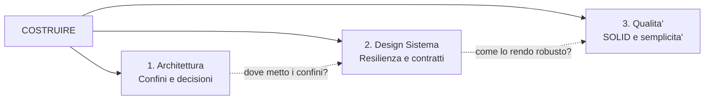
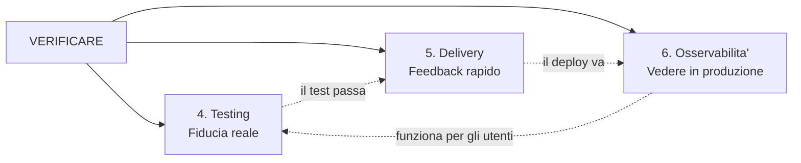
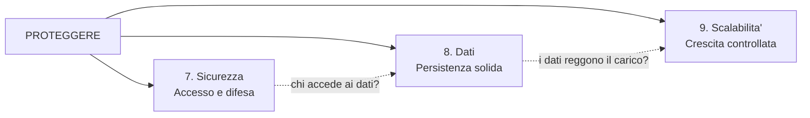
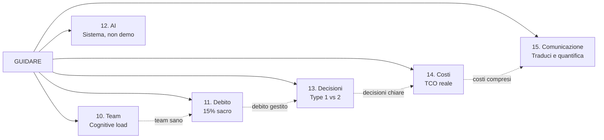
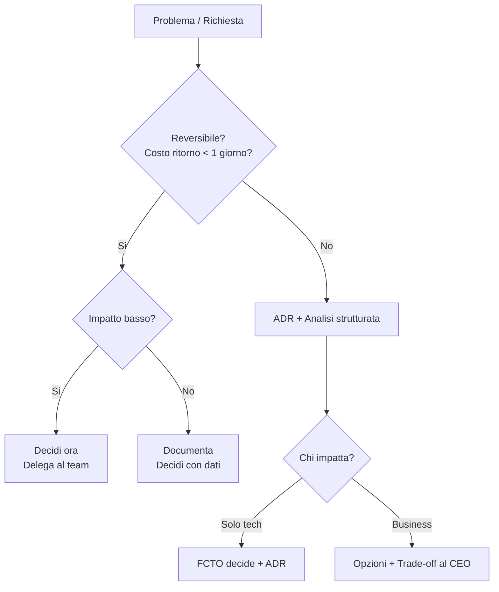

# Mappa Navigabile — Principi Tecnici FCTO

> Naviga per macro-area o per singolo pilastro. Ogni scheda e' autosufficiente: essenza, concetti, test rapido, azione.

---

## Indice

| # | Pilastro | Essenza in 5 parole | Vai a |
|---|----------|---------------------|-------|
| | **COSTRUIRE** | *Cosa e come* | [Mappa →](#costruire) |
| 1 | Architettura | Trade-off, non dogma | [Scheda →](#1-architettura) |
| 2 | Design Sistema | Ogni chiamata fallira' | [Scheda →](#2-design-sistema) |
| 3 | Qualita' Software | Testa senza avviare tutto | [Scheda →](#3-qualita-software) |
| | **VERIFICARE** | *Come sappiamo che funziona* | [Mappa →](#verificare) |
| 4 | Testing | Comportamento, non implementazione | [Scheda →](#4-testing) |
| 5 | Delivery CI/CD | Deploy noioso, release decisione | [Scheda →](#5-delivery-cicd) |
| 6 | Osservabilita' | No debugger in prod | [Scheda →](#6-osservabilita) |
| | **PROTEGGERE** | *Come lo difendiamo* | [Mappa →](#proteggere) |
| 7 | Sicurezza | Default = negare accesso | [Scheda →](#7-sicurezza) |
| 8 | Dati | PostgreSQL a meno che... | [Scheda →](#8-dati) |
| 9 | Scalabilita' | Verticale finche' conviene | [Scheda →](#9-scalabilita) |
| | **GUIDARE** | *Come funzionano le persone* | [Mappa →](#guidare) |
| 10 | Team | Semplifica il sistema | [Scheda →](#10-team) |
| 11 | Debito Tecnico | 15% non negoziabile | [Scheda →](#11-debito-tecnico) |
| 12 | AI Engineering | Sistema, non demo | [Scheda →](#12-ai-engineering) |
| 13 | Decisioni | Reversibile = decidi ora | [Scheda →](#13-decisioni) |
| 14 | Costi | Build core, buy rest | [Scheda →](#14-costi) |
| 15 | Comunicazione | Mai sorprese, quantifica | [Scheda →](#15-comunicazione) |

**Navigazione rapida:** [Per situazione cliente →](#il-cliente-mi-chiede) | [Manifesto tascabile →](#manifesto-tascabile) | [Flusso decisionale →](#flusso-decisionale)

---

## COSTRUIRE

> Domanda guida: "Cosa stiamo costruendo e come?"



**Filo logico:** Prima definisci i confini (Architettura), poi rendi robusto cio' che attraversa quei confini (Design), poi mantieni pulito il codice dentro ogni confine (Qualita').

---

### 1. Architettura

**Essenza:** L'architettura non e' "fare la scelta giusta" — e' rendere esplicito cosa sacrifichi per cosa ottieni.

| Concetto | Sintesi | Domanda-test |
|----------|---------|--------------|
| Trade-off espliciti | Non esiste "giusto". Esiste "adatto a questo contesto, pagando questo costo". | Quale qualita' stai sacrificando? |
| Fitness Functions | Un principio che non puoi misurare e' decorazione. Scrivi 3-5 metriche automatiche. | Puoi verificare automaticamente se l'architettura e' rispettata? |
| ADR | Se non e' scritto, tra 6 mesi nessuno ricorda perche'. Formato: contesto, decisione, conseguenze. | C'e' un ADR per ogni decisione irreversibile? |
| Bounded Context | "Cliente" per Sales ≠ "Cliente" per Fatturazione. Stessa parola, significato diverso = confine. | I team usano gli stessi termini con lo stesso significato? |
| Conway's Law | L'architettura rispecchia l'org chart. Se vuoi cambiarla, cambia prima la comunicazione. | Chi parla con chi? Il codice rispecchia quei flussi? |
| Modular Monolith | Non estrarre un microservizio finche' il confine non esiste gia' nel codice, dominio, dati E team. | Team < 10? Dominio instabile? → Monolite modulare. |

**Red flag:** Buzzword senza trade-off ("facciamo microservizi perche' e' best practice").

**Azione FCTO:** Definisci 3-5 fitness functions, scrivi ADR, identifica i bounded context dal linguaggio del business.

---

### 2. Design Sistema

**Essenza:** Ogni sistema distribuito fallira'. La domanda non e' SE ma QUANDO — e cosa succede in quel momento.

| Concetto | Sintesi | Domanda-test |
|----------|---------|--------------|
| Fallimento certo | Mai progettare assumendo che il provider risponda subito e correttamente. | "Cosa succede se X e' down 5 minuti?" |
| Idempotenza | Chiamare 1 volta o 5 = stesso risultato. Senza idempotenza, i retry corrompono i dati. | Le operazioni critiche sono idempotenti? |
| Async dove possibile | Se non serve la risposta ORA, mettilo in coda. Sincrono = nemico della scala. | Questo flusso DEVE essere sincrono? |
| Fallback | "X e' down. E adesso?" — se la risposta e' "tutto si blocca", hai un SPOF. | Ogni dipendenza critica ha un fallback? |
| API-First | Contratto prima, codice dopo. RFC 7807 per errori. Versione nel path. No PII in URL. | L'API spec esiste PRIMA del codice? |

**Pattern di resilienza — B-T-R-C** (dall'esterno verso l'interno):

```
Bulkhead → Timeout → Retry (expo backoff) → Circuit Breaker
  "Isola"   "Non aspetto     "Riprovo         "Se continua a
             per sempre"      con calma"        fallire, smetto"
```

**Red flag:** Nessun timeout, nessun circuit breaker su chiamate esterne.

**Azione FCTO:** Implementa B-T-R-C su ogni integrazione. Definisci fallback per ogni dipendenza critica.

---

### 3. Qualita' Software

**Essenza:** SOLID non e' dogma da applicare tutto. Due principi contano davvero: SRP (una responsabilita') e DIP (dipendi da astrazioni, non da concreti).

| Concetto | Sintesi | Domanda-test |
|----------|---------|--------------|
| SRP | Descrivi cosa fa la classe SENZA usare "e" o "oppure". Se non ci riesci, ha troppe responsabilita'. | Quante ragioni ha per cambiare? |
| DIP | Se per testare devi avviare database, framework e 3 servizi → le dipendenze sono invertite. | Puoi testare senza avviare l'intero sistema? |
| Clean Architecture | Le dipendenze puntano verso l'interno. La business logic NON sa del framework. | La logica di dominio importa classi del framework? |
| Coupling basso | 1 feature = quanti file tocchi? Se > 8 file in 4+ directory = troppo accoppiato. | Un cambio qui forza cambi altrove? |
| KISS / YAGNI | La soluzione piu' semplice per i requisiti di OGGI. Non costruire per "il futuro". | Quale problema specifico risolvi ORA? |

**Red flag:** 1 feature = 8+ file modificati. "Stiamo costruendo un'astrazione per il futuro."

**Azione FCTO:** Inverti le dipendenze. Estrai la logica in domain service puro. Elimina codice "per il futuro".

---

## VERIFICARE

> Domanda guida: "Come sappiamo che funziona?"



**Filo logico:** I test costruiscono fiducia PRE-deploy (Testing), la pipeline la verifica in minuti (Delivery), l'osservabilita' la mantiene POST-deploy (Osservabilita'). Un ciclo continuo.

---

### 4. Testing

**Essenza:** Coverage alto non significa fiducia alta. Un test utile verifica COSA fa il sistema, non COME lo fa internamente.

| Concetto | Sintesi | Domanda-test |
|----------|---------|--------------|
| Coverage ≠ fiducia | 90% coverage su getter/setter = 0% fiducia sui flussi critici. | I test proteggono i flussi che il business riconosce? |
| Comportamento, non impl. | Se refactorizzi senza cambiare output e il test si rompe → il test e' sbagliato. | I test reggono un refactoring interno? |
| Piramide | Molti unit veloci, medi integration sui confini, pochi E2E business-critical. | Quanti secondi impiega la test suite? |
| Contract test | Se team diversi rilasciano indipendentemente, senza contract test il deploy e' una scommessa. | C'e' un contratto verificato tra i servizi? |
| Testabilita' = architettura | Se testare e' difficile, la logica e' nel posto sbagliato (non manca il test — manca il design). | E' difficile per ragioni di design o di tool? |

**Red flag:** 500 unit test su getter + 0 integration test su DB. Test che si rompono ad ogni refactoring.

**Azione FCTO:** Integration test sui flussi critici. Contract test tra team. Elimina test fragili.

---

### 5. Delivery CI/CD

**Essenza:** Deploy e' un evento tecnico noioso. Release e' una decisione di prodotto. Separarli ti da' il controllo.

| Concetto | Sintesi | Domanda-test |
|----------|---------|--------------|
| Deploy ≠ Release | Puoi deployare codice spento (feature flag) e accenderlo quando vuoi. | Il deploy richiede una decisione business? Se si', sono accoppiati. |
| Feedback < 10 min | Una pipeline lenta insegna al team ad aggirarla. Velocita' = fiducia. | Quanto tempo tra push e feedback verde/rosso? |
| Trunk-based | Branch > 3 giorni = debito di integrazione. Merge piccoli, frequenti. | Ci sono branch vivi da piu' di 3 giorni? |
| Feature Flags | Deploya incompleto, rilascia graduale, kill switch istantaneo se qualcosa va storto. | Puoi spegnere una feature senza rilascio? |
| Rollback < 5 min | Se non puoi tornare indietro in 5 minuti, non andare avanti. | Quanto tempo serve per il rollback? |

**Red flag:** Branch > 3 giorni. Deploy manuale via SSH. "Non possiamo rollbackare."

**Azione FCTO:** Trunk-based + pipeline automatica + feature flags + rollback plan documentato.

---

### 6. Osservabilita'

**Essenza:** In produzione non hai il debugger. Hai tre strumenti: Log, Metriche, Trace. Se manca uno dei tre, sei cieco.

| Concetto | Sintesi | Domanda-test |
|----------|---------|--------------|
| 3 Pilastri (L-M-T) | **Log** = cosa e' successo. **Metriche** = quanto va bene/male. **Trace** = dove e' passata la richiesta. | Hai tutti e tre attivi su ogni servizio? |
| Golden Signals (L-T-E-S) | **Latency**, **Traffic**, **Errors**, **Saturation** — le 4 metriche che contano su ogni servizio. | Hai una dashboard con questi 4? |
| Log strutturato | JSON su stdout. Campi: timestamp, level, message, service.name, trace_id, span_id. Mai PII. | I log sono parsabili da una macchina? |
| Correlation ID | Un trace_id segue la richiesta attraverso tutti i servizi. Senza, ricostruire un incident e' impossibile. | Puoi seguire una richiesta end-to-end? |
| SLA > SLO > SLI | SLA = promessa al cliente. SLO = target interno. SLI = metrica misurata. | Hai SLO definiti? Li misuri? |

**Red flag:** Log su file. Niente trace_id. "L'abbiamo scoperto perche' ha chiamato il cliente."

**Azione FCTO:** JSON stdout + correlation ID + dashboard Golden Signals + SLO per servizio critico.

---

## PROTEGGERE

> Domanda guida: "Come lo difendiamo?"



**Filo logico:** Prima proteggi l'accesso (Sicurezza), poi assicura l'integrita' dei dati (Dati), poi garantisci che regga sotto carico (Scalabilita').

---

### 7. Sicurezza

**Essenza:** Quando qualcosa va storto, il default e' NEGARE accesso. Non il contrario.

| Concetto | Sintesi | Domanda-test |
|----------|---------|--------------|
| Least Privilege | Ogni componente ha solo i permessi minimi per funzionare. Mai "admin per comodita'". | Questo servizio ha piu' permessi del necessario? |
| Defense in Depth | Piu' livelli di difesa. Se uno cade, il successivo tiene. | Se bypasso il WAF, cosa mi ferma? |
| Zero Trust | Nessuna fiducia implicita. Verifica sempre, anche dentro la rete. | I servizi interni autenticano tra loro? |
| Fail Secure | Se il sistema di auth e' down, il default e' "negare" — non "permettere tutto". | Cosa succede se l'identity provider e' down? |

**4 cose che il FCTO assicura:**
1. Threat modeling su feature critiche (trimestrale)
2. SAST + dependency scan + secret detection in CI
3. Processo incident response documentato e testato
4. Credenziali MAI in codice, log, env del laptop

**Red flag:** No SAST in CI. Secret nel repo. "Non abbiamo un piano incident."

**Azione FCTO:** SAST + dep scan + secret detection in CI. Threat model trimestrale. IR plan documentato.

---

### 8. Dati

**Essenza:** Se non hai un motivo specifico per altro, parti da PostgreSQL. Versiona lo schema. Caccia gli N+1.

| Concetto | Sintesi | Domanda-test |
|----------|---------|--------------|
| PostgreSQL default | Copre il 90% dei casi (relazionale, JSON, full-text, geo). Scegli altro solo con motivo specifico. | Perche' NON PostgreSQL? (se non sai rispondere, usa Postgres) |
| Schema versionato | Ogni cambio schema in un file di migrazione numerato, tracciato in git. Mai manuale in prod. | Le migrazioni sono in git e automatizzate? |
| Backward-compatible | La vecchia versione dell'app deve ancora funzionare con il nuovo schema (deploy blue-green). | Se faccio rollback dell'app, il DB regge? |
| N+1 killer | > 10 query per request nel log = probabilmente N+1 nascosto. Il killer silenzioso della performance. | Il log mostra query ripetute per la stessa request? |

**Red flag:** Migrazioni manuali in prod. Nessun eager loading. Schema senza versioning.

**Azione FCTO:** Flyway/Liquibase obbligatorio. Monitor query count per request. Projections + JOIN.

---

### 9. Scalabilita'

**Essenza:** Scala verticalmente (macchina piu' grossa) finche' costa meno dell'engineering necessario per scalare orizzontalmente.

| Concetto | Sintesi | Domanda-test |
|----------|---------|--------------|
| Verticale prima | Una macchina con piu' RAM/CPU e' spesso piu' economica di riscrivere per lo scale-out. | Hai esaurito il verticale? O stai scalando per sport? |
| Cache 80/20 | Il 20% dei dati serve l'80% delle richieste. Cacha solo quello. | Stai cachando tutto o solo l'hot path? |
| Load test 2x | Testa sempre a 2x il picco atteso PRIMA del lancio. Non dopo l'incidente. | Hai un load test automatizzato? |
| Invalidazione | La cache e' la causa #1 di bug in produzione. Strategia di invalidazione PRIMA di cachare. | Come invalidi la cache quando il dato cambia? |

**4 livelli di cache:**
```
Browser (Cache-Control) → CDN (TTL + purge) → Application (TTL + evento) → Database (query cache)
```

**Red flag:** Cache senza strategia di invalidazione. No load test pre-lancio. "Dobbiamo scalare" senza aver provato vertical.

**Azione FCTO:** Load test con k6 a 2x picco. Cache il 20% hot con invalidazione chiara. Verticale prima.

---

## GUIDARE

> Domanda guida: "Come facciamo funzionare le persone?"



**Filo logico:** Un team con carico sostenibile (Team) gestisce il debito (Debito), prende decisioni informate (Decisioni) su tecnologie inclusa l'AI (AI Engineering), controlla i costi (Costi) e comunica tutto al business (Comunicazione).

---

### 10. Team

**Essenza:** Se il team non riesce a tenere tutto in testa, il problema e' il sistema — non il team. Semplifica il sistema, non aggiungere documentazione.

| Concetto | Sintesi | Domanda-test |
|----------|---------|--------------|
| 4 Team Types | Stream-aligned (valore), Enabling (aiuta), Platform (self-service), Complicated Subsystem (isola complessita'). | Ogni team sa quale tipo e'? |
| Cognitive Load | Se "chi sa come funziona X?" si sente ogni giorno → il sistema e' troppo complesso per il team. | Un dev nuovo e' autonomo in < 4 settimane? |
| Developer Experience | Setup < 30 min. Code review < 4h. Deploy senza ticket. | Quanta friction c'e' tra "scrivo" e "funziona in prod"? |

**Segnali di allarme cognitive load:**
- "Chi sa come funziona X?" (troppo spesso)
- Code review che durano giorni
- Onboarding che dura mesi
- "Nessuno tocca quel modulo"

**Red flag:** Onboarding > 2 mesi. "Solo Mario sa come funziona." Review > 48h.

**Azione FCTO:** Riduci scope per team. Setup < 30 min. Elimina knowledge silos. Semplifica prima di documentare.

---

### 11. Debito Tecnico

**Essenza:** 15% di ogni sprint per debito tecnico. Non e' negoziabile — e' manutenzione. Ma non dire "debito tecnico" al business.

| Concetto | Sintesi | Domanda-test |
|----------|---------|--------------|
| 4 Quadranti | Prudente/Imprudente x Deliberato/Involontario. Non tutto il debito e' uguale. | Questo debito e' stato una scelta consapevole? |
| Regola 15% | Ogni sprint, 15% della capacity va in riduzione debito. Non si rimanda. | C'e' un budget fisso per il debito nello sprint? |
| Comunicare al business | NON dire "debito tecnico". DI': "La prossima feature costera' 3x e ha 40% rischio incidente." | Il business capisce il costo del non-fare? |

**Priorita' debito:**
1. **Blocca feature** → risolvi subito (ROI immediato)
2. **Codice modificato spesso** → alto ROI (lo tocchi comunque)
3. **Codice stabile** → lascia stare (non costa niente dov'e')

**Red flag:** "Non abbiamo tempo per i test." Codice che nessuno osa toccare. Zero sprint allocation.

**Azione FCTO:** 15% fisso. Prioritizza per impatto. Comunica al business in EUR/tempo/rischio.

---

### 12. AI Engineering

**Essenza:** Una demo AI mostra possibilita'. Un sistema AI produttivo gestisce i fallimenti. Senza evaluation, non sai se hai un sistema o una slot machine.

| Concetto | Sintesi | Domanda-test |
|----------|---------|--------------|
| Sistema, non demo | In produzione servono: input validation, guardrail, fallback, monitoring, costi, human review. | Cosa succede quando l'LLM risponde male? |
| Eval prima di entusiasmo | Senza golden dataset + metriche automatiche, non puoi misurare se migliora o peggiora. | Hai un golden dataset? Come misuri la qualita'? |
| Cost routing 3 tier | Non usare il modello costoso per tutto. 90% dei task va sul tier economico. | Sai quanto costa per request? |

**5 Rischi AI da gestire:** Prompt injection, Data leakage, Hallucination, Cost explosion, Over-trust

**Cost routing:**
| Tier | Uso | Costo relativo |
|------|-----|----------------|
| Haiku/Mini | Classificazione, routing, estrazione semplice | 1x |
| Sonnet/Medium | Generazione, coding, analisi | 10x |
| Opus/Large | Decisioni critiche, ragionamento complesso | 50x |

**Red flag:** "Proviamolo e vediamo" senza metriche. Modello costoso per tutto. Nessun guardrail.

**Azione FCTO:** Golden dataset + eval automatica + 3 tier routing + guardrail + budget alert.

---

### 13. Decisioni

**Essenza:** Se puoi tornare indietro in meno di 1 giorno, decidi subito. Se non puoi, scrivi un ADR e usa dati.

| Concetto | Sintesi | Domanda-test |
|----------|---------|--------------|
| Type 1 (irreversibili) | DB primario, linguaggio, architettura, contratti API, cloud provider. ADR obbligatorio. | Quanto costa tornare indietro? |
| Type 2 (reversibili) | Library, formato log, struttura directory, tool CI. Decidi e vai. | Lo puoi cambiare in < 1 giorno? |
| Framework > decisioni | Il FCTO non prende ogni decisione. Crea i criteri con cui il team decide da solo. | Il team sa decidere senza di te? |

**Come governa il FCTO:**
1. **Decide** le Type 1 (con ADR + dati)
2. **Delega** le Type 2 (il team e' autonomo)
3. **Crea framework** decisionali (criteri, non risposte)
4. **Revisiona** ogni quarter

**Red flag:** Decisioni irreversibili prese in fretta. "Perche' l'abbiamo fatto?" dopo 6 mesi. Tutto centralizzato.

**Azione FCTO:** Classifica ogni decisione Type1/Type2. ADR per Type1. Delega Type2. Review quarter.

---

### 14. Costi

**Essenza:** Lo sviluppo iniziale e' il 20% del costo totale. Il restante 80% e' manutenzione, infra e incidenti. Costruisci solo il core — compra il resto.

| Concetto | Sintesi | Domanda-test |
|----------|---------|--------------|
| TCO reale | 20-30% sviluppo, 50-60% manutenzione, 10-20% infra, 5-15% incidenti. | Stai guardando il costo totale o solo il build? |
| Build core, Buy rest | Build SOLO cio' che ti differenzia. Tutto il resto: compra/usa SaaS. L'ego tecnico non e' un criterio. | Questo "build" e' su core differenziante? |
| FinOps | Tag su ogni risorsa cloud. Alert a 50%, 80%, 100% del budget. Review mensile. | Sai quanto spendi per servizio? |

**Distribuzione TCO reale:**
```
[===========] 20-30%  Sviluppo iniziale (il piu' visibile, meno rilevante)
[=================================] 50-60%  Manutenzione ed evoluzione (dove si spende)
[========] 10-20%  Infrastruttura
[=====] 5-15%  Incidenti e downtime
```

**Red flag:** "Costruiamo il nostro framework di auth." Budget cloud senza tag. Nessun alert costi.

**Azione FCTO:** Buy non-core. Tag cloud resources. Budget alert 50/80/100%. Review mensile costi.

---

### 15. Comunicazione

**Essenza:** Il CEO non capisce "debito tecnico". Capisce "le modifiche costano il doppio e c'e' il 40% di rischio incidente". Traduci, quantifica, mai sorprese.

| Tecnico | Traduzione business |
|---------|---------------------|
| Debito tecnico | "Le modifiche costano il doppio del previsto" |
| Microservizi | "Ogni team rilascia senza aspettare gli altri" |
| Test automatizzati | "Sappiamo in 8 minuti se qualcosa e' rotto" |
| CI/CD | "Rilasciamo in 20 minuti, non in 2 giorni" |
| Observability | "Sappiamo di un problema in 30 secondi, non quando chiama il cliente" |
| Feature flag | "Accendiamo/spegniamo senza rilascio" |

**3 regole d'oro:**
1. **Mai sorprese** — comunica PRIMA che diventi un problema
2. **Sempre opzioni** — almeno 2 con trade-off espliciti
3. **Quantifica** — "Costa 30K/anno in velocity persa" non "c'e' del debito"

**Red flag:** "Abbiamo debito tecnico" (senza quantificare). Incidente scoperto dal cliente. Zero report periodici.

**Azione FCTO:** Report mensile. Ogni comunicazione: impatto in EUR/tempo/rischio. Comunica PRIMA.

---

## Il cliente mi chiede...

> Navigazione rapida per situazione reale.

| Richiesta del cliente | Pilastro | Domanda chiave da fare |
|-----------------------|----------|------------------------|
| "Fare microservizi" | [1. Architettura](#1-architettura) | Team < 10? Confini gia' stabilizzati nel codice? |
| "Scalare per piu' utenti" | [9. Scalabilita'](#9-scalabilita) | Hai esaurito il verticale? Load test fatto? |
| "Aggiungere AI" | [12. AI Engineering](#12-ai-engineering) | Hai un golden dataset? Budget token definito? |
| "Velocizzare i rilasci" | [5. Delivery](#5-delivery-cicd) | Pipeline < 10 min? Branch < 3 giorni? |
| "Risolvere bug in produzione" | [6. Osservabilita'](#6-osservabilita) | Hai log JSON + trace + dashboard Golden Signals? |
| "Ridurre i costi" | [14. Costi](#14-costi) | Dove spendi davvero? (Hint: 80% e' post-dev) |
| "Il team e' lento" | [10. Team](#10-team) | Cognitive load sostenibile? Quanta friction nel workflow? |
| "Riscrivere tutto" | [11. Debito Tecnico](#11-debito-tecnico) | Quale quadrante? Costo/rischio rewrite vs refactor? |
| "Rendere sicuro il sistema" | [7. Sicurezza](#7-sicurezza) | Threat model fatto? SAST in CI? IR plan? |
| "Scegliere il database" | [8. Dati](#8-dati) | PostgreSQL a meno che... (motivo specifico?) |
| "Il CEO vuole un report tecnico" | [15. Comunicazione](#15-comunicazione) | Traduci in EUR/tempo/rischio. Mai "debito tecnico". |
| "Decidere tra X e Y" | [13. Decisioni](#13-decisioni) | E' reversibile? Se si', decidi e vai. Se no, ADR + dati. |

---

## Flusso decisionale



---

## Manifesto tascabile

> 15 frasi — una per pilastro. Se ricordi queste, ricordi l'essenziale.

| # | Frase |
|---|-------|
| 1 | Non esiste giusto, esiste adatto |
| 2 | Non SE fallira', ma QUANDO |
| 3 | Descrivi senza "e" o "oppure" |
| 4 | Coverage alto, fiducia zero |
| 5 | Deploy noioso, release decisione |
| 6 | No debugger in prod — solo Log, Metriche, Trace |
| 7 | Default = negare accesso |
| 8 | PostgreSQL a meno che... |
| 9 | Scala verticale finche' costa meno |
| 10 | Semplifica il sistema, non documentare |
| 11 | 15% non negoziabile |
| 12 | Sistema, non demo |
| 13 | Reversibile = decidi ora |
| 14 | Build core, buy rest |
| 15 | Mai sorprese, sempre opzioni, quantifica |

---

*108 Vision — Costruiamo la direzione, non solo il codice.*
