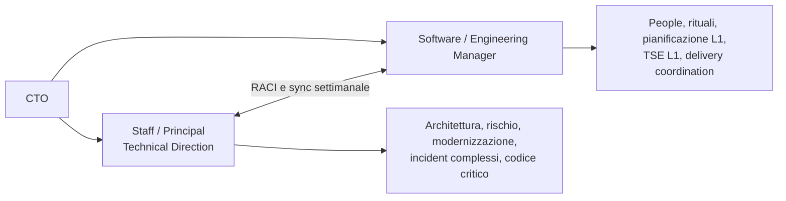

# Proposta a TicketOne — specializzare il mio ruolo sulla Direzione Tecnica

v2.0 | 2026-08-11 | Memo riservato per Emanuele (CTO)
Autore: Elios Scoglio | Stato: bozza da validare con evidenze interne

---

## Come usare il documento

- **Parte I**: memo da inviare o usare come traccia della conversazione.
- **Parte II**: allegato operativo per chiudere perimetro, transizione e criteri.
- Le note marcate `[da verificare]` non vanno presentate come risultati acquisiti.
- Obiettivo prioritario: **retention in TicketOne** con un ruolo Staff/Principal
  di Direzione Tecnica senza line management.

---

# PARTE I — Memo a Emanuele

**Oggetto:** Una proposta per usare meglio la mia seniority in TicketOne

Emanuele,

oggi il mio ruolo formale — **Head of Software Architecture & Development & AI
Engineer** — tiene insieme due lavori diversi:

1. direzione tecnica, architettura, incident complessi, evoluzione dei flussi e
   contributo operativo sui punti critici;
2. people management, escalation, sprint, TSE di primo livello e primo contatto
   per quasi ogni pianificazione.

Il secondo blocco assorbe circa il **70% del mio tempo** `[da misurare con un
time log]`. Il risultato non è solo personale: TicketOne usa una risorsa senior
e difficile da sostituire soprattutto come punto di smistamento organizzativo,
mentre restano meno spazio e continuità per le decisioni tecniche che riducono
rischio, accelerano il delivery e preparano la piattaforma al cambiamento.

## La proposta

Vorrei restare in TicketOne in un ruolo più netto di **Staff/Principal —
Technical Direction & Architecture**, riportando a te e senza line management.

Il mio perimetro diventerebbe:

- direzione architetturale e decisioni cross-team;
- ADR, standard e fitness function verificabili;
- rischio tecnico su on-sale, incidenti e flussi SPORT↔SETA/SUITE;
- modernizzazione e riduzione del debito che blocca il business;
- review, pair e anche codice sui punti ad alto leverage;
- coaching tecnico di Tech Lead e valutazione tecnica nell’hiring;
- adozione AI dove produce un risultato misurabile, con governance e fallback.

Un **Software/Engineering Manager** prenderebbe ownership di people management,
rituali, TSE L1, primo livello di pianificazione e interfaccia operativa con
PO/PM. Posso preparare la job description, partecipare alla selezione e
affiancarlo nella transizione.

## Perché conviene a TicketOne

Il valore non è teorico. I casi da trasformare in evidenza prima della call sono:

- **velocità di sviluppo**: intervento, baseline e delta `[da documentare]`;
- **incident management**: cambiamento introdotto e impatto su MTTR/escalation
  `[da documentare]`;
- **rilascio T-zone**: decisioni e rischio rimosso `[da documentare]`;
- **gestione dei flussi**: collo di bottiglia risolto e risultato
  `[da documentare]`.

La tesi è semplice: dove ho potuto lavorare su sistema, architettura e delivery,
ho creato leva. Lo status quo mi porta invece sul lavoro più delegabile e lascia
scoperto quello meno sostituibile.

## Come lo facciamo senza creare un vuoto

Propongo una transizione di **90 giorni**, non un cambio titolo:

1. chiudiamo RACI e ruolo target;
2. individuiamo o cerchiamo il manager;
3. trasferisco people/TSE/pianificazione con shadowing;
4. misuriamo continuità operativa e maggiore capacità tecnica;
5. al giorno 90 decidiamo su dati se il modello regge.

Il bonus di fine anno resta una conversazione separata sul compenso. Questa è
una proposta di operating model e retention.

Se sei d’accordo sul problema, facciamo una sessione dedicata di 60 minuti e
usciamo con RACI, profilo del manager e primi tre risultati tecnici attesi.

Elios

---

# PARTE II — Allegato operativo

## 1. Problema organizzativo da risolvere

### Sintomo

Un solo ruolo è contemporaneamente:

- responsabile tecnico;
- line manager di 8 dev, 3 QA, 2 PO e 2 PM `[organigramma da confermare]`;
- escalation people;
- owner di rituali e sprint;
- TSE di primo livello;
- primo contatto di pianificazione;
- escalation sugli incidenti difficili.

### Rischio per TicketOne

| Rischio | Effetto |
|---|---|
| Seniority dispersa | Le decisioni strutturali competono con urgenze e coordinamento |
| Collo di bottiglia | Pianificazione ed escalation convergono su una persona |
| Debito non governato | La modernizzazione perde contro il lavoro quotidiano |
| Successione fragile | Né people management né direzione tecnica hanno un secondo owner |
| Retention | Il modello non è sostenibile per la persona nel ruolo |

### Decisione proposta

Separare due responsabilità entrambe necessarie:

## 2. Modello target

### Ruolo proposto per Elios

**Titolo di lavoro:** Staff/Principal — Technical Direction & Architecture
**Reporting:** CTO
**Line management:** nessuno
**Modalità:** full-time TicketOne; flessibilità eventuale trattata separatamente

### Cinque responsabilità

1. **Direzione:** roadmap tecnica rolling collegata ai rischi e alle priorità di
   business.
2. **Architettura:** ADR, boundary, integrazioni, resilienza e fitness function.
3. **Delivery engineering:** testabilità, CI/CD, osservabilità e riduzione della
   latenza dal cambiamento al rilascio.
4. **Hot-path operativo:** review, pair, spike e codice quando l’intervento
   diretto sblocca un rischio o trasferisce conoscenza.
5. **Capacità tecnica del team:** mentoring dei Tech Lead, hiring assessment,
   standard e adozione AI governata.

### Cosa non diventa

- un “architetto da slide” separato dal codice;
- un developer assegnato stabilmente a uno sprint;
- il PM ombra dei progetti;
- un sostituto informale dell’Engineering Manager;
- il punto di escalation per ogni problema di primo livello.

## 3. RACI essenziale

Legenda: **A** accountable, **R** responsible, **C** consulted, **I** informed.

| Attività | CTO | Technical Direction | Engineering Manager | TL / PO / PM |
|---|---:|---:|---:|---:|
| Strategia e priorità tecnologiche | A | R | C | C |
| ADR e standard architetturali | C | A/R | C | R/C |
| Modernizzazione SPORT↔SETA/SUITE | A | R | C | C |
| Incidenti critici / problem management | I | A/R tecnico | R coordinamento | R |
| People, performance, ferie, conflitti | I | I/C tecnico | A/R | C |
| Sprint e rituali | I | C selettivo | A | R |
| Pianificazione L1 | I | C sui trade-off | A/R | R |
| TSE L1 | I | escalation tecnica | A/R | R |
| Hiring | A | R assessment tecnico | R processo/people | C |
| Coaching Tech Lead | I | A/R tecnico | R people | C |
| Codice / spike critici | I | R selettivo | I | A/R delivery |

## 4. Profilo Software / Engineering Manager

### Missione

Rendere prevedibile il sistema di delivery e sostenibile il sistema people,
senza usare la Direzione Tecnica come sportello operativo universale.

### Ownership

- line management e performance cycle;
- escalation people e conflitti;
- cadenza dei rituali e health del delivery;
- TSE e triage di primo livello;
- pianificazione con PO/PM e gestione dipendenze;
- reporting operativo e capacity;
- crescita organizzativa dei Tech Lead.

### Requisiti da validare nella ricerca

- esperienza reale su team software multi-ruolo;
- capacità di leggere metriche di flow senza usarle come target individuali;
- competenza tecnica sufficiente per distinguere escalation e delega;
- gestione incidenti e stakeholder;
- leadership senza micro-management;
- inglese e lavoro cross-country.

### Mio contributo alla successione

- job description e scorecard;
- colloqui tecnici e scenario interview;
- mappa stakeholder, rituali e responsabilità correnti;
- shadowing e handover 4–6 settimane;
- retro con CTO e nuovo manager a 30/60/90 giorni.

## 5. Piano di transizione a 90 giorni

| Finestra | People / organizzazione | Direzione tecnica | Gate |
|---|---|---|---|
| 0–15 | Conferma organigramma, RACI, sponsor HR | Baseline tempo e backlog decisioni | CTO approva modello e ricerca |
| 16–30 | JD, shortlist interna/esterna, owner temporanei | Prime 3 decisioni/ADR prioritarie | Nessuna escalation senza owner |
| 31–60 | Selezione e shadowing manager | Roadmap 90 gg, risk register, fitness function iniziali | Manager selezionato o fallback interno |
| 61–75 | Trasferimento people, sprint, TSE e planning L1 | Review/codice su 1–2 hot path | <30% tempo Elios su people |
| 76–90 | Manager accountable e comunicazione definitiva | Tech Update al CTO con outcome e rischi | Go/no-go sul modello target |

### Rollback

Se al giorno 60 non esiste un manager selezionato:

1. nominare un interim con perimetro e durata;
2. ridurre esplicitamente il numero di attività, non ricomprimerle sul vecchio
   ruolo;
3. rivedere la data del passaggio con decisione scritta del CTO.

## 6. KPI della transizione

I target numerici vanno fissati dopo 2 settimane di baseline.

| KPI | Baseline | Target 90 gg | Fonte |
|---|---|---|---|
| Tempo Elios su people / coordinamento L1 | ~70% `[da misurare]` | <20–30% | Time log settimanale |
| Decisioni architetturali senza owner | `[da raccogliere]` | 0 critiche | Decision backlog |
| Tempo richiesta → decisione tecnica | `[da raccogliere]` | miglioramento concordato | ADR log |
| Incidenti critici senza postmortem/owner | `[da raccogliere]` | 0 | Incident register |
| Regressioni on-sale durante transizione | 0 atteso | 0 | Incident / on-sale report |
| People escalation gestite dal nuovo manager | 0 | 100% del perimetro | Log manager/CTO |

## 7. Evidence pack da preparare prima della call

Per ogni risultato: **contesto → mio intervento → outcome → fonte**.

| Caso | Domanda da chiudere | Fonte minima |
|---|---|---|
| Velocità sviluppo | Quale metrica? Da quando a quando? Su quale team? | Jira/flow report |
| Incident management | È calato MTTR, numero P1 o latenza escalation? | Incident report |
| T-zone | Quale rischio/tempo/costo è stato rimosso? | Release/decision log |
| Flussi | Quale collo di bottiglia e quale delta? | Process map + KPI |
| Architettura | Quali decisioni hanno evitato rework o incidenti? | ADR/design doc |
| AI engineering | Quale attività migliorata senza rischio qualità/security? | Baseline + report |

**Regola:** il `+60%` non entra nel memo o nella call finché questa tabella non
ha una fonte difendibile.

## 8. Opzioni di retention

### A — Preferita: Staff/Principal interno

Full-time TicketOne, nessuna line, Engineering Manager affiancato. È l’opzione
che massimizza continuità e usa meglio la seniority.

### B — Fallback: transizione progressiva

Stesso obiettivo, ma people management trasferito per blocchi in 90 giorni a
uno o più owner interni mentre si completa la ricerca.

### C — Da discutere solo se necessario: flessibilità contrattuale

Assetto con fino a 3 giorni flessibili per iniziative esterne, con:

- calendario e capacità scritti;
- blackout su on-sale e momenti critici concordati;
- gestione esplicita dei conflitti di interesse;
- SLA ed escalation realistici;
- review trimestrale.

Non è la proposta di apertura. È un’opzione di compatibilità se A/B non sono
possibili.

## 9. Sostenibilità, attività esterne e bonus

### Sostenibilità

Il people management continuativo è la componente che non voglio mantenere.
Non è indisponibilità alla responsabilità: propongo responsabilità più nette e
misurabili sul sistema tecnico. Il burnout è un segnale di design del ruolo, non
la tesi economica della proposta.

### 108 Vision e altre iniziative

Esiste un interesse professionale esterno reale. La priorità della proposta è
però restare e creare più valore in TicketOne. Compatibilità, tempi e conflitti
di interesse si discutono solo dopo aver condiviso il modello target.

### Bonus

Bonus di fine anno ed eventuale adeguamento del ruolo seguono il processo
compensation/HR. Non sono condizione implicita per discutere l’operating model.

## 10. Agenda della conversazione con Emanuele

1. Il problema per TicketOne: seniority dispersa e doppia ownership.
2. Le evidenze: T-zone, incident, flussi, delivery.
3. Il modello Staff/Principal + Engineering Manager.
4. Cosa resta / cosa passa, usando il RACI.
5. Transizione 90 giorni e fallback.
6. KPI e decisione successiva.
7. Solo alla fine: sostenibilità e compatibilità esterna.

### Decisioni da ottenere

- Confermiamo il problema?
- A è il modello target o preferisci B?
- Ricerca interna, esterna o entrambe?
- Chi sponsorizza headcount e processo HR?
- Quali tre outcome tecnici vuoi nei primi 90 giorni?
- Quando separiamo formalmente ruolo e bonus?

---

## Checklist personale pre-call

- [ ] Completare time log di due settimane.
- [ ] Confermare organigramma e responsabilità attuali.
- [ ] Preparare almeno tre schede evidence complete.
- [ ] Definire la red line personale se il people management resta invariato.
- [ ] Entrare con A come proposta, non con tre opzioni equivalenti.
- [ ] Non usare metriche non verificabili.
- [ ] Non aprire la conversazione con 108 Vision o con il bonus.

---

*Documento personale e riservato. Non è materiale commerciale 108 Vision.*
