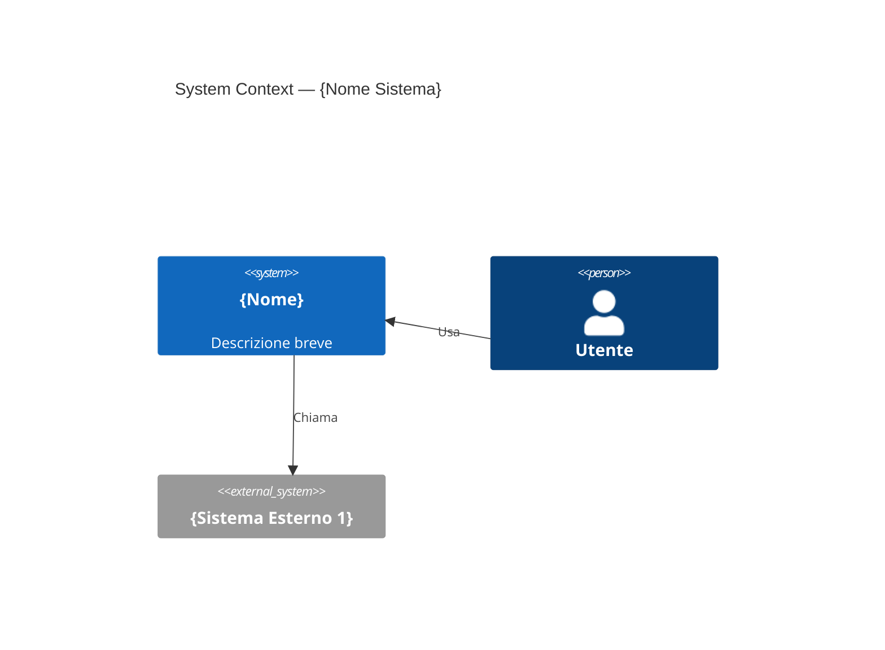
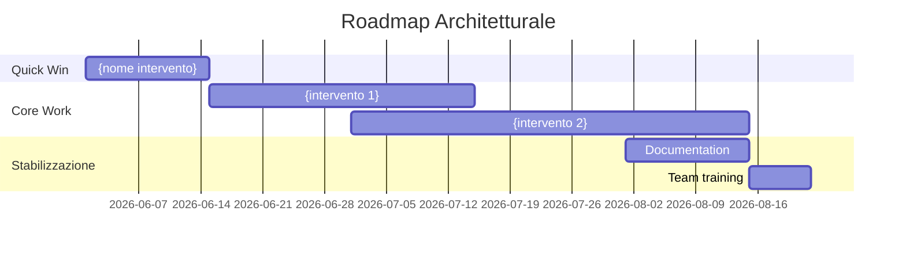
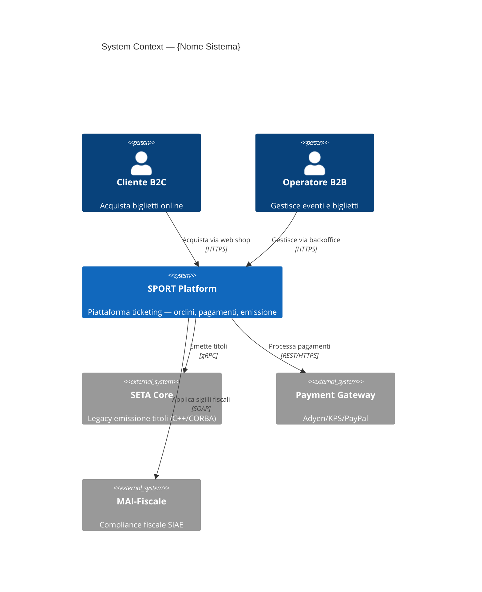
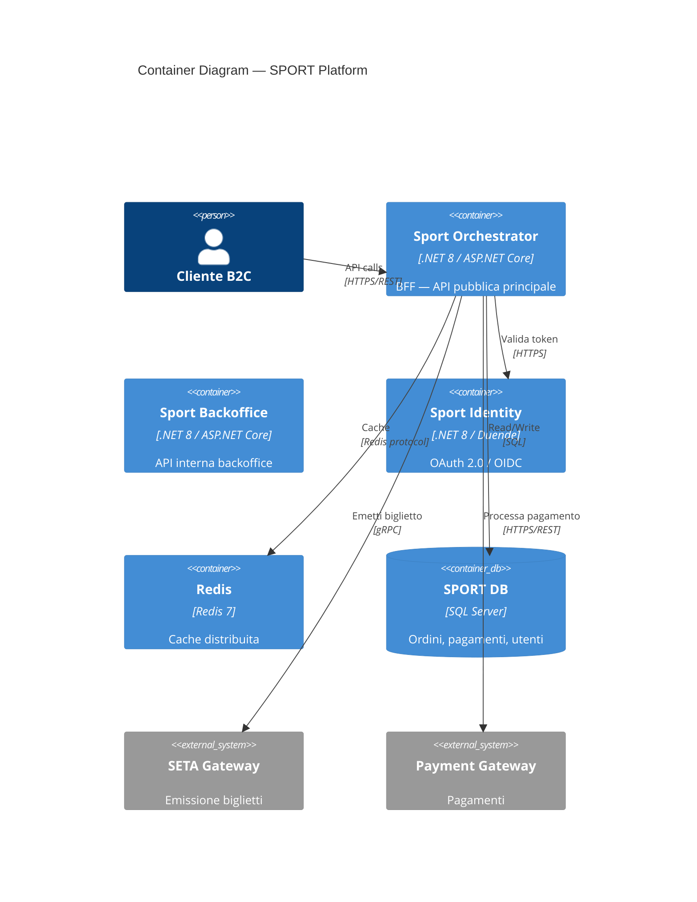

# Playbook — Tech Scaling & Architettura
**Guida operativa interna. Non mostrare al cliente.**

---

## Indice

1. [Il Servizio: Posizionamento e Qualificazione](#sezione-1)
2. [Il Framework: Architecture Review in 2-3 Giorni](#sezione-2)
3. [Monolite vs Microservizi: Framework Decisionale](#sezione-3)
4. [Il 90-Day Tech Transformation](#sezione-4)
5. [ADR: Architecture Decision Records](#sezione-5)
6. [Resilienza e Performance — Playbook Tecnico](#sezione-6)
7. [DDD per Clienti Reali](#sezione-7)
8. [Template e Checklist](#sezione-8)

---

## SEZIONE 1 — Il Servizio: Posizionamento e Qualificazione {#sezione-1}

### Cosa Vendo

| Servizio | Durata | Prezzo | Output |
|---|---|---|---|
| **Architecture Audit** | 2-3 giorni on-site + report | €12K–€20K | Report executive + technical, roadmap prioritizzata |
| **90-Day Tech Transformation** | 3 mesi, ~2 gg/settimana | €50K–€80K | Sistema trasformato, team formato, ADR scritti, KPI misurati |
| **Architecture Advisory** | Mensile, 4-8 ore/mese | €5K–€8K/mese | Review continua, mentorship tech lead, governance ADR |

Il pricing alto non è il problema. Il problema è qualificare bene. Un cliente che non capisce il valore dell'Architecture Audit a €15K non capirà nemmeno il valore della trasformazione. Perdere quel cliente è un guadagno.

### Cliente Ideale

**Profilo target:**
- Azienda con prodotto digitale **già in produzione** (non in sviluppo, non in pianificazione)
- Team 5–50 sviluppatori
- Uno o più di questi sintomi:
  - Deploy lenti o dolorosi ("deployiamo ogni 3 mesi perché fa paura")
  - Feature velocity in calo ("aggiungere una cosa nuova rompe sempre qualcos'altro")
  - Costi infrastrutturali sproporzionati rispetto al volume
  - Team senior che abbandona ("il codebase è illeggibile")
  - Scaling problem: l'on-sale va giù (questo lo conosco bene — TicketOne, 100K+ tx in pochi minuti)
  - Integrazione con sistemi terzi che "non si riesce a testare mai"

**Trigger d'acquisto reali:**
- Hanno appena avuto un incidente grave in produzione
- Stanno per assumere un CTO e vogliono capire cosa eredita
- Stanno valutando un'acquisizione (target o acquirente)
- Hanno appena chiuso un round e devono scalare il team da 5 a 20

**Settori dove ho credenziali reali:** ticketing, e-commerce, sistemi di compliance regolamentare (fiscale, polizia), piattaforme multi-tenant B2B/B2C.

### Red Flag — Non Accettare

Questi clienti non generano valore e consumano energia:

| Red Flag | Perché è un problema | Come uscire |
|---|---|---|
| "Siamo in fase di ideazione, non abbiamo ancora codice" | Non c'è niente da analizzare. Architettura su carta è filosofia, non consulenza. | "Il mio servizio richiede un sistema in produzione. Ricontattatemi quando avete utenti reali." |
| "Vorremmo che tu scrivessi anche il codice" | Confondono architettura con development. Se accetti, diventi un contractor junior con titolo di consulente. | "Io definisco l'architettura e guido il team nella realizzazione. L'implementazione resta al vostro team." |
| "Cerchiamo qualcuno che ci installi SonarQube e ci dica la coverage" | Problema di tooling, non di architettura. | "Quello che fate con SonarQube lo può fare un DevOps senior. Chiamatemi quando volete capire perché la coverage non corrisponde alla fiducia nel codice." |
| "Il CTO è contrario ma il CEO vuole farlo lo stesso" | Engagement politico. Senza buy-in tecnico, nessuna raccomandazione sarà implementata. | Incontra il CTO prima di firmare. Se non cambia atteggiamento, declina. |
| "Budget massimo €3K per l'audit" | Incompatibile col prezzo. Non trattare. | "Con €3K posso fare una sessione di 4 ore di assessment iniziale. Se volete un audit completo, il minimo è €12K." |

### Differenziarmi dai Tool Automatici

La domanda che mi fanno spesso: "Abbiamo già SonarQube/Codacy/Snyk. Perché pagarti?"

Risposta operativa da usare:

> "SonarQube vi dice che avete 2.400 code smell e una coverage del 43%. Non vi dice perché il vostro deploy richiede 4 ore, perché ogni nuova feature torna indietro 3 volte in QA, e perché i senior developer minacciano di andarsene. Io lavoro sui confini del sistema, sulle responsabilità dei team, sulla strategia di evoluzione. Non compete con SonarQube — viene dopo che SonarQube non basta più."

La differenziazione concreta:

| Tool automatico | Cosa fa | Cosa non fa |
|---|---|---|
| SonarQube | Conta bug, smell, duplicazioni | Non capisce se il bounded context è sbagliato |
| Codacy | Code quality metrics | Non capisce se stai costruendo un distributed monolith |
| Dependabot | Vulnerability nei package | Non capisce se la dipendenza ciclica tra servizi è il problema reale |
| Datadog/NewRelic | Osservabilità runtime | Non capisce perché la latenza alta è un problema di design, non di infrastruttura |

Il valore unico: **strategia, confini, responsabilità, decisioni esplicite**. Questo non si automatizza.

---

## SEZIONE 2 — Il Framework: Architecture Review in 2-3 Giorni {#sezione-2}

### Preparazione — Prima del Giorno 1

**Cosa richiedere al cliente (email 1 settimana prima):**

```
Gentile [Nome],

Per preparare la review in modo efficace, ho bisogno di:

1. Accesso in sola lettura al repository principale (o ai repo principali)
2. C4 diagrams o qualsiasi documentazione architetturale esistente
3. ADR esistenti (Architecture Decision Records), se presenti
4. Incident log degli ultimi 3 mesi (anche in forma anonimizzata)
5. Deployment frequency attuale (quante volte deployate al mese per ambiente)
6. Lead time misurabile (dal commit al deploy in produzione — media)
7. Lista dei 5 componenti/servizi che "fanno più paura" al team
8. Organigramma del team di sviluppo (team/squad, senior/junior)
9. Stack tecnologico completo (linguaggi, framework, DB, cloud/on-prem)
10. Accesso a un ambiente non-produzione per osservare il sistema live

Se alcune di queste informazioni non esistono o non sono disponibili,
comunicatemelo — è già un'informazione utile per la review.
```

Se non riescono a darmi l'incident log perché "non lo teniamo", ho già trovato il primo problema.

**10 Domande Pre-Review (email contestuale):**

1. Qual è il principal pain point che vi ha portato a questo audit?
2. Qual è la funzionalità più critica per il business (quella che, se smette di funzionare, perdete clienti in tempo reale)?
3. In questo momento, qual è il componente che nessuno vuole toccare? Perché?
4. Quanto tempo passa mediamente da una richiesta di feature al deploy in produzione?
5. Quante volte nell'ultimo anno avete avuto un incidente che ha impattato utenti finali?
6. Il team ha mai discusso di passare a microservizi? Qual era la motivazione?
7. Avete un processo di code review? È sistematico o ad hoc?
8. Come si fa il deploy oggi? Chi lo può fare? Quanto dura?
9. C'è documentazione aggiornata del sistema? Chi la mantiene?
10. Tra 12 mesi, cosa deve essere migliorato per considerare questo engagement un successo?

---

### Giorno 1 — Discovery

**Obiettivo:** capire il contesto business e i pain point tecnici. Non toccare ancora il codice in profondità.

**Interview CEO/CTO (2 ore):**

Domande chiave:
- "Qual è la vostra strategia di crescita a 12 mesi? Come il sistema tecnico la supporta o la ostacola?"
- "Se poteste cambiare una cosa del sistema tecnico oggi, quale sarebbe?"
- "Quando avete paura di un deploy? Cosa fa scattare quella paura?"
- "Il team tecnico vi parla di technical debt? Come rispondete di solito?"
- "Avete mai perso un cliente (o un'opportunità) per un limite tecnico?"

Quello che cerco:
- Distanza tra visione business e realtà tecnica
- Comprensione (o ignoranza) del technical debt da parte del management
- Paure concrete: "ogni on-sale siamo in ansia" (conosco questa sensazione — TicketOne, Gradinata Nord sold out in 8 minuti)
- Budget mentale per il cambiamento

**Interview Tech Lead / Senior Developer (2 ore):**

Domande chiave:
- "Cosa è difficile fare ogni giorno nel vostro codebase?"
- "Quale parte del sistema spiegate ai nuovi con fatica? Perché?"
- "Se poteste riscrivere un componente da zero, quale scegliereste? Cosa non riscrivereste mai?"
- "Quando aggiungete una feature, di solito quanti file toccate? In quanti moduli?"
- "Avete test automatici? Ci fidate?"
- "Il deploy è automatico? Chi decide quando deployare?"
- "C'è qualcosa che sapete essere sbagliato ma non avete il tempo/permesso di sistemare?"

Quello che cerco:
- Knowledge silos: "solo Marco sa come funziona il modulo pagamenti"
- Test debt: coverage alta ma fiducia bassa
- Accoppiamento implicito: "se tocco X si rompe Y anche se non sono collegati"
- Frustrazione repressa: è la fonte delle insight più oneste

**Tour del Codebase (2-3 ore):**

Non è una code review. Cerco pattern, non bug.

Checklist rapida del tour:

```
[ ] Struttura cartelle: riflette il dominio o riflette il pattern tecnico?
    (es. /controllers /services /repositories → tecnico — warning)
    (es. /orders /inventory /payments → dominio — buon segnale)

[ ] Naming: i nomi delle classi/metodi/variabili rivelano l'intento business?
    (OrderService.ProcessPayment → ok)
    (DataManager.Execute → red flag)

[ ] Dipendenze: ci sono dipendenze circolari tra moduli?
    (verificare con dotnet-depends, mvn dependency:analyze, o manuale)

[ ] Test: quanti test esistono? Testano comportamento o implementazione?
    (mock eccessivi → testano l'implementazione)
    (integration test presenti → buon segnale)

[ ] Deployment pipeline: CI/CD configurato? Quanti stage? Gate automatici?

[ ] Configuration: i segreti sono in config file versionati? (red flag immediato)

[ ] Logging: i log sono strutturati? Contengono trace_id?

[ ] Error handling: ci sono try/catch con catch(Exception e) {} vuoti?

[ ] Database: ORM o SQL raw? N+1 visibili nelle query?

[ ] Dimensione dei file: file > 1000 righe → God Class candidate
```

**Note operative per il tour:**

Uso 30-45 minuti per modulo/bounded context candidato. Non mi perdo nei dettagli. Se trovo qualcosa di interessante, lo annoto e passo oltre — il Day 2 è per l'analisi.

---

### Giorno 2 — Analysis

**Obiettivo:** costruire la mappa dei problemi con priorità. Passare dalla lista di osservazioni alla diagnosi strutturata.

**Matrice di accoppiamento tra componenti:**

Costruirla manualmente o con strumenti (dipende dallo stack):

```
          | OrderSvc | PaymentSvc | InventorySvc | UserSvc | NotifySvc |
----------|----------|------------|--------------|---------|-----------|
OrderSvc  |    -     |    FORTE   |    FORTE     |  MEDIA  |   MEDIA   |
PaymentSvc|  FORTE   |     -      |    NESSUNA   |  DEBOLE |   DEBOLE  |
Inventory |  FORTE   |  NESSUNA   |      -       | NESSUNA |  NESSUNA  |
UserSvc   |  MEDIA   |   DEBOLE   |   NESSUNA    |    -    |   DEBOLE  |
NotifySvc |  MEDIA   |   DEBOLE   |   NESSUNA    |  DEBOLE |     -     |
```

Leggere la matrice:
- Accoppiamento **FORTE bidirezionale** tra due servizi → distributed monolith o bounded context sbagliato
- Un servizio con **FORTE** verso tutti gli altri → God Service candidate
- Servizi con **NESSUNA** dipendenza da tutti → candidato all'estrazione in microservizio indipendente

**Identificare il tipo di sistema:**

| Pattern | Segnali | Implicazione |
|---|---|---|
| **Big Ball of Mud** | Nessuna struttura evidente, tutto chiama tutto, test quasi assenti | Reset parziale. Prima isola il core domain. |
| **Modular Monolith (buono)** | Cartelle per dominio, dipendenze unidirezionali, test presenti | Preservare e rafforzare. Non rompere. |
| **Distributed Monolith** | Microservizi con DB condiviso o chiamate sincrone a cascata | Peggio del monolite. Identificare i confini reali prima di procedere. |
| **Microservizi reali** | Team indipendenti, deploy indipendenti, contratti versionati | Verificare che non sia un distributed monolith travestito. |

**Identificare i Bounded Context nascosti:**

In un codebase legacy, i bounded context spesso esistono già — sono solo mescolati nello stesso deployment.

Tecnica rapida (1-2 ore):
1. Chiedere al team: "Chi usa questa tabella/entità?" — se la risposta è "tutti", è un aggregato condiviso sospetto
2. Cercare il "linguaggio del codice": parole come `Order` usate con significati diversi in contesti diversi → boundary implicito
3. Chiedere: "Se questo sistema si dividesse in due team indipendenti, dove tagliereste?" — il team sa già dove sono i confini

Esempio concreto da TicketOne:
- `Ticket` nel contesto SPORT = un item in un ordine di vendita con prezzo e stato pagamento
- `Ticket` nel contesto SETA = un titolo di accesso con numero di serie e sigillo fiscale
- `Ticket` nel contesto MAI = un oggetto fisico con chip SIAE e validità temporale

Tre bounded context diversi, tre modelli diversi, tre team diversi. Confonderli è la fonte di metà dei bug.

**Tech Debt Inventory — Classificazione per tipo:**

| Tipo | Esempi | Impatto tipico |
|---|---|---|
| **Design Debt** | God classes, accoppiamento forte, assenza di bounded context | Velocity bassa, ogni feature rompe 3 cose |
| **Test Debt** | Coverage bassa, test che testano solo happy path, assenza di integration test | Paura del refactoring, bug in produzione invisibili |
| **Infrastructure Debt** | Deploy manuale, nessun CI/CD, configurazione hardcodata | Deploy dolorosi, ambienti non riproducibili |
| **Knowledge Debt** | Solo 1-2 persone capiscono certi moduli, nessuna documentazione | Bus factor 1, turnover blocca il team |
| **Dependency Debt** | Librerie obsolete, vulnerabilità note, fork non mantenuti | Rischio sicurezza, incompatibilità future |

**Matrice di prioritizzazione del tech debt:**

```
                    IMPATTO SU VELOCITY
                    Basso          Alto
                 ┌─────────────┬─────────────┐
RISCHIO   Alto   │  Monitor    │  FIX SUBITO  │
                 │  (watch)    │  (sprint 1)  │
                 ├─────────────┼─────────────┤
          Basso  │  Backlog    │  Pianifica   │
                 │  (se tempo) │  (3-6 mesi)  │
                 └─────────────┴─────────────┘
```

Terza dimensione: **effort**. Un fix ad alto impatto/alto rischio ma effort 2 giorni → priorità assoluta. Lo stesso fix con effort 6 mesi → pianifica attentamente.

---

### Giorno 3 — Reportistica

**Struttura del Report:**

```
1. Executive Summary (1 pagina)
   - 3 finding principali tradotti in impatto business
   - 1 raccomandazione prioritaria con stima ROI
   - Timeline proposta

2. Technical Assessment (5-10 pagine)
   - Architettura as-is (C4 Level 1-2, Mermaid)
   - Bounded context identificati
   - Tech debt inventory classificato
   - Matrice di accoppiamento
   - Finding dettagliati per area (design, test, infra, knowledge)

3. Roadmap (1 pagina)
   - Quick win (30 giorni): 1 intervento ad alto impatto visibile
   - Core work (60-90 giorni): i 2-3 interventi strutturali
   - Long term (6-12 mesi): obiettivi di maturità architetturale

4. Appendice
   - ADR template consigliato
   - DORA metrics baseline
   - Lista tool consigliati
```

**Come scrivere l'Executive Summary per un CEO non tecnico:**

Regola fondamentale: **mai usare gergo tecnico senza traduzione immediata**.

Template trasposizione:

| Trovato (tecnico) | Traduzione business |
|---|---|
| "Il servizio di pagamento è accoppiato al catalogo" | "Ogni volta che aggiornate il catalogo prodotti, rischiate di bloccare i pagamenti" |
| "N+1 query nel modulo ordini" | "La pagina ordini rallenta 10x quando un utente ha più di 50 ordini — esattamente i clienti premium che vogliamo mantenere" |
| "Nessun circuit breaker su MAI-Fiscale" | "Se il sistema fiscale SIAE rallenta, tutta la vendita si blocca — inclusi gli on-sale con 50K utenti connessi" |
| "Coverage al 23%" | "Il 77% del codice non ha test automatici — ogni modifica richiede verifica manuale e ogni bug ha 3x più probabilità di arrivare in produzione" |
| "Distributed monolith con 12 servizi" | "Avete i costi operativi di 12 sistemi separati con la rigidità di un sistema monolitico. Il peggio dei due mondi." |

**Come presentare i finding senza demotivare il team:**

Il team ha costruito quel sistema in condizioni reali — vincoli di tempo, budget, requisiti cambiati, pressione degli stakeholder. Non è stupidità, è storia.

NLP pratico per la presentazione:
- **Separare il problema dalla persona**: "Il sistema ha accumulato debt" non "il team ha fatto scelte sbagliate"
- **Riconoscere il contesto**: "Questo è tipico nelle aziende che crescono velocemente — il sistema ha inseguito il business, ora è il momento di consolidare"
- **Agganciare al futuro**: "Il problema non è quello che c'è adesso — è quello che diventa impossibile tra 6 mesi se non interveniamo"
- **Quick win come segnale**: identificare qualcosa che il team può sistemare in 1 sprint e che ha impatto visibile. Dà energia, non demotiva.

---

## SEZIONE 3 — Monolite vs Microservizi: Framework Decisionale {#sezione-3}

### Le Domande Giuste Prima di Decidere

Non "vogliamo microservizi?" ma queste:

1. **Team**: Avete team con ownership chiara di bounded context separati? (non "abbiamo sviluppatori" ma "il team A non deve aspettare il team B per deployare")
2. **Bounded Context**: I confini del dominio sono chiari, stabili e concordati? (se ancora discutete di dove finisce "ordine" e dove inizia "spedizione", i microservizi vi esploderanno in mano)
3. **Deploy maturity**: La pipeline CI/CD è automatizzata, affidabile, con test gate? (microservizi con deploy manuale = inferno operativo)
4. **Osservabilità**: Avete log centralizzati, tracing distribuito, metriche per servizio? (senza questo, debuggare un problema in 12 servizi è impossibile)
5. **Organizazione**: Il modello organizzativo supporta team indipendenti? (Conway's Law: la struttura del software segue la struttura del team)
6. **Operational capability**: Avete capacity per gestire N deployment pipeline invece di 1? (container orchestration, service discovery, distributed config)

Se la risposta a più di 2 di queste è no, il cliente non è pronto per i microservizi.

### Decision Tree

```
Hai bounded context chiari e stabili?
├── NO → Modular Monolith
│         (prima chiarisci i confini, poi valuta)
└── SI → Team indipendenti per BC?
          ├── NO → Modular Monolith con API interne
          │         (prepara l'organizzazione prima dell'architettura)
          └── SI → Pipeline CI/CD automatizzata e affidabile?
                    ├── NO → Modular Monolith
                    │         (sistema il CI/CD prima di distribuire)
                    └── SI → Osservabilità (log, trace, metriche)?
                              ├── NO → Modular Monolith
                              │         (non puoi operare microservizi senza)
                              └── SI → Scaling differenziale necessario?
                                        ├── NO → Valuta se il valore giustifica il costo
                                        └── SI → Microservizi (bounded context per bounded context)
```

### Segnali che il Cliente è Pronto per i Microservizi

**Segnali positivi:**
- Team distinti con ownership chiara di area funzionale
- Deploy frequency alta e differenziata: "il team payments deploya 3 volte al giorno, il team catalogo 1 volta a settimana — vogliono andare a velocità diverse"
- Bottleneck di scaling differenziale documentato: "la componente di ricerca deve scalare 100x durante l'on-sale, il resto no" (scenario TicketOne tipico)
- Pipeline CI/CD testata, con rollback automatico
- Team con esperienza Docker/Kubernetes o disponibilità a investire

**Segnali che non è pronto:**
- "Vogliamo microservizi perché lo fa anche Netflix"
- Nessun bounded context identificato ("si capisce guardando il codice")
- Pipeline di deploy manual o semi-automatica
- Log non centralizzati, nessun tracing
- Team di 4 persone totali (non si giustifica il costo operativo)
- CTO vuole microservizi, ma il team non ha le competenze DevOps

### Come Presentare la Raccomandazione al Cliente che "Vuole Microservizi per Forza"

Mai contraddicere direttamente il "voglio microservizi". È una posizione, non un obiettivo.

Tecnica NLP: **agganciarsi al perché, non al cosa**.

> "Ottimo — i microservizi sono lo strumento giusto per ottenere esattamente quello che volete: deploy indipendenti, scaling selettivo, team autonomi. Quello che vi propongo è un percorso per arrivarci in modo che funzioni davvero, non uno che crea 12 servizi che devono ancora deployarsi insieme per non rompersi. Partiamo dai bounded context — quando quelli sono stabili, i microservizi escono naturalmente."

Se insistono sul "facciamolo subito":
> "Posso farlo. Ma voglio che sappiate: senza i bounded context chiari, tra 18 mesi avrete un distributed monolith — 12 servizi con gli stessi problemi del monolite più latenza di rete e debug impossibile. Ho visto questo scenario più volte. Se volete procedere comunque, lo facciamo — ma lo documentiamo come rischio accettato."

### Anti-Pattern da Documentare Subito nel Report

**Distributed Monolith:**
- Segnali: microservizi che si chiamano in catena sincrona (A→B→C→D per rispondere a una richiesta), DB condiviso tra servizi, impossibilità di deployare un servizio senza deployare anche gli altri
- Impatto: costi operativi di microservizi + rigidità di un monolite. Il peggio dei due mondi.
- Fix: identificare i veri bounded context, rompere le catene sincrone con eventi asincroni o aggregazione nel chiamante

**Anemic Domain Model:**
- Segnali: classi con solo getter/setter, logica di business tutta in service layer, entità che sono DTO glorificati
- Impatto: logica duplicata, invarianti di dominio non enforced, difficile trovare "dove sta la regola"
- Fix: spostare la logica nelle entità (rich domain model), applicare DDD Aggregates

**God Service:**
- Segnali: un servizio che gestisce ordini, utenti, pagamenti, notifiche, report, e "l'altra roba"
- Impatto: team bloccati sul deploy di un singolo componente, coupling impossibile da ridurre
- Fix: identificare le responsabilità singole, estrarre per bounded context (non per layer tecnico)

**Esempio concreto SETA:**
Nel progetto SETA di TicketOne, `t1-seta-so-orchestrator` era a rischio God Service perché doveva orchestrare tutte le operazioni verso il legacy CORBA. La soluzione è stata segregare le responsabilità nei microservizi specializzati (`t1-seta-micro-seats`, `t1-seta-micro-fiscal`, `t1-seta-micro-personaldata`) lasciando all'orchestrator solo il coordinamento e l'adapter pattern verso il legacy.

---

## SEZIONE 4 — Il 90-Day Tech Transformation {#sezione-4}

### Struttura Complessiva

```
Mese 1 (giorni 1-30): Foundation
  - Architecture Review completo
  - KPI definition
  - Quick win tecnico
  - Governance setup

Mese 2 (giorni 31-60): Core Work
  - Interventi sulle 2-3 aree critiche
  - Strangler fig / refactoring guidato
  - Code review process
  - DORA metrics baseline

Mese 3 (giorni 61-90): Stabilizzazione e Handover
  - Documentazione aggiornata
  - Team training
  - Handover e autonomia
  - Success criteria verification
```

---

### Fase 1 — Foundation (Giorni 1-30)

**Architecture Review completo** (vedi Sezione 2) — 3-4 giorni.

**Definizione dei 3 KPI del progetto:**

Massimo 3. Non 10. Non 7. Tre. Devono essere:
- Misurabili oggi (baseline) e misurabili tra 90 giorni
- Collegati al business, non solo tecnici
- Credibili per il management (non "code quality score")

Esempi di KPI buoni:

| KPI | Come misurarlo | Target tipico |
|---|---|---|
| Deployment frequency | Numero deploy/settimana in produzione | Da 1/mese a 4/settimana |
| Lead time for changes | Dal commit merged al deploy in produzione | Da 2 settimane a 2 giorni |
| Change failure rate | % deploy che richiedono rollback o hotfix | Da 30% a <10% |
| MTTR | Tempo medio per ripristino dopo incidente | Da 4h a <1h |

**Quick Win tecnico:**

Criteri: alta visibilità, basso rischio, max 1 sprint di effort.

Come identificarlo:
- Nel Day 2 dell'architecture review, nota cosa ha generato più "ah, finalmente!" nelle interview
- Spesso è: centralizzare i log, aggiungere health check, automatizzare il deploy di un componente non critico, eliminare un God Method evidente

Perché è importante:
- Crea fiducia nel team: "questo consulente non solo parla — fa"
- Dimostra che il cambiamento è possibile
- Dà energia per il lavoro più difficile che viene dopo

Esempio concreto: in un engagement precedente, il quick win è stato aggiungere log strutturati JSON su un servizio di notifiche. Il team non riusciva mai a capire perché le notifiche fallissero. Dopo 2 ore di lavoro, il problema (timeout verso il provider SMTP) era visibile in Kibana. Il team era convinto — e il CTO anche.

**Setup Governance:**

Attivare subito, anche se il team non è abituato:

1. **ADR Process**: definire template (vedi Sezione 5), repository dove tenerli, chi li scrive, chi li approva
2. **Tech Radar**: semestrale, 4 quadranti (Adopt/Trial/Assess/Hold), con decisione condivisa
3. **Meeting Ritmo**:
   - Weekly sync: 30 min, stato avanzamento, blocchi
   - Bi-weekly architecture review: 1h, ADR nuovi, decisioni tecniche rilevanti
   - Monthly retrospective: 1h, cosa sta funzionando, cosa no

---

### Fase 2 — Core Work (Giorni 31-60)

**Intervento sulle 2-3 aree critiche:**

Non di più. La tentazione è fare tutto. Il risultato è fare niente bene.

Come scegliere le aree:
- Risultano da due o più KPI degradati
- Il team ha consenso che sono problemi reali
- Hanno un confine abbastanza definito da rendere l'intervento misurabile

**Strangler Fig Pattern — come lavorare senza bloccare le feature:**

```
Sistema legacy (monolite o modulo da riscrivere)
     │
     ▼
[Router / Facade]  ← aggiungo qui il punto di controllo
     │
     ├─── Legacy path (invariato finché non è pronto il nuovo)
     │
     └─── Nuovo path (bounded context riscritta)
```

Steps:
1. Identificare il confine (API, evento, chiamata DB)
2. Creare il facade/router davanti al componente da sostituire
3. Implementare la nuova versione in parallelo
4. Spostare traffico progressivamente (feature flag, A/B routing)
5. Spegnere il vecchio quando il nuovo è stabile

Non si blocca mai lo sviluppo delle feature — si lavora in parallelo.

**Feature Flags:**

Usarli per:
- Abilitare il nuovo path solo per un subset di utenti/tenant
- Rollback istantaneo senza revert del codice
- Test graduale in produzione

Strumenti: LaunchDarkly, Unleash (self-hosted), o anche un semplice config value letto da database.

**Come fare Code Review Costruttive senza Creare Resistenza:**

Il consulente esterno che entra a fare code review può essere percepito come "il giudice da fuori". Va gestito.

Regole operative:
- **Prima review sempre in coppia col tech lead**: non arrivo da solo a correggere il codice del team
- **Ratio: 3 positivi per 1 negativo**: ogni sessione, identificare esplicitamente cosa funziona bene
- **Suggerire, non imporre**: "un'alternativa che potrebbe ridurre il coupling qui potrebbe essere..." non "questo è sbagliato, fate così"
- **Spiegare il perché**: ogni commento deve avere la motivazione, non solo la correzione
- **Focus sul sistema, non sulla persona**: "questo metodo ha troppa responsabilità" non "hai scritto questo metodo male"

**Come Misurare il Progresso — DORA Metrics:**

| Metrica | Come Misurare | Tool |
|---|---|---|
| Deployment Frequency | Deploy per settimana su prod | GitLab CI log, Jira |
| Lead Time for Changes | Da merge a deploy prod | GitLab CI/CD timing |
| MTTR | Tempo da alert a resolve | PagerDuty, alert log |
| Change Failure Rate | % deploy con rollback/hotfix entro 24h | Deploy log + incident log |

Raccogliere baseline alla fine del mese 1. Misurare ogni 2 settimane. Presentare al management mensile.

---

### Fase 3 — Stabilizzazione e Handover (Giorni 61-90)

**Documentazione — cosa lasciare:**

1. **ADR aggiornati**: ogni decisione presa durante il progetto documentata
2. **C4 Diagrams aggiornati**: livello 1 (system context) e livello 2 (container) — il livello 3 (component) solo per i bounded context modificati
3. **Runbook**: per ogni componente critico — come deployarlo, come fare rollback, come debuggarlo, quali alert monitorare
4. **Changelog architetturale**: cosa è cambiato rispetto all'as-is del Day 1

**Training del Team:**

Non un corso — sessioni pratiche su quello che hanno vissuto.

Agenda tipica (2 sessioni da 2h ciascuna):

Sessione 1 — Pattern e Anti-Pattern:
- Perché il distributed monolith è peggio del monolite (con esempi dal loro codebase)
- Come identificare quando un bounded context si sta "inquinando"
- Come usare gli ADR quotidianamente

Sessione 2 — Operatività e Resilienza:
- Come leggere le DORA metrics e cosa fare quando degradano
- Come fare strangler fig in autonomia
- Come scrivere un circuit breaker (con codice concreto nel loro stack)

**Handover — cosa lasciare in autonomia, cosa monitorare:**

| Area | Autonomia immediata | Ancora da consolidare | Monitorare |
|---|---|---|---|
| ADR process | Si — tech lead gestisce | Qualità dei template | Review trimestrale |
| DORA metrics | Si — dashboard pronta | Cultura di risposta ai trend | Alert su degradi |
| Strangler fig | Con supervisione | Prime 2-3 estrazioni | Review codice |
| Bounded context nuovi | Con supervisione | Identificazione BC nascosti | Event storming con loro |

**Success Criteria — Come Dichiarare "Done":**

Un engagement è concluso quando:
- I 3 KPI definiti in Fase 1 mostrano miglioramento misurabile
- Il team sa spiegare perché le decisioni architetturali sono state prese (non solo cosa)
- Il tech lead può condurre un ADR review in autonomia
- Il deployment è automatizzato per almeno i componenti critici
- Il cliente ha un runbook operativo che non richiede la mia presenza per essere usato

Se questi criteri non sono soddisfatti a giorno 90: rinegoziare un'estensione mirata, non prolungare senza obiettivo.

---

## SEZIONE 5 — ADR: Architecture Decision Records {#sezione-5}

### Perché Sono Fondamentali

Non per il presente — per il futuro. Tra 18 mesi, quando cambia il team, cambia il CTO, o cambia il contesto di business, gli ADR sono l'unica fonte di risposta a "perché abbiamo fatto così?"

Senza ADR, l'architettura diventa folklore. Sopravvive nei ricordi di Marco (che se ne andrà tra 6 mesi) e nelle conversazioni informali che nessuno ha scritto.

Con gli ADR:
- Il nuovo senior developer capisce il contesto in 1 ora invece di 2 settimane
- Le decisioni controversie hanno una storia tracciata — non si ricomincia da capo ogni volta
- Si può tornare su una decisione con informazioni nuove senza perdersi

### Template ADR

```markdown
# ADR-{NNN}: {Titolo breve della decisione}

**Stato:** Proposed | Accepted | Deprecated | Superseded by ADR-{NNN}
**Data:** {YYYY-MM-DD}
**Autore:** {Nome}
**Contesto:** {progetto/sistema/bounded context}

## Contesto

{Descrizione del problema o della situazione che richiede una decisione.
Cosa stava succedendo? Quale vincolo o opportunità ha generato questa scelta?
Max 10 righe.}

## Decisione

{La decisione presa, in forma diretta e affermativa.
"Abbiamo deciso di..." / "Utilizziamo..." / "Non utilizziamo..."}

## Motivazione

{Perché questa decisione. Quali criteri hanno guidato la scelta.
Qual è il problema che risolve.}

## Conseguenze

### Positive
- {beneficio 1}
- {beneficio 2}

### Negative / Trade-off
- {costo o limitazione accettata}
- {rischio residuo}

## Alternative Considerate

| Alternativa | Motivo del rigetto |
|---|---|
| {opzione A} | {perché no} |
| {opzione B} | {perché no} |

## Note

{Riferimenti, link a ticket JIRA, link ad altri ADR correlati.}
```

**Esempio reale (dal contesto SETA):**

```markdown
# ADR-042: Utilizzo di gRPC per la comunicazione intra-SETA

**Stato:** Accepted
**Data:** 2024-03-15
**Autore:** Elios Scoglio
**Contesto:** SETA Platform — comunicazione tra microservizi

## Contesto

Il layer legacy SETA Core comunica via CORBA (C++). I nuovi microservizi Java
devono comunicare tra loro in modo efficiente e type-safe. REST era l'alternativa
più familiare al team, ma il volume di chiamate interne durante un on-sale
(~5.000 operazioni/sec) richiedeva bassa latenza.

## Decisione

Utilizziamo gRPC per tutta la comunicazione interna tra i microservizi SETA.
I contratti sono definiti in Protobuf in `t1-micro-commons` e compilati come stub
condivisi.

## Motivazione

- Performance: HTTP/2 multiplexing, binary payload — ~40% latenza in meno vs REST in benchmark interni
- Type safety: Protobuf enforcea i contratti — nessuna surpresa di deserializzazione
- Streaming: utile per operazioni batch (emissione massiva biglietti)
- Code generation: stub client/server generati dal contratto — riduce errori di integrazione

## Conseguenze

### Positive
- Contratto formale tra servizi — breaking change visibile a compile time
- Performance adeguata ai requisiti di on-sale

### Negative / Trade-off
- Learning curve per sviluppatori non familiari con Protobuf
- Debug più difficile (non human-readable come JSON)
- Tooling browser/curl non applicabile direttamente

## Alternative Considerate

| Alternativa | Motivo del rigetto |
|---|---|
| REST/JSON | Overhead serializzazione troppo alto per le chiamate interne ad alta frequenza |
| GraphQL | Overkill per chiamate server-to-server, nessun beneficio rispetto a gRPC per questo caso |
| Message Queue async | Non adatto per operazioni sincrone che richiedono risposta immediata (es. lock posto) |
```

### Come Introdurli in un Team che Non Li Ha Mai Usati

**Resistenze tipiche e risposte:**

| Resistenza | Risposta operativa |
|---|---|
| "Non abbiamo tempo" | "Un ADR richiede 20 minuti. La riunione che fate ogni 3 mesi per ri-discutere la stessa decisione richiede 2 ore. ADR è ROI." |
| "È burocratico" | "È un template di 6 blocchi. Meno burocrazia di un ticket Jira." |
| "Tanto le decisioni cambiano" | "Esatto — e quando cambiano, volete sapere perché avevate scelto diversamente. L'ADR vi aiuta a cambiare in modo informato." |
| "Non so chi deve scriverli" | "Chi propone la decisione, la scrive. Il tech lead approva. Punto." |

**Rollout graduale:**
1. Settimana 1: io scrivo il primo ADR su una decisione già presa — mostra il formato
2. Settimana 2-3: il tech lead scrive il secondo, io revedo
3. Da settimana 4: processo autonomo, io faccio review mensile

### Dove Tenerli

| Opzione | Pro | Contro |
|---|---|---|
| **Git repo (stesso del codice)** | Versionato con il codice, diff visibili, PR process | Richiede accesso al repo per chi non è developer |
| **Cartella `/docs/adr/` nel repo** | Standard di fatto, tool di supporto (adr-tools) | Come sopra |
| **Confluence** | Accessibile a non-developer, ricercabile | Non versionato con il codice, rischio di drift |
| **Notion** | Comodo per team piccoli | Non è un sistema di record, rischio di disordine |

**Raccomandazione**: Git repo, cartella `/docs/adr/`, naming `NNNN-titolo-kebab-case.md`. Se il cliente usa Confluence attivamente, mirror lì — ma il source of truth rimane il repo.

### Come Fare ADR Review nell'Advisory Mensile

Agenda mensile tipica (30 min su ADR):
1. Review degli ADR scritti nel mese: sono completi? Il formato è rispettato?
2. Identificare decisioni prese informalmente che meritano un ADR retroattivo
3. Verificare se ci sono ADR in stato "Proposed" che richiedono una decisione
4. Identificare ADR "Deprecated" che dovrebbero essere aggiornati

---

## SEZIONE 6 — Resilienza e Performance — Playbook Tecnico {#sezione-6}

### Timeout

**Perché il default "infinito" è un errore:**
Un thread in attesa di risposta consuma risorse. In un sistema sotto carico (es. on-sale ticketing), 100 thread bloccati su un servizio lento possono esaurire il thread pool dell'intero servizio chiamante. Il sistema sano muore per colpa del sistema malato.

**Come dimensionarli:**

Regola pratica:
```
Timeout = P99 latency * 2

Se non hai dati: inizia con 2-3s per chiamate sincrone business-critical,
                 500ms per chiamate in hot path (es. availability check su on-sale)
```

**Dove metterli (tutti questi livelli, non solo uno):**
- Timeout HTTP client (connessione + risposta)
- Timeout database query
- Timeout chiamate gRPC
- Timeout operazioni di caching (Redis)

**Esempio .NET con Polly:**
```csharp
var policy = Policy
    .TimeoutAsync(TimeSpan.FromSeconds(2), TimeoutStrategy.Pessimistic);
```

**Esempio Java con Resilience4j:**
```java
TimeLimiterConfig config = TimeLimiterConfig.custom()
    .timeoutDuration(Duration.ofSeconds(2))
    .build();
```

---

### Retry con Exponential Backoff

**Quando usarlo:**
- Errori transienti: 5xx, timeout, network glitch
- Il servizio chiamato è temporaneamente sovraccarico

**Quando NON usarlo:**
- Operazioni non idempotenti (es. "prenota posto" senza idempotency key — il retry potrebbe prenotare due volte)
- Errori 4xx: sono errori del chiamante, non del chiamato — il retry non cambia niente
- Latenza alta strutturale: il retry peggiora il carico

**Implementazione base .NET:**
```csharp
var retryPolicy = Policy
    .Handle<HttpRequestException>()
    .Or<TimeoutRejectedException>()
    .WaitAndRetryAsync(
        retryCount: 3,
        sleepDurationProvider: retryAttempt =>
            TimeSpan.FromSeconds(Math.Pow(2, retryAttempt)) // 2s, 4s, 8s
            + TimeSpan.FromMilliseconds(new Random().Next(0, 1000))); // jitter
```

Il jitter è fondamentale: senza, N client in retry contemporaneamente inviano N burst simultanei (thundering herd).

**Idempotency Key pattern** per rendere sicuri i retry:
```csharp
// Il chiamante genera un ID unico per l'operazione
var idempotencyKey = Guid.NewGuid().ToString();
request.Headers.Add("Idempotency-Key", idempotencyKey);

// Il server verifica se ha già processato questa chiave
// → se sì, restituisce il risultato precedente senza ri-eseguire
```

---

### Circuit Breaker

**Stati:**

```
CLOSED (funziona) → dopo N failures → OPEN (blocca tutto) → dopo timeout → HALF-OPEN (prova)
                                                                              ├─ success → CLOSED
                                                                              └─ failure → OPEN
```

**Quando aprire:** dopo 5 failures consecutive in 60 secondi (configurabile per servizio).
**Quando chiudere (tentativamente):** dopo 30 secondi in stato OPEN, permetti 1 richiesta di probe.
**Half-Open:** se la richiesta di probe ha successo → CLOSED. Se fallisce → torna OPEN.

**Esempio concreto — MAI-Fiscale in TicketOne:**

Il sistema MAI-Fiscale è un cluster di 10 server con smart card SIAE. Ogni operazione di emissione biglietto richiede un sigillo fiscale. Capacità: ~5 sigilli/sec.

Durante un on-sale con picco a 1.000 richieste/sec, se MAI-Fiscale non regge, il circuit breaker:
1. Dopo 5 failures apre il circuito
2. Le richieste falliscono velocemente (fast fail) invece di aspettare il timeout
3. Il sistema può accodare le operazioni su una coda asincrona
4. MAI-Fiscale recupera, il circuit breaker chiude, si svuota la coda

Senza circuit breaker: il sistema intero si blocca in attesa di MAI-Fiscale. Con circuit breaker: il sistema degrada gracefully.

**Implementazione .NET:**
```csharp
var circuitBreakerPolicy = Policy
    .Handle<HttpRequestException>()
    .CircuitBreakerAsync(
        exceptionsAllowedBeforeBreaking: 5,
        durationOfBreak: TimeSpan.FromSeconds(30),
        onBreak: (exception, duration) =>
            logger.LogWarning("Circuit breaker opened for {Duration}s", duration.TotalSeconds),
        onReset: () =>
            logger.LogInformation("Circuit breaker reset"),
        onHalfOpen: () =>
            logger.LogInformation("Circuit breaker half-open — probing"));
```

---

### Bulkhead

**Quando serve:** isolare risorse critiche da risorse lente o instabili.

**Esempio tipico:** Il servizio A chiama sia il servizio B (veloce, critico) che il servizio C (lento, non critico — es. analytics). Senza bulkhead, C lento consuma tutti i thread di A e blocca anche le chiamate a B.

**Con bulkhead:** pool separato di thread/connessioni per B e per C. Il degrado di C non impatta B.

```
Servizio A
  ├── Thread pool B (max 20 thread) → Servizio B (critico)
  └── Thread pool C (max 5 thread)  → Servizio C (analytics, non critico)
```

**Implementazione .NET:**
```csharp
var bulkheadPolicy = Policy.BulkheadAsync(
    maxParallelization: 20,
    maxQueuingActions: 50,
    onBulkheadRejectedAsync: context =>
    {
        logger.LogWarning("Bulkhead rejected request");
        return Task.CompletedTask;
    });
```

**Ordine combinazione policy (Polly):**
```csharp
// Ordine corretto: Bulkhead → Timeout → Retry → CircuitBreaker
var policy = Policy.WrapAsync(bulkheadPolicy, timeoutPolicy, retryPolicy, circuitBreakerPolicy);
```

---

### Database N+1

**Come identificarlo:**

Nel log database (con query logging abilitato), cercare pattern:
```sql
-- Una query per la lista
SELECT * FROM orders WHERE user_id = 123

-- Poi N query, una per ogni ordine
SELECT * FROM order_items WHERE order_id = 1
SELECT * FROM order_items WHERE order_id = 2
...
SELECT * FROM order_items WHERE order_id = N
```

O con APM (Datadog, Application Insights): query identiche ripetute N volte nella stessa trace.

**Come risolverlo:**

1. **Eager loading (EF Core):**
```csharp
// Prima (N+1):
var orders = await context.Orders.Where(o => o.UserId == userId).ToListAsync();
foreach (var order in orders)
{
    var items = await context.OrderItems.Where(i => i.OrderId == order.Id).ToListAsync();
}

// Dopo (1 query con JOIN):
var orders = await context.Orders
    .Where(o => o.UserId == userId)
    .Include(o => o.Items)
    .ToListAsync();
```

2. **Proiezione con Select:**
```csharp
var orders = await context.Orders
    .Where(o => o.UserId == userId)
    .Select(o => new OrderDto
    {
        Id = o.Id,
        ItemCount = o.Items.Count(),
        Total = o.Items.Sum(i => i.Price)
    })
    .ToListAsync();
```

3. **Query batching (Dapper):**
```csharp
using var multi = await connection.QueryMultipleAsync(
    "SELECT * FROM orders WHERE user_id = @UserId; " +
    "SELECT * FROM order_items WHERE order_id IN (SELECT id FROM orders WHERE user_id = @UserId)",
    new { UserId = userId });

var orders = multi.Read<Order>().ToList();
var items = multi.Read<OrderItem>().ToList();
```

---

### Caching Strategy

**Le 3 domande da fare sempre prima di aggiungere cache:**

1. **I dati sono condivisi o per-utente?** (cache condivisa vs cache per sessione — cambiano TTL e invalidation strategy)
2. **Quanto costa una cache miss?** (se la query sottostante è veloce, la cache può non valere il costo di complessità)
3. **Come invalidi la cache quando i dati cambiano?** (TTL puro, event-driven invalidation, o versioning)

**Pattern L1/L2:**
- L1 = in-memory (Caffeine in Java, MemoryCache in .NET) — velocissima, nessuna latenza rete, ma locale al processo
- L2 = Redis (distribuita) — condivisa tra istanze, ha latenza rete (~1-2ms), ma scalabile

Regola: L1 per dati che cambiano raramente e hanno alto hit rate (configurazioni, tariffe). L2 per dati condivisi tra istanze (sessioni, availability seats).

**Cache invalidation:**

Tre strategie, in ordine di semplicità:
1. **TTL puro**: scade dopo N secondi, si ricarica. Semplice ma può servire dati stale.
2. **Event-driven**: al cambio dato, pubblica un evento → i consumer invalidano la cache. Complesso ma preciso.
3. **Write-through**: quando scrivi, scrivi anche nella cache. Coerenza garantita ma overhead in scrittura.

**FusionCache in SPORT** (esempio reale):
```csharp
// Registrazione
services.AddSportFusionCache(Configuration);

// Uso con fail-safe (serve dati stale se la sorgente è down)
var data = await cache.GetOrSetAsync(
    "availability:event:123",
    async _ => await seatService.GetAvailabilityAsync(123),
    new FusionCacheEntryOptions
    {
        Duration = TimeSpan.FromSeconds(30),
        FailSafeMaxDuration = TimeSpan.FromMinutes(5),   // serve stale fino a 5 min se source è down
        FailSafeThrottleDuration = TimeSpan.FromSeconds(30)
    });
```

---

### Observability — 4 Golden Signals da Zero in 2 Ore

**I 4 Golden Signals (Google SRE):**

| Signal | Cosa misura | Esempio allarme |
|---|---|---|
| **Latency** | Tempo di risposta (P50, P95, P99) | P99 > 2s per più di 5 minuti |
| **Traffic** | Volume richieste/sec | Rate < 10 req/sec su endpoint principale (potrebbe indicare down del chiamante) |
| **Errors** | % richieste con errore (5xx, timeout) | Error rate > 1% per più di 2 minuti |
| **Saturation** | Quanto è "pieno" il sistema (CPU, memory, thread pool, DB connections) | DB connection pool > 80% |

**Setup in 2 ore (.NET + Prometheus + Grafana):**

Step 1 — Esporre metriche Prometheus (30 min):
```csharp
// Program.cs
builder.Services.AddOpenTelemetry()
    .WithMetrics(b => b
        .AddAspNetCoreInstrumentation()
        .AddHttpClientInstrumentation()
        .AddRuntimeInstrumentation()
        .AddPrometheusExporter());

app.MapPrometheusScrapingEndpoint("/metrics");
```

Step 2 — Aggiungere metriche custom per business KPI (30 min):
```csharp
private static readonly Counter<int> _ordersProcessed =
    Metrics.CreateCounter<int>("orders_processed_total", "Total orders processed");

private static readonly Histogram<double> _orderProcessingTime =
    Metrics.CreateHistogram<double>("order_processing_duration_seconds",
        "Order processing time", new[] { 0.1, 0.5, 1.0, 2.0, 5.0 });

// Nel codice:
_ordersProcessed.Add(1, new("status", "success"));
_orderProcessingTime.Record(elapsed.TotalSeconds);
```

Step 3 — Grafana dashboard (30 min): importare dashboard community per ASP.NET Core (ID: 10427) e customizzare con le metriche business.

Step 4 — Alert (30 min): configurare 4 alert (uno per Golden Signal) in Grafana o AlertManager.

---

## SEZIONE 7 — DDD per Clienti Reali {#sezione-7}

### Come Identificare i Bounded Context in un Codebase Legacy

Non cercare cartelle o package — cercare il **linguaggio**.

Tecnica in 3 passi:

**Passo 1 — Glossario ambiguo:**
Chiedere al team: "Cosa significa 'cliente' nel vostro sistema?"
Se la risposta varia tra persone o contesti, hai trovato un confine di bounded context.

Esempio TicketOne:
- "Cliente" nel contesto Ordini = entità con metodi di pagamento e storico acquisti
- "Cliente" nel contesto Access Control = possessore di biglietto con dati biometrici
- "Cliente" nel contesto Compliance = persona fisica con dati fiscali e privacy GDPR

Tre modelli, tre rappresentazioni, tre responsabilità. Se stai usando lo stesso oggetto `Customer` ovunque, hai un problema.

**Passo 2 — Analisi dei cambiamenti:**
Chiedere: "Negli ultimi 6 mesi, quando è cambiato il modulo X, cosa altro ha dovuto cambiare?"
Le aree che cambiano insieme sono candidate a stare nello stesso bounded context.
Le aree che cambiano indipendentemente sono candidate a bounded context separati.

**Passo 3 — Team boundaries:**
Chi lavora su cosa? I confini organizzativi sono spesso già la risposta (Conway's Law applicata in reverse).

### Come Fare Event Storming in 4 Ore

Non serve software. Servono: post-it (almeno 4 colori), spazio su parete, 5-8 persone, un facilitatore.

**Setup:**
- Arancione: Domain Events ("cosa è successo")
- Blu: Comandi ("cosa ha causato l'evento")
- Giallo: Attori ("chi ha dato il comando")
- Rosa/Rosso: Problemi/domande ("qui non è chiaro")
- Verde: Read Model / Vista ("cosa devo vedere per dare il comando")

**Agenda 4 ore:**

| Fase | Durata | Cosa succede |
|---|---|---|
| 1. Event Brainstorm | 45 min | Tutti scrivono Domain Events in silenzio — nessuna discussione |
| 2. Timeline | 30 min | Ordinare gli eventi in sequenza temporale |
| 3. Problemi e domande | 30 min | Identificare i post-it rosa — dove non è chiaro |
| 4. Comandi e attori | 45 min | Associare ogni evento al comando e all'attore |
| 5. Aggregati e confini | 45 min | Raggruppare eventi correlati → emergono i bounded context |
| 6. Review e naming | 30 min | Dare nome ai bounded context, concordare il linguaggio |

**Cosa cercare:**
- Cluster di eventi naturali (stessa area, stesso linguaggio) → bounded context candidato
- Post-it rosa concentrati in una zona → area problematica da approfondire
- Lo stesso termine usato con significati diversi in cluster diversi → Anti-Corruption Layer necessario

**Esempio da TicketOne — on-sale flow:**

```
[Utente] → Seleziona Posto → [SeatLocked] → Procede Pagamento
→ [PaymentAuthorized] → Emissione Biglietto → [TicketIssued]
→ Sigillo Fiscale SIAE → [FiscalSealApplied] → Notifica Cliente
→ [OrderCompleted]
```

Bounded context emergenti:
- **Seat Management** (SeatLocked, SeatReleased)
- **Order & Payment** (PaymentAuthorized, PaymentFailed)
- **Ticket Issuance** (TicketIssued, TicketAnnulled)
- **Fiscal Compliance** (FiscalSealApplied, SIAEReported)
- **Customer Notification** (EmailSent, SMSSent)

### Ubiquitous Language — Workshop 2 Ore

**Obiettivo:** costruire un glossario condiviso tra business e tech per il core domain.

**Agenda:**

Parte 1 — Divergenza (45 min):
- Ogni partecipante scrive i 10 termini che usa più spesso nel loro lavoro quotidiano
- Nessuna discussione, solo scrittura individuale

Parte 2 — Confronto (45 min):
- Comparare i termini: dove business e tech usano parole diverse per la stessa cosa?
- Dove usano la stessa parola per cose diverse? (questo è il problema più insidioso)

Parte 3 — Consensus (30 min):
- Per ogni termine ambiguo: scegliere UN termine, documentarlo con la definizione precisa
- Nessun sinonimo tollerato — se "ordine" e "prenotazione" significano cose diverse, sono due termini distinti

**Output:** documento di 1-2 pagine con il glossario. Va versionato nel repo — è un artefatto architetturale.

**Esempio concreto:**

| Termine nel codice | Termine nel business | Risoluzione |
|---|---|---|
| `Booking` | "Prenotazione" | Adottare "Reservation" — è un'intenzione di acquisto non ancora confermata |
| `Order` | "Ordine" | Distinguere: `Reservation` (prima del pagamento) e `Order` (dopo il pagamento) |
| `Ticket` | "Biglietto" / "Titolo" / "Voucher" | "Ticket" = entità emessa e numerata; "Voucher" = ticket non nominativo |

### Core Domain vs Supporting vs Generic

**Definizione operativa:**

| Tipo | Definizione | Come investire |
|---|---|---|
| **Core Domain** | Dove create vantaggio competitivo — nessun vendor lo farà per voi meglio di voi | Massima qualità, DDD completo, senior developer, continuous investment |
| **Supporting Domain** | Necessario per il business ma non differenziante | Buona qualità, può essere outsourced parzialmente |
| **Generic Subdomain** | Commodity — altri lo fanno meglio | Comprare o usare SaaS, non costruire |

**Come aiutare il cliente a classificare:**

Domanda chiave: "Se un competitor copiasse esattamente questo componente, perdereste clienti?"
- Se sì → Core Domain
- Se no ma è necessario → Supporting o Generic

**Esempio TicketOne:**

| Componente | Tipo | Motivazione |
|---|---|---|
| Seat selection con seatmap 3D | Core Domain | Differenziante vs competitor — l'esperienza di selezione posto è un vantaggio di prodotto |
| Lock atomico dei posti durante acquisto | Core Domain | Critico per l'on-sale — nessun vendor gestisce questa concorrenza nel ticketing sportivo |
| Sistema fiscale SIAE | Supporting | Obbligatorio per legge, ma non differenziante — però così specifico che non si compra facilmente |
| Payment processing | Generic | Adyen/Stripe lo fanno meglio — integriamo, non costruiamo |
| Email/SMS notifications | Generic | Twilio, SendGrid — commodity |
| Identity & Auth | Generic (quasi) | Duende IdentityServer è un trade-off: Generic per il protocollo OIDC, ma il modello di autorizzazione multi-tenant è Supporting |

### Anti-Corruption Layer — Quando è Obbligatorio

**Obbligatorio quando:**
1. Integri con un sistema legacy con modello di dominio incompatibile (SETA Core CORBA → microservizi Java)
2. Integri con un sistema esterno che cambia indipendentemente da te (API Adyen, API Polizia di Stato VRO)
3. Il modello esterno rischia di "inquinare" il tuo dominio interno (es. terminologia SIAE diversa dalla terminologia di business)

**Pattern di implementazione:**

```
Tuo Dominio
    │
    ▼
[Anti-Corruption Layer]
    │  traduce il modello esterno nel tuo linguaggio interno
    │  isola le chiamate al sistema esterno
    │  gestisce errori e trasformazioni
    ▼
Sistema Esterno (legacy o terzo)
```

**Esempio SETA:**

```java
// ACL che isola il legacy CORBA:
@Service
public class SetaCorbaAdapter implements TicketIssuanceService {

    // Il chiamante usa il linguaggio del dominio SPORT
    @Override
    public TicketId issueTicket(TicketRequest request) {
        // Traduco in CORBA-speak
        SetaCorbaRequest corbaRequest = mapToCorba(request);
        SetaCorbaResponse corbaResponse = corbaClient.issueTicket(corbaRequest);
        // Ritorno nel linguaggio del dominio, nascondendo i dettagli CORBA
        return mapFromCorba(corbaResponse);
    }

    private SetaCorbaRequest mapToCorba(TicketRequest request) { /* ... */ }
    private TicketId mapFromCorba(SetaCorbaResponse response) { /* ... */ }
}
```

Il chiamante non sa che dietro c'è CORBA. Quando migriamo SETA Core, l'ACL cambia — il dominio SPORT no.

---

## SEZIONE 8 — Template e Checklist {#sezione-8}

### Template Architecture Review Report

```markdown
# Architecture Review Report
**Cliente:** {Nome Azienda}
**Data:** {YYYY-MM-DD}
**Consulente:** Elios Scoglio
**Versione:** 1.0 — Riservato

---

## Executive Summary

### Stato Attuale (1 frase)
{Il sistema X ha raggiunto un livello di complessità che rallenta la velocità
di sviluppo del 40% rispetto a 12 mesi fa, con un rischio operativo crescente.}

### 3 Finding Principali

| # | Finding | Impatto Business | Priorità |
|---|---|---|---|
| 1 | {finding tecnico tradotto} | {cosa succede al business se non si interviene} | ALTA |
| 2 | {finding tecnico tradotto} | {impatto} | MEDIA |
| 3 | {finding tecnico tradotto} | {impatto} | MEDIA |

### Raccomandazione Prioritaria
{1 azione concreta, con stima di effort e ROI atteso.}

### Timeline Proposta
- Mese 1: {Quick win + foundation}
- Mese 2-3: {Intervento core}
- Mese 6: {Obiettivo di maturità}

---

## Technical Assessment

### Architettura As-Is



### Bounded Context Identificati

| Bounded Context | Responsabilità | Stato | Problemi |
|---|---|---|---|
| {nome} | {cosa fa} | Sano / A rischio / Critico | {lista problemi} |

### Tech Debt Inventory

| Area | Tipo Debt | Descrizione | Impatto Velocity | Rischio | Effort Fix |
|---|---|---|---|---|---|
| {area} | Design / Test / Infra / Knowledge | {desc} | Alto/Medio/Basso | Alto/Medio/Basso | {giorni} |

### Finding Dettagliati

#### Finding 1 — {Titolo}
**Evidenza:** {cosa ho trovato nel codice/interviste}
**Impatto:** {conseguenza attuale o futura}
**Raccomandazione:** {azione concreta}

#### Finding 2 — ...

---

## Roadmap



### KPI Target

| Metrica | Baseline | Target 90gg | Come Misurare |
|---|---|---|---|
| Deployment frequency | {N/mese} | {N/settimana} | CI/CD log |
| Lead time | {N settimane} | {N giorni} | Jira → deploy timestamp |
| Change failure rate | {N%} | <10% | Deploy + incident log |
| MTTR | {N ore} | <1h | Alert log |
```

---

### Template ADR

(Vedi Sezione 5 per il template completo.)

---

### Checklist Pre-Review

**1 settimana prima:**
- [ ] Inviata email con richiesta materiali
- [ ] Ricevuto accesso al repository
- [ ] Ricevuto o richiesta risposta alle 10 domande pre-review
- [ ] Calendarizzate le interview (CEO/CTO + Tech Lead)

**Il giorno prima:**
- [ ] Clonato il repository, prima lettura veloce della struttura
- [ ] Annotati 5 punti da approfondire nelle interview
- [ ] Preparato l'ambiente di visualizzazione dipendenze (dotnet-depends, mvn dependency:tree, ecc.)
- [ ] Verificato accesso all'ambiente non-produzione

**Giorno 1:**
- [ ] Interview CEO/CTO completata — note scritte
- [ ] Interview Tech Lead completata — note scritte
- [ ] Tour codebase completato — checklist rapida compilata
- [ ] Prima bozza di 3-5 finding candidate

**Giorno 2:**
- [ ] Matrice accoppiamento compilata
- [ ] Tech debt inventory completo
- [ ] Bounded context identificati e mappati
- [ ] Prioritizzazione con matrice impatto/rischio/effort

**Giorno 3:**
- [ ] Executive Summary scritto (1 pagina, nessun gergo tecnico)
- [ ] Technical Assessment completo
- [ ] Roadmap bozza concordata con Tech Lead
- [ ] Report revisionato dal punto di vista "e se mi sbaglio?"

---

### DORA Metrics Tracking

```markdown
## DORA Metrics — {Nome Cliente}
Aggiornato: {data}

### Deployment Frequency
| Settimana | Deploy totali | Deploy prod | Note |
|---|---|---|---|
| {2026-W21} | {N} | {N} | {note} |

### Lead Time for Changes
| Sprint | Ticket campione | Merge date | Deploy prod date | Lead time |
|---|---|---|---|---|
| {Sprint 23} | {JIRA-123} | {data} | {data} | {N giorni} |

### Change Failure Rate
| Mese | Deploy totali | Deploy con rollback/hotfix | CFR% |
|---|---|---|---|
| {2026-05} | {N} | {N} | {N%} |

### MTTR
| Incidente | Data | Alert time | Resolve time | MTTR |
|---|---|---|---|---|
| {nome} | {data} | {HH:MM} | {HH:MM} | {N min} |
```

---

### Tech Debt Prioritization Matrix

```markdown
## Tech Debt Priority Matrix — {Nome Cliente}
Data: {YYYY-MM-DD}

| ID | Descrizione | Tipo | Impatto Velocity | Rischio Prod | Effort (gg) | Score | Priorità |
|---|---|---|---|---|---|---|---|
| TD-01 | {desc} | Design | Alto (3) | Alto (3) | 2 | **18** | P1 — Sprint 1 |
| TD-02 | {desc} | Test | Medio (2) | Alto (3) | 5 | **12** | P2 — Sprint 2-3 |
| TD-03 | {desc} | Infra | Alto (3) | Basso (1) | 10 | **3** | P3 — Pianifica |
| TD-04 | {desc} | Knowledge | Basso (1) | Alto (3) | 1 | **9** | P2 — Presto |

Score = (Impatto × Rischio) / Effort
P1 = Score > 15
P2 = Score 5-15
P3 = Score < 5
```

---

### C4 Diagram Template (Mermaid)

**Livello 1 — System Context:**



**Livello 2 — Container:**



---

### Note Finali — Operatività del Playbook

Questo documento è un work in progress. Aggiornarlo dopo ogni engagement con:
- Pattern nuovi trovati
- Anti-pattern non documentati qui
- Template migliorati in base al feedback del cliente
- Pricing aggiornato in base al mercato

**Review semestrale:** ogni 6 mesi, rivalutare sezioni 1 (pricing/posizionamento) e 3 (monolite vs microservizi — il mercato cambia, non la tecnica).

**Non condividere mai** le sezioni 1 (pricing dettagliato), 2 (domande pre-review esatte), e questa sezione con i clienti. Il valore della consulenza sta anche nella preparazione invisibile.

---

*Versione 1.0 — 2026-05-23 — Elios Scoglio*
