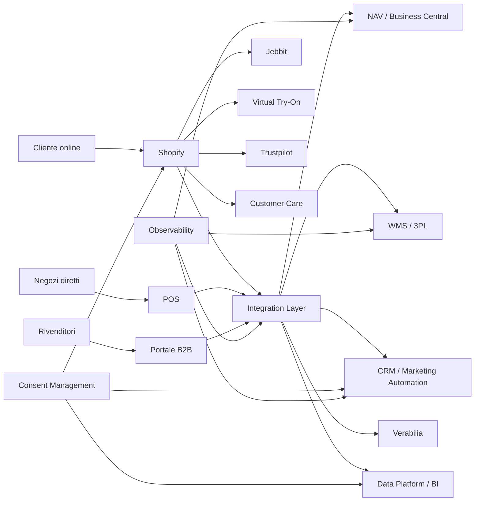
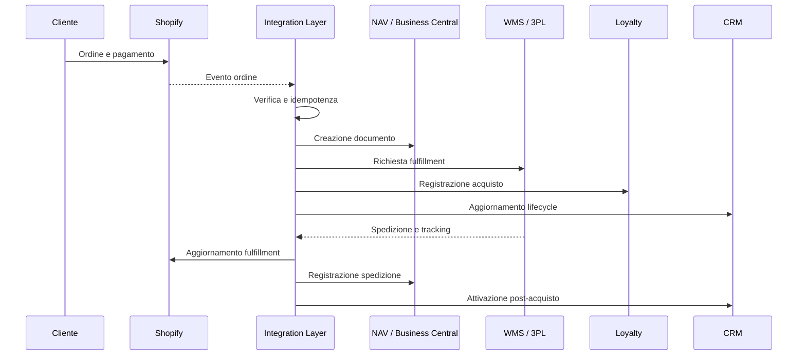
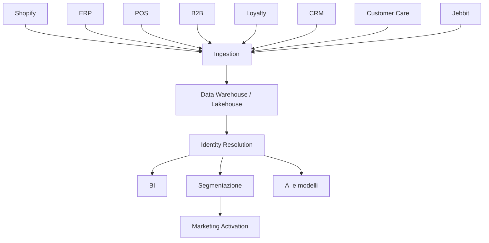

# Studio tecnico preliminare

## Ecosistema Shopify, Dynamics NAV e piattaforme digitali Veralab

**Azienda:** Re-Forme S.r.l. / Veralab  
**Autore:** Elios Scoglio — 108 Vision  
**Versione:** luglio 2026  
**Stato:** studio preliminare basato su fonti pubbliche, documentazione ufficiale e precedenti analisi tecniche  
**Finalità:** preparazione del secondo colloquio e base per un successivo assessment tecnico

> **Costruiamo la direzione, non solo il codice.**

* * *

# 1\. Obiettivo del documento

Questo documento descrive:

- il ruolo possibile di Shopify nell’ecosistema Veralab;
    
- il funzionamento tecnico delle integrazioni Shopify;
    
- le modalità con cui Shopify espone eventi;
    
- il ruolo possibile di Microsoft Dynamics NAV;
    
- l’evoluzione da Dynamics NAV a Business Central;
    
- i criteri per stabilire se NAV debba essere aggiornato o sostituito;
    
- i principali flussi Shopify–ERP;
    
- gli strumenti digitali rilevati pubblicamente;
    
- i casi d’uso specifici di Veralab;
    
- rischi, domande e attività da includere in un assessment.
    

Non rappresenta l’architettura interna effettiva di Veralab.

L’architettura reale potrà essere ricostruita soltanto attraverso:

- accesso ai sistemi;
    
- colloqui con il team;
    
- inventario delle applicazioni;
    
- analisi delle integrazioni;
    
- verifica dei contratti;
    
- analisi dei dati e dei processi.
    

* * *

# 2\. Livelli di affidabilità

## `[verificato]`

Informazione proveniente da:

- documentazione ufficiale;
    
- sito aziendale;
    
- annunci aziendali;
    
- analisi tecnica documentata.
    

## `[probabile]`

Inferenza ragionevole basata su:

- job description;
    
- configurazioni osservabili;
    
- struttura del business;
    
- pattern architetturali ricorrenti.
    

Deve essere verificata internamente.

## `[ignoto]`

Informazione non determinabile dall’esterno.

Non deve essere presentata come un fatto.

* * *

# 3\. Executive summary

Veralab è un ecosistema che combina:

- e-commerce;
    
- presenza retail;
    
- rete di rivenditori;
    
- secondo brand Overskin;
    
- programma loyalty Verabilia;
    
- customer care;
    
- attività B2B;
    
- marketing automation;
    
- raccolta di dati dichiarativi;
    
- virtual try-on;
    
- crescita delle capability CRM e Data.
    

Il sito ufficiale presenta vendita online e in store, prodotti Veralab e Overskin, test digitali, beauty expert e virtual try-on. Le ricerche aziendali attuali per ruoli CRM, Loyalty, Marketing Automation e Customer Intelligence mostrano inoltre la volontà di trasformare dati e comportamenti cliente in iniziative misurabili.

Il precedente audit tecnico ha rilevato pubblicamente:

- Shopify;
    
- Cloudflare;
    
- Jebbit;
    
- Klaviyo;
    
- Trustpilot.
    

La presenza di Dynamics NAV è invece un’informazione derivata dalla precedente ricerca di una figura tecnica e deve essere verificata internamente.

## Tesi tecnica

> Il problema principale non è stabilire se Shopify o NAV siano prodotti validi.

Il problema è capire:

1.  quale sistema governa ogni dato;
    
2.  come i sistemi comunicano;
    
3.  con quale frequenza;
    
4.  cosa accade quando un’integrazione fallisce;
    
5.  come vengono recuperati gli errori;
    
6.  chi è responsabile dei singoli flussi;
    
7.  quali decisioni future devono sostenere crescita, retail e internazionalizzazione.
    

## Raccomandazione preliminare

Non partire da una soluzione già scelta.

Non dire:

- “NAV va sostituito”;
    
- “serve Kafka”;
    
- “serve un middleware”;
    
- “serve una CDP”;
    
- “serve Shopify Plus”;
    
- “serve un’architettura headless”.
    

Partire da:

- application inventory;
    
- integration map;
    
- data ownership;
    
- volumi;
    
- errori;
    
- costi;
    
- vincoli;
    
- lifecycle;
    
- dipendenza dai fornitori;
    
- obiettivi di business.
    

* * *

# 4\. Profilo tecnico preliminare di Veralab

| Componente | Stato | Possibile funzione | Da verificare |
| --- | --- | --- | --- |
| Shopify | `[verificato]` | E-commerce D2C | Piano, store, app, tema e checkout |
| Shopify Plus | `[probabile]` | Governance enterprise, B2B, checkout avanzato | Contratto e funzioni utilizzate |
| Dynamics NAV | `[probabile]` | ERP amministrativo e operativo | Versione, moduli, processi e customizzazioni |
| Cloudflare | `[verificato nel precedente audit]` | CDN, DNS, sicurezza edge | Configurazione e ownership |
| Klaviyo | `[verificato nel precedente audit]` | Marketing automation | Flussi, profili, consensi e costi |
| Jebbit | `[verificato]` | Quiz e raccolta zero-party data | Integrazioni e ownership dei dati |
| Trustpilot | `[verificato nel precedente audit]` | Recensioni | Trigger, mapping e performance |
| Verabilia | `[verificato]` | Loyalty | Vendor, ledger, regole e integrazioni |
| Portale B2B | `[verificato]` | Vendita e servizio ai rivenditori | Tecnologia, listini e collegamento ERP |
| Virtual try-on | `[verificato]` | Prova digitale dei prodotti make-up | Vendor, privacy e mapping varianti |
| Customer care | `[verificato]` | Assistenza e ticket | Piattaforma e integrazione con ordini |
| POS | `[ignoto]` | Vendite nei negozi diretti | Vendor, modalità offline e integrazioni |
| WMS o 3PL | `[ignoto]` | Magazzino e fulfillment | Vendor e ownership dello stock |
| CRM centrale | `[ignoto]` | Customer lifecycle | Piattaforma e source of truth |
| Data platform | `[ignoto]` | BI e Customer Intelligence | Architettura, owner e qualità |
| CMP | `[ignoto]` | Gestione del consenso | Propagazione ai sistemi downstream |

Overskin non è un progetto futuro o un sito placeholder: è un brand attivo, integrato nell’offerta make-up Veralab, con catalogo e funzionalità di prova virtuale.

* * *

# 5\. Architettura logica di riferimento

Lo schema seguente rappresenta un possibile modello di riferimento, non l’architettura attuale verificata.



## Principio

L’Integration Layer non deve necessariamente essere una nuova piattaforma.

Può essere composto da:

- connettore standard;
    
- iPaaS;
    
- servizi custom;
    
- code gestite;
    
- API gateway;
    
- processi batch;
    
- funzionalità del nuovo ERP;
    
- combinazione di più componenti.
    

La scelta deve dipendere dal problema, non dalla preferenza tecnologica.

* * *

# 6\. Shopify: ruolo nella piattaforma

Shopify è una piattaforma SaaS per il commercio digitale.

Può gestire:

- catalogo;
    
- prodotti;
    
- varianti;
    
- prezzi;
    
- promozioni;
    
- disponibilità pubblicata;
    
- clienti;
    
- carrello;
    
- checkout;
    
- pagamenti;
    
- ordini;
    
- fulfillment;
    
- resi;
    
- contenuti commerciali;
    
- applicazioni e canali di vendita.
    

## Vantaggio principale

Shopify delega al fornitore una parte significativa della complessità del commerce:

- infrastruttura;
    
- disponibilità della piattaforma;
    
- checkout;
    
- aggiornamenti;
    
- sicurezza della piattaforma core;
    
- ecosistema applicativo.
    

## Limite principale

L’azienda non controlla completamente il ciclo di vita della piattaforma.

Le personalizzazioni devono rispettare:

- API;
    
- versionamento;
    
- limiti di utilizzo;
    
- modello dati;
    
- lifecycle delle estensioni;
    
- regole del checkout;
    
- disponibilità delle capability per piano.
    

* * *

# 7\. Shopify e Shopify Plus

Shopify Plus aggiunge capability destinate ad aziende con esigenze organizzative e commerciali più complesse.

Tra le aree interessate possono esserci:

- organizzazione multi-store;
    
- governance;
    
- checkout;
    
- B2B avanzato;
    
- automazioni;
    
- cataloghi;
    
- pagamenti;
    
- gestione di più mercati.
    

Le funzioni B2B non sono più esclusivamente limitate a Plus, ma Plus include capability aggiuntive quali cataloghi illimitati, assegnazioni dirette, depositi e pagamenti parziali.

## Cosa verificare in Veralab

- Quale piano Shopify è attivo?
    
- Esiste un solo store?
    
- Veralab e Overskin condividono lo stesso store?
    
- Esistono store internazionali?
    
- Esistono store dedicati al B2B?
    
- Quali funzioni Plus vengono realmente utilizzate?
    
- Quali personalizzazioni esistono nel checkout?
    
- Quali applicazioni hanno accesso ai dati cliente?
    

## Rischio

Pagare Shopify Plus senza utilizzare le capability che ne giustificano il costo.

## Rischio opposto

Utilizzare un piano o un’architettura non adeguati, costruendo customizzazioni costose per replicare capability già disponibili.

* * *

# 8\. Modello dati Shopify

## 8.1 Prodotti e varianti

Il prodotto rappresenta l’elemento commerciale.

La variante rappresenta una combinazione specifica:

- formato;
    
- quantità;
    
- tonalità;
    
- colore;
    
- confezione;
    
- SKU;
    
- barcode.
    

Nel settore beauty il mapping tra:

- prodotto;
    
- variante;
    
- shade;
    
- SKU;
    
- barcode;
    
- immagine;
    
- stock;
    

è critico.

Un errore può produrre:

- prodotto sbagliato;
    
- tonalità errata;
    
- stock attribuito alla variante sbagliata;
    
- recensioni associate al prodotto sbagliato;
    
- errori nel virtual try-on.
    

* * *

## 8.2 Inventory

Shopify utilizza un modello composto da:

- `InventoryItem`;
    
- `Location`;
    
- `InventoryLevel`.
    

Ogni `InventoryLevel` collega un articolo a una location e può rappresentare stati quali disponibilità, quantità fisica, quantità impegnata e quantità in arrivo.

Le location possono rappresentare:

- magazzini;
    
- negozi;
    
- temporary store;
    
- servizi di fulfillment;
    
- dropshipper.
    

## Implicazione

Lo stock Shopify non deve essere confuso automaticamente con lo stock fisico aziendale.

È necessario distinguere:

- stock fisico;
    
- stock disponibile;
    
- stock impegnato;
    
- safety stock;
    
- stock in trasferimento;
    
- available-to-sell.
    

* * *

## 8.3 Ordini

Un ordine può contenere:

- cliente;
    
- linee;
    
- varianti;
    
- sconti;
    
- tasse;
    
- pagamenti;
    
- fulfillment;
    
- rimborsi;
    
- resi;
    
- attributi;
    
- canale di origine.
    

L’ordine Shopify rappresenta il contesto commerciale.

L’ERP può rappresentare invece:

- documento amministrativo;
    
- fattura;
    
- movimento contabile;
    
- movimento di magazzino;
    
- reso;
    
- nota di credito.
    

I due concetti devono essere collegati, ma non sono necessariamente identici.

* * *

## 8.4 Cliente

Shopify può contenere un profilo cliente utile al commerce.

Non significa però che Shopify debba essere il sistema master dell’identità cliente aziendale.

Lo stesso cliente può apparire in:

- Shopify;
    
- POS;
    
- Verabilia;
    
- CRM;
    
- Klaviyo;
    
- customer care;
    
- Jebbit;
    
- portale B2B;
    
- piattaforma dati.
    

* * *

# 9\. API Shopify

## 9.1 GraphQL Admin API

La GraphQL Admin API è l’interfaccia principale per le nuove integrazioni amministrative.

La REST Admin API è considerata legacy dal 1° ottobre 2024. Dal 1° aprile 2025 le nuove applicazioni pubbliche devono utilizzare la GraphQL Admin API.

## Conseguenza per Veralab

Devono essere individuate eventuali integrazioni che utilizzano ancora:

- REST Admin API;
    
- versioni obsolete;
    
- endpoint deprecati;
    
- vecchio modello prodotto;
    
- librerie non aggiornate.
    

## Rate limit

Le API GraphQL utilizzano un sistema basato sul costo calcolato delle query.

Una query complessa consuma più capacità di una query semplice.

## Contromisure

- query limitate;
    
- paginazione;
    
- bulk operation;
    
- cache;
    
- backoff;
    
- monitoraggio dei costi delle query;
    
- separazione tra sincronizzazione iniziale e aggiornamenti incrementali.
    

* * *

# 10\. Eventi Shopify

## 10.1 Shopify espone soltanto webhook HTTP?

No.

### `[verificato]`

Shopify utilizza il modello delle **webhook subscription**, ma la destinazione non deve essere necessariamente un endpoint HTTP.

Le destinazioni supportate comprendono:

- endpoint HTTPS;
    
- Google Cloud Pub/Sub;
    
- Amazon EventBridge.
    

La configurazione delle webhook subscription supporta quindi destinazioni cloud native oltre agli endpoint web tradizionali.

* * *

## 10.2 Kafka e RabbitMQ

### `[verificato]`

Shopify non espone una destinazione nativa diretta verso:

- Apache Kafka;
    
- RabbitMQ.
    

Per usarli è necessario introdurre un adapter.

```text
Shopify
    ↓
HTTPS / Amazon EventBridge / Google Pub/Sub
    ↓
Ingestion service
    ↓
Kafka oppure RabbitMQ
    ↓
ERP / CRM / Loyalty / Data Platform
```

* * *

## 10.3 Shopify Events

Shopify ha introdotto anche un nuovo modello denominato **Events**.

Permette:

- trigger su specifici campi GraphQL;
    
- payload personalizzati;
    
- filtri;
    
- riduzione degli eventi non rilevanti.
    

Al luglio 2026 è ancora in **developer preview**, utilizza la versione API `unstable` e copre soltanto una parte degli argomenti. Shopify indica di utilizzare i webhook per i carichi di produzione e gli Events per test anticipati.

## Decisione attuale

| Meccanismo | Stato | Uso consigliato |
| --- | --- | --- |
| Webhook HTTPS | Stabile | Integrazioni standard |
| Webhook → Google Pub/Sub | Stabile | Stack Google Cloud |
| Webhook → EventBridge | Stabile | Stack AWS |
| Shopify Events | Developer preview | Sperimentazione |
| Shopify → Kafka | Non nativo | Tramite adapter |
| Shopify → RabbitMQ | Non nativo | Tramite adapter |

* * *

# 11\. Kafka, RabbitMQ o servizi gestiti

## 11.1 Kafka

### Cosa

Piattaforma distribuita per stream di eventi persistenti.

### Perché

Ha senso quando:

- esistono molti consumer;
    
- serve conservare gli eventi;
    
- gli eventi devono essere riprodotti;
    
- i volumi sono elevati;
    
- esiste già una data platform Kafka;
    
- il team possiede competenze operative.
    

### Alternativa

- EventBridge;
    
- SQS;
    
- Google Pub/Sub;
    
- Azure Service Bus;
    
- iPaaS.
    

### Rischio

Introdurre Kafka senza necessità può aumentare:

- complessità;
    
- costi;
    
- superficie operativa;
    
- necessità di monitoring;
    
- competenze richieste;
    
- tempi di diagnosi.
    

* * *

## 11.2 RabbitMQ

### Cosa

Message broker orientato a code, routing e distribuzione del lavoro.

### Perché

È adatto quando:

- prevalgono job asincroni;
    
- servono acknowledgment;
    
- servono retry;
    
- esistono workflow command-oriented;
    
- non serve mantenere a lungo lo storico.
    

### Alternativa

- SQS;
    
- Azure Service Bus;
    
- Google Pub/Sub;
    
- servizi gestiti.
    

### Rischio

Una gestione diretta richiede:

- alta disponibilità;
    
- monitoraggio;
    
- capacity planning;
    
- gestione delle code;
    
- dead-letter queue;
    
- procedure operative.
    

* * *

## 11.3 EventBridge e SQS

### Cosa

Utilizzare EventBridge come event bus e una coda SQS per ogni consumer.

### Perché

- servizi gestiti;
    
- separazione dei consumer;
    
- retry;
    
- dead-letter queue;
    
- scalabilità;
    
- isolamento dei guasti;
    
- integrazione con AWS.
    

### Alternativa

Kafka, RabbitMQ o iPaaS.

### Rischio

- dipendenza da AWS;
    
- costi per evento;
    
- configurazioni distribuite;
    
- necessità di governance dei topic e degli schemi.
    

* * *

## Raccomandazione per Veralab

### `[probabile]`

Se l’infrastruttura applicativa è su AWS, un modello proporzionato potrebbe essere:

```text
Shopify
    ↓
Amazon EventBridge
    ├── SQS Ordini → ERP
    ├── SQS Acquisti → Loyalty
    ├── SQS Clienti → CRM
    ├── SQS Catalogo → Search / PIM
    └── SQS Eventi → Data Platform
```

Non introdurrei Kafka senza aver prima verificato:

- volumi;
    
- necessità di replay;
    
- numero di consumer;
    
- stack esistente;
    
- capacità del team;
    
- costo operativo.
    

* * *

# 12\. Affidabilità degli eventi Shopify

Un broker non rende automaticamente affidabile il processo.

Shopify specifica che la consegna dei webhook non è sempre garantita e raccomanda job di riconciliazione periodica. Inoltre, lo stesso webhook può essere consegnato più volte e deve essere elaborato in maniera idempotente.

## Pattern necessario

```text
Ricezione evento
    ↓
Verifica autenticità
    ↓
Lettura X-Shopify-Webhook-Id
    ↓
Persistenza evento
    ↓
Risposta immediata
    ↓
Elaborazione asincrona
    ↓
Controllo idempotenza
    ↓
Chiamata al sistema destinatario
    ↓
Registrazione risultato
    ↓
Retry o dead-letter queue
    ↓
Riconciliazione periodica
```

## Controlli

- verifica HMAC;
    
- deduplicazione;
    
- idempotenza;
    
- timeout;
    
- retry con backoff;
    
- circuit breaker;
    
- dead-letter queue;
    
- audit trail;
    
- monitoraggio;
    
- riconciliazione tramite GraphQL API.
    

## Esempio

Prima di creare un ordine nell’ERP:

```text
Ricevuto ordine Shopify 12345
    ↓
Esiste già una relazione Shopify 12345 → ERP 9876?
    ├── Sì → non creare nuovamente
    └── No → creare ordine e salvare la relazione
```

* * *

# 13\. Dynamics NAV

## 13.1 Che cos’è

Microsoft Dynamics NAV è un ERP Microsoft, predecessore di Dynamics 365 Business Central.

Può gestire:

- contabilità;
    
- vendite;
    
- acquisti;
    
- articoli;
    
- inventario;
    
- clienti;
    
- fornitori;
    
- ordini;
    
- spedizioni;
    
- resi;
    
- processi amministrativi;
    
- report;
    
- personalizzazioni verticali.
    

## Stato Veralab

### `[probabile]`

Dynamics NAV è stato indicato nella precedente documentazione collegata alla ricerca di una figura tecnica.

### `[ignoto]`

Non sono noti:

- versione;
    
- deployment;
    
- moduli;
    
- customizzazioni;
    
- processi gestiti;
    
- ruolo sullo stock;
    
- rapporto con POS e WMS;
    
- partner Microsoft;
    
- stato del supporto.
    

Non bisogna affermare che NAV gestisca sicuramente inventario, negozi o logistica prima di averlo verificato.

* * *

# 14\. Esistono nuove versioni di NAV?

No.

Il nome commerciale **Dynamics NAV** non identifica più la linea ERP attuale.

L’evoluzione del prodotto è:

```text
Microsoft Dynamics NAV
    ↓
Microsoft Dynamics 365 Business Central
```

Business Central è disponibile:

- online, gestito da Microsoft;
    
- on-premises, gestito dal cliente o dal partner.
    

La release corrente nel luglio 2026 è Business Central 2026 release wave 1, versione 28. Microsoft utilizza un ciclo di rilascio semestrale.

* * *

# 15\. Lifecycle di Dynamics NAV

| Versione | Fine mainstream support | Fine extended support | Stato a luglio 2026 |
| --- | ---: | ---: | --- |
| NAV 2016 | 13 aprile 2021 | 14 aprile 2026 | Fuori supporto |
| NAV 2017 | 11 gennaio 2022 | 11 gennaio 2027 | Solo supporto esteso |
| NAV 2018 | 10 gennaio 2023 | 11 gennaio 2028 | Solo supporto esteso |

Le date sono quelle pubblicate dal Microsoft Lifecycle.

* * *

# 16\. È obbligatorio cambiare NAV?

## Risposta

No.

Non è automaticamente obbligatorio sostituire NAV subito.

È però obbligatorio conoscere:

1.  versione;
    
2.  supporto;
    
3.  customizzazioni;
    
4.  dipendenze;
    
5.  costi;
    
6.  rischi;
    
7.  capacità di evoluzione.
    

## Principio

> Il must non è migrare.  
> Il must è prendere una decisione informata.

* * *

# 17\. Decisione in base alla versione

## Caso A — NAV 2016 o precedente

### Cosa

Avviare immediatamente un piano di remediation e una decisione di uscita.

### Perché

Il prodotto è fuori supporto.

### Alternativa

Mantenimento temporaneo con:

- isolamento;
    
- controllo degli accessi;
    
- monitoraggio;
    
- partner specializzato;
    
- riduzione dell’esposizione;
    
- piano finanziato.
    

### Rischio

- sicurezza;
    
- continuità;
    
- difficoltà nel reperire competenze;
    
- costi crescenti;
    
- vincoli sulle integrazioni.
    

* * *

## Caso B — NAV 2017

### Cosa

Completare l’assessment e prendere una decisione in tempi brevi.

### Perché

Il supporto esteso termina l’11 gennaio 2027.

### Alternativa

Mantenere NAV fino alla scadenza con una roadmap di uscita già approvata.

### Rischio

Arrivare vicino alla fine del supporto senza conoscere:

- codice custom;
    
- processi;
    
- dati;
    
- integrazioni;
    
- effort di migrazione.
    

* * *

## Caso C — NAV 2018

### Cosa

Mantenere temporaneamente il sistema, se stabile, ma definire una roadmap.

### Perché

Il supporto esteso termina l’11 gennaio 2028.

### Alternativa

Avviare anticipatamente la migrazione.

### Rischio

Interpretare il 2028 come una ragione per non decidere.

Due anni possono non essere molti per un ERP altamente personalizzato.

* * *

# 18\. Business Central

Business Central è l’evoluzione attuale di NAV.

Copre aree quali:

- finanza;
    
- vendite;
    
- acquisti;
    
- supply chain;
    
- inventario;
    
- progetti;
    
- servizi;
    
- reporting;
    
- automazione;
    
- integrazioni Microsoft.
    

La release 2026 wave 1 continua a investire su supply chain, governance, AI, Power Platform e integrazione Shopify.

## Business Central online

### Vantaggi

- gestione SaaS;
    
- aggiornamenti Microsoft;
    
- API moderne;
    
- sicurezza e compliance gestite;
    
- minore infrastruttura;
    
- integrazione con Microsoft 365 e Power Platform.
    

### Rischi

- aggiornamenti obbligatori;
    
- necessità di rendere compatibili le estensioni;
    
- limiti sulle personalizzazioni;
    
- dipendenza dal cloud Microsoft;
    
- necessità di revisione periodica.
    

* * *

## Business Central on-premises

### Vantaggi

- maggiore controllo;
    
- deployment gestito;
    
- compatibilità con specifici vincoli;
    
- possibilità di personalizzazioni particolari.
    

### Rischi

- infrastruttura;
    
- patch;
    
- aggiornamenti;
    
- sicurezza;
    
- competenze;
    
- costo operativo;
    
- rischio di rimanere nuovamente indietro.
    

* * *

# 19\. Personalizzazioni NAV

NAV è stato storicamente personalizzato attraverso:

- C/SIDE;
    
- C/AL;
    
- codeunit;
    
- report;
    
- table extension;
    
- modifiche dirette agli oggetti;
    
- web service custom;
    
- accessi al database.
    

Business Central privilegia invece:

- AL;
    
- extension;
    
- event subscriber;
    
- API;
    
- integrazioni desacoppiate.
    

## Implicazione

Una migrazione non è un semplice aggiornamento tecnico.

Ogni customizzazione deve essere:

1.  inventariata;
    
2.  classificata;
    
3.  valutata;
    
4.  convertita;
    
5.  sostituita;
    
6.  eliminata.
    

## Classificazione consigliata

| Customizzazione | Decisione |
| --- | --- |
| Obbligo normativo | Migrare o sostituire |
| Processo differenziante | Ripensare e migrare |
| Workaround storico | Eliminare |
| Funzione oggi standard | Sostituire con standard |
| Funzione mai usata | Eliminare |
| Report legacy | Valutare BI o reporting moderno |

* * *

# 20\. Opzioni per NAV

## Opzione 1 — Mantenere e stabilizzare NAV

### Cosa

Proseguire temporaneamente con il sistema esistente.

### Perché

- processi stabili;
    
- customizzazioni rilevanti;
    
- rischio di migrazione elevato;
    
- priorità aziendali diverse;
    
- supporto ancora attivo.
    

### Alternativa

Migrazione a Business Central.

### Rischio

- ulteriore debito;
    
- competenze più rare;
    
- dipendenza dal partner;
    
- difficoltà di integrazione;
    
- costi crescenti.
    

* * *

## Opzione 2 — Migrazione tecnica

### Cosa

Trasferire dati, configurazioni e logiche verso Business Central.

### Perché

- piattaforma attuale;
    
- lifecycle continuo;
    
- API moderne;
    
- connettori;
    
- estensioni AL.
    

### Alternativa

Reimplementazione.

### Rischio

Trasferire nel nuovo sistema anche processi e customizzazioni obsolete.

* * *

## Opzione 3 — Reimplementazione

### Cosa

Ripartire dai processi necessari e implementare soltanto ciò che serve.

### Perché

Riduce il debito storico.

### Alternativa

Migrazione conservativa.

### Rischio

- maggiore cambiamento organizzativo;
    
- formazione;
    
- revisione dei processi;
    
- scope creep;
    
- forte coinvolgimento degli utenti.
    

* * *

## Opzione 4 — Sostituzione ERP

### Cosa

Selezionare un ERP differente.

### Perché

Può avere senso se Business Central non è coerente con strategia e processi.

### Alternativa

Evoluzione verso Business Central.

### Rischio

È l’opzione potenzialmente più rischiosa:

- migrazione dati;
    
- riprogettazione;
    
- integrazioni;
    
- formazione;
    
- continuità operativa;
    
- costi.
    

* * *

# 21\. Connettore Shopify per Business Central

Microsoft fornisce un connettore ufficiale Shopify–Business Central.

Può sincronizzare:

- articoli;
    
- inventory;
    
- clienti;
    
- società;
    
- ordini;
    
- transazioni;
    
- pagamenti;
    
- payout.
    

Supporta inoltre più store Shopify.

## Vantaggio

Ridurre sviluppo custom per flussi standard.

## Limite

Un connettore non elimina la progettazione.

Devono comunque essere definiti:

- ownership dei dati;
    
- mapping;
    
- frequenza;
    
- gestione degli errori;
    
- promozioni;
    
- resi;
    
- rimborsi;
    
- gift card;
    
- listini;
    
- clienti duplicati;
    
- location;
    
- fiscalità;
    
- riconciliazione.
    

Microsoft raccomanda di testare il connettore in ambienti controllati perché può creare e modificare articoli, clienti e documenti commerciali.

* * *

# 22\. Matrice di ownership

La seguente tabella è un’ipotesi di lavoro.

| Entità | Possibile master | Consumer |
| --- | --- | --- |
| SKU | ERP o PIM | Shopify, WMS, POS, B2B |
| Barcode | ERP o PIM | Shopify, WMS, POS |
| Descrizione commerciale | Shopify o PIM | E-commerce e marketing |
| Immagini | Shopify o DAM | E-commerce e marketing |
| Prezzo base | ERP o commerce | Shopify, POS, B2B |
| Promozione D2C | Shopify | Checkout, CRM, finance |
| Stock fisico | WMS o ERP | Shopify, POS, customer care |
| Available-to-sell | OMS o servizio inventory | Tutti i canali |
| Ordine D2C | Shopify all’origine | ERP, WMS, CRM |
| Documento fiscale | ERP | Finance e BI |
| Fulfillment | WMS, 3PL o ERP | Shopify e customer care |
| Cliente commerce | Shopify | CRM e loyalty |
| Identità cliente | CRM o CDP | Marketing, supporto e BI |
| Punti loyalty | Loyalty engine | Shopify, POS e CRM |
| Payout | PSP o Shopify Payments | ERP e finance |

## Principio

Ogni entità deve avere:

- un master;
    
- consumer identificati;
    
- frequenza di aggiornamento;
    
- regole di validazione;
    
- gestione degli errori;
    
- owner.
    

* * *

# 23\. Flusso ordine



## Casi da gestire

- pagamento autorizzato ma non acquisito;
    
- ordine modificato;
    
- ordine annullato;
    
- ordine parziale;
    
- fulfillment multiplo;
    
- rimborso;
    
- reso;
    
- sostituzione;
    
- gift card;
    
- voucher;
    
- spedizione fallita;
    
- evento duplicato;
    
- evento fuori sequenza.
    

* * *

# 24\. Flusso inventory

## Possibile processo

```text
ERP / WMS
    ↓
Stock fisico
    ↓
Regole available-to-sell
    ↓
Safety stock
    ↓
Stock pubblicabile
    ↓
Shopify InventoryLevel
```

## Domande

- Chi possiede lo stock?
    
- Esiste un WMS?
    
- NAV è master o consumer?
    
- Le location Shopify rappresentano negozi reali?
    
- Esistono stock dedicati al B2B?
    
- Lo stock è condiviso tra Veralab e Overskin?
    
- Con quale frequenza viene aggiornato?
    
- Esiste reservation?
    
- Esiste una riconciliazione?
    
- Come vengono gestiti i trasferimenti?
    

## Rischio

Utilizzare direttamente lo stock fisico come stock vendibile senza:

- ordini impegnati;
    
- safety stock;
    
- resi;
    
- qualità;
    
- trasferimenti;
    
- ordini B2B.
    

* * *

# 25\. Opzioni di integrazione

## 25.1 Point-to-point

### Cosa

Shopify comunica direttamente con ciascun sistema.

### Perché

È rapido con poche integrazioni.

### Alternativa

Integration layer.

### Rischio

Cresce una rete di collegamenti difficili da modificare.

* * *

## 25.2 Connettore standard

### Cosa

Prodotto preconfigurato.

### Perché

Riduce sviluppo e tempo di avvio.

### Alternativa

Servizio custom.

### Rischio

- processi vincolati al connettore;
    
- scarsa flessibilità;
    
- costi di personalizzazione;
    
- dipendenza dal vendor.
    

* * *

## 25.3 iPaaS

### Cosa

Piattaforma managed per orchestrare sistemi e dati.

### Perché

- molti connettori;
    
- sviluppo rapido;
    
- gestione centralizzata;
    
- monitoraggio integrato.
    

### Alternativa

Middleware custom.

### Rischio

- costo per transazione;
    
- logiche nascoste nei workflow;
    
- lock-in;
    
- testabilità;
    
- competenze concentrate.
    

* * *

## 25.4 Middleware custom

### Cosa

Servizi dedicati che ricevono eventi e orchestrano processi.

### Perché

Controllo completo sui flussi differenzianti.

### Alternativa

Connettore o iPaaS.

### Rischio

- sviluppo;
    
- manutenzione;
    
- on-call;
    
- sicurezza;
    
- osservabilità;
    
- competenze interne.
    

* * *

## Raccomandazione

Modello ibrido:

- standard per i processi commodity;
    
- custom per i processi differenzianti;
    
- eventi per processi sensibili alla latenza;
    
- batch per riconciliazione e processi non urgenti.
    

* * *

# 26\. Casi d’uso Veralab

## 26.1 Lanci prodotto

### Problema

Un lancio può generare un forte incremento simultaneo di:

- traffico;
    
- checkout;
    
- ordini;
    
- eventi;
    
- aggiornamenti stock;
    
- email;
    
- richieste al customer care.
    

### Rischio

Shopify può continuare a ricevere ordini mentre ERP, WMS, loyalty o CRM accumulano ritardo.

### Interventi

- test di carico sulle integrazioni;
    
- code;
    
- rate limit management;
    
- idempotenza;
    
- runbook;
    
- dashboard;
    
- war room;
    
- safety stock;
    
- riconciliazione post-lancio.
    

* * *

## 26.2 Veralab e Overskin

Veralab e Overskin condividono oggi almeno l’esperienza commerciale pubblica, ma il livello di separazione tecnica non è noto.

## Decisioni

- stesso store o store distinti;
    
- stesso checkout;
    
- stesso profilo cliente;
    
- stessa loyalty;
    
- stesso catalogo;
    
- stessi prezzi;
    
- stesso magazzino;
    
- stesso reporting;
    
- stessa strategia internazionale.
    

## Rischio

Separare troppo presto duplica costi e sistemi.

Non separare mai può impedire autonomia futura.

* * *

## 26.3 Verabilia

Il programma Verabilia include acquisti online e acquisti effettuati in specifici punti vendita diretti. Non è invece applicabile automaticamente all’intera rete di rivenditori autorizzati.

## Processi

- accumulo punti;
    
- punti in sospeso;
    
- punti spendibili;
    
- voucher;
    
- premi;
    
- scadenze;
    
- storno dopo reso;
    
- account cliente;
    
- acquisti in store.
    

## Principio tecnico

I punti devono essere trattati come un ledger.

Non come un semplice campo numerico modificabile.

## Rischi

- doppio accredito;
    
- mancato storno;
    
- voucher utilizzato due volte;
    
- account duplicati;
    
- riconciliazione incompleta;
    
- differenze online/offline.
    

* * *

## 26.4 B2B

Veralab dispone di un canale o portale dedicato ai rivenditori.

## Casi d’uso

- anagrafica azienda;
    
- cataloghi;
    
- listini;
    
- quantità minime;
    
- ordini;
    
- stato spedizione;
    
- riordino;
    
- documenti;
    
- condizioni commerciali.
    

## Rischi

- clienti duplicati;
    
- listini non sincronizzati;
    
- ordini inseriti manualmente;
    
- stock non governato;
    
- promozioni D2C applicate al B2B;
    
- reporting incompleto.
    

* * *

## 26.5 Internazionalizzazione

Shopify Markets permette di differenziare lingua, valuta, prezzo e disponibilità prodotto per mercato.

## Aspetti da progettare

- dominio;
    
- lingua;
    
- valuta;
    
- listino;
    
- tasse;
    
- dazi;
    
- pagamenti;
    
- corriere;
    
- resi;
    
- customer care;
    
- ERP;
    
- contabilità;
    
- consensi;
    
- disponibilità prodotto.
    

## Rischio

Aprire un mercato lavorando soltanto sul frontend e non sui processi post-acquisto.

* * *

# 27\. Altri strumenti rilevati

## 27.1 Cloudflare

### Stato

`[verificato nel precedente audit, da riconfermare internamente]`

### Possibili funzioni

- DNS;
    
- CDN;
    
- WAF;
    
- protezione DDoS;
    
- bot management;
    
- caching;
    
- rate limiting;
    
- security header.
    

### Rischi

- configurazioni non documentate;
    
- account controllato da un fornitore;
    
- regole cache errate;
    
- blocco di traffico legittimo;
    
- falsa sicurezza sulle applicazioni downstream.
    

* * *

## 27.2 Klaviyo

### Stato

`[verificato nel precedente audit, da riconfermare internamente]`

### Possibili casi d’uso

- welcome flow;
    
- carrello abbandonato;
    
- post-acquisto;
    
- replenishment;
    
- win-back;
    
- segmentazione;
    
- campagne;
    
- loyalty.
    

### Rischi

- profili duplicati;
    
- eventi mancanti;
    
- consensi non sincronizzati;
    
- flussi attivati su dati obsoleti;
    
- costi legati alla crescita dei profili;
    
- marketing automation usata come database centrale.
    

* * *

## 27.3 Jebbit

### Stato

`[verificato]`

### Possibili casi d’uso

- quiz;
    
- skin test;
    
- zero-party data;
    
- preferenze;
    
- raccomandazioni;
    
- segmentazione.
    

### Rischi

- risposta anonima non collegata al profilo;
    
- profilo duplicato;
    
- consenso;
    
- versionamento del quiz;
    
- qualità delle risposte;
    
- logica di raccomandazione non documentata.
    

* * *

## 27.4 Trustpilot

### Stato

`[verificato nel precedente audit, da riconfermare internamente]`

### Possibili casi d’uso

- recensioni prodotto;
    
- recensioni azienda;
    
- social proof;
    
- inviti post-acquisto.
    

### Rischi

- inviti duplicati;
    
- inviti prima della consegna;
    
- mapping SKU errato;
    
- widget pesanti;
    
- condivisione dati non governata.
    

* * *

## 27.5 Virtual try-on

### Stato

`[verificato]`

### Casi d’uso

- selezione shade;
    
- prova make-up;
    
- riduzione dell’incertezza;
    
- collegamento con varianti.
    

### Rischi

- mapping errato;
    
- tonalità non corretta;
    
- latenza;
    
- fotocamera;
    
- trattamento immagini;
    
- incompatibilità dispositivi;
    
- dipendenza dal vendor.
    

* * *

## 27.6 Customer care

### Stato

`[verificato]`

Esiste un centro assistenza con articoli e apertura di ticket. Il vendor tecnologico deve essere confermato.

### Integrazioni utili

- ordini;
    
- tracking;
    
- resi;
    
- rimborsi;
    
- loyalty;
    
- profilo cliente;
    
- catalogo;
    
- procedure.
    

### Rischi

- dati copiati nei ticket;
    
- accessi eccessivi;
    
- informazioni non aggiornate;
    
- più identità dello stesso cliente;
    
- allegati contenenti dati personali.
    

* * *

# 28\. Data e Customer Intelligence

Le ricerche attuali di Veralab mostrano un focus su:

- CRM;
    
- loyalty;
    
- customer lifecycle;
    
- segmentazione;
    
- personalizzazione;
    
- customer lifetime value;
    
- reporting;
    
- preparazione dei dati;
    
- automazione;
    
- insight azionabili.
    

## Principio

Unificare i dati non significa copiare tutto in un database.

Significa definire:

- identità;
    
- significato;
    
- ownership;
    
- qualità;
    
- frequenza;
    
- lineage;
    
- accessi;
    
- consenso;
    
- retention.
    

## Architettura possibile



## Rischio

Costruire una piattaforma dati senza aver definito le decisioni che deve supportare.

* * *

# 29\. AI applicata all’ecosistema

## Percorso 108 Vision

1.  problema;
    
2.  processo;
    
3.  dati;
    
4.  baseline;
    
5.  caso d’uso;
    
6.  esperimento;
    
7.  eval;
    
8.  industrializzazione;
    
9.  adozione;
    
10. misurazione.
    

## Principi

- sistema, non demo;
    
- eval prima;
    
- cost routing;
    
- rischi espliciti;
    
- build il core, buy il resto;
    
- responsabilità umana.
    

## Casi d’uso potenziali

### Customer care

- classificazione ticket;
    
- sintesi;
    
- ricerca assistita;
    
- suggerimento risposte.
    

### Marketing

- analisi feedback;
    
- segmentazione;
    
- supporto alla preparazione delle campagne;
    
- generazione di varianti controllate.
    

### Commerce

- ricerca semantica;
    
- raccomandazioni;
    
- classificazione catalogo;
    
- assistenza prodotto.
    

### Operations

- anomalie;
    
- previsione domanda;
    
- riconciliazione;
    
- previsione stock.
    

### Tecnologia

- analisi log;
    
- code review;
    
- test;
    
- documentazione;
    
- supporto incidenti.
    

## Rischio

Utilizzare dati cliente, customer care, quiz e loyalty senza:

- base giuridica;
    
- controllo degli accessi;
    
- data minimization;
    
- eval;
    
- responsabilità;
    
- monitoraggio.
    

* * *

# 30\. Osservabilità

Il monitoraggio non deve limitarsi a verificare che il sito sia raggiungibile.

## Flussi da monitorare

- ordine Shopify → ERP;
    
- ERP → WMS;
    
- stock → Shopify;
    
- fulfillment → Shopify;
    
- rimborso → ERP;
    
- loyalty;
    
- cliente → CRM;
    
- catalogo;
    
- prezzo;
    
- B2B;
    
- payout.
    

## Metriche tecniche

- eventi ricevuti;
    
- completati;
    
- falliti;
    
- ritentati;
    
- in dead-letter queue;
    
- latenza;
    
- backlog;
    
- error rate;
    
- timeout.
    

## Metriche business

- numero ordini bloccati;
    
- valore economico bloccato;
    
- clienti coinvolti;
    
- stock non sincronizzato;
    
- rimborsi non riconciliati;
    
- punti loyalty non assegnati;
    
- campagne con dati incompleti.
    

## Principio

> Un problema tecnico deve essere tradotto in impatto sul business.

* * *

# 31\. Risk register preliminare

| Rischio | Stato | Impatto |
| --- | --- | --- |
| Versione NAV non conosciuta | `[ignoto]` | Lifecycle e sicurezza |
| Customizzazioni NAV non documentate | `[ignoto]` | Migrazione e dipendenza |
| Ownership inventory non chiara | `[ignoto]` | Overselling e stock errato |
| Webhook senza riconciliazione | `[ignoto]` | Eventi persi |
| Processi non idempotenti | `[ignoto]` | Duplicazioni |
| App Shopify non governate | `[ignoto]` | Sicurezza e performance |
| REST API legacy | `[probabile]` | Compatibilità futura |
| Cliente duplicato | `[probabile]` | CRM e loyalty |
| Consensi non propagati | `[ignoto]` | Compliance |
| Multi-brand non progettato | `[ignoto]` | Debito futuro |
| B2B separato dall’ERP | `[ignoto]` | Ordini manuali |
| Dipendenza dai fornitori | `[probabile]` | Tempi e costi |
| Monitoring solo infrastrutturale | `[ignoto]` | Impatto business invisibile |
| Data platform senza ownership | `[ignoto]` | KPI non affidabili |

* * *

# 32\. Assessment proposto

## Workstream 1 — Application inventory

Per ogni sistema:

- nome;
    
- funzione;
    
- owner;
    
- vendor;
    
- contratto;
    
- costo;
    
- utenti;
    
- dati;
    
- ambienti;
    
- supporto;
    
- criticità;
    
- roadmap.
    

* * *

## Workstream 2 — Shopify

- piano;
    
- store;
    
- mercati;
    
- temi;
    
- checkout;
    
- app;
    
- custom app;
    
- API;
    
- webhook;
    
- EventBridge o Pub/Sub;
    
- deployment;
    
- monitoring;
    
- permessi;
    
- protected customer data.
    

* * *

## Workstream 3 — NAV

- versione;
    
- cumulative update;
    
- deployment;
    
- database;
    
- moduli;
    
- aziende;
    
- codice C/AL;
    
- extension AL;
    
- web service;
    
- job;
    
- batch;
    
- partner;
    
- repository;
    
- documentazione;
    
- costi;
    
- incidenti.
    

* * *

## Workstream 4 — Integration map

Per ogni flusso:

- sorgente;
    
- destinazione;
    
- evento;
    
- frequenza;
    
- volume;
    
- protocollo;
    
- mapping;
    
- idempotenza;
    
- retry;
    
- dead-letter queue;
    
- riconciliazione;
    
- owner;
    
- SLA.
    

* * *

## Workstream 5 — Data ownership

Per ogni entità:

- master;
    
- consumer;
    
- identificatore;
    
- regole;
    
- qualità;
    
- latenza;
    
- consenso;
    
- retention;
    
- owner.
    

* * *

## Workstream 6 — Customer stack

- CRM;
    
- Klaviyo;
    
- loyalty;
    
- Jebbit;
    
- customer care;
    
- consenso;
    
- identity resolution;
    
- segmentazione;
    
- activation;
    
- BI.
    

* * *

# 33\. Domande per il team

## Shopify

1.  Quale piano è attivo?
    
2.  Quanti store esistono?
    
3.  Veralab e Overskin condividono lo stesso store?
    
4.  Quali custom app esistono?
    
5.  Quali API vengono utilizzate?
    
6.  Esistono chiamate REST legacy?
    
7.  Dove vengono consegnati i webhook?
    
8.  Utilizzate EventBridge, Pub/Sub o endpoint HTTPS?
    
9.  Come gestite duplicazioni e riconciliazione?
    
10. Come vengono rilasciati temi e applicazioni?
    

## NAV

1.  Quale versione è installata?
    
2.  Qual è il cumulative update?
    
3.  On-premises o hosted?
    
4.  Quali moduli vengono utilizzati?
    
5.  Quante customizzazioni C/AL esistono?
    
6.  Chi possiede il repository?
    
7.  Quale partner lo gestisce?
    
8.  Quali processi sono batch?
    
9.  Esistono accessi diretti al database?
    
10. È già stato valutato Business Central?
    

## Inventory

1.  Qual è la fonte autorevole?
    
2.  Esiste un WMS?
    
3.  Come calcolate l’available-to-sell?
    
4.  Quanto dura la sincronizzazione?
    
5.  Come gestite safety stock e reservation?
    
6.  Come recuperate gli errori?
    
7.  Esiste una riconciliazione?
    
8.  Le location Shopify corrispondono ai negozi?
    
9.  Qual è il picco durante i lanci?
    
10. Come gestite stock B2B e D2C?
    

## CRM e loyalty

1.  Qual è il CRM centrale?
    
2.  Dove risiede l’identità cliente?
    
3.  Klaviyo è activation layer o database?
    
4.  Dove risiede il ledger Verabilia?
    
5.  Come vengono gestiti i resi?
    
6.  Come vengono unificati gli account?
    
7.  Jebbit aggiorna il CRM?
    
8.  Come vengono propagati i consensi?
    
9.  Qual è la latenza dei segmenti?
    
10. Quali KPI sono considerati affidabili?
    

* * *

# 34\. Quick win candidati

Da confermare dopo la discovery:

- registro app Shopify;
    
- mappa delle integrazioni;
    
- dashboard ordini non sincronizzati;
    
- riconciliazione giornaliera;
    
- alert sui flussi;
    
- verifica API REST;
    
- controllo permessi;
    
- mapping SKU e varianti;
    
- ownership dei flussi;
    
- runbook lanci prodotto;
    
- assessment lifecycle NAV;
    
- inventario customizzazioni;
    
- verifica costi SaaS;
    
- decision backlog.
    

## Principio

> Un quick win non è semplicemente una modifica facile.

È un intervento limitato che produce:

- riduzione del rischio;
    
- maggiore visibilità;
    
- minore lavoro manuale;
    
- risultato misurabile.
    

* * *

# 35\. Roadmap preliminare

## Comprendere e rendere visibile

- application inventory;
    
- integration map;
    
- data ownership;
    
- versione NAV;
    
- piano Shopify;
    
- fornitori;
    
- baseline errori;
    
- alert sui flussi critici.
    

## Stabilizzare

- idempotenza;
    
- retry;
    
- dead-letter queue;
    
- riconciliazione;
    
- dashboard;
    
- incident management;
    
- accessi;
    
- ownership;
    
- ADR.
    

## Decidere

- mantenere NAV o migrare;
    
- Business Central;
    
- connettore standard o custom;
    
- architettura multi-brand;
    
- inventory omnicanale;
    
- roadmap dati;
    
- B2B;
    
- AI.
    

* * *

# 36\. Raccomandazione conclusiva

## Cosa

Avviare uno **Stack, Integration & ERP Assessment**.

## Perché

Le decisioni più costose non riguardano il singolo software.

Riguardano:

- proprietà dei dati;
    
- flussi;
    
- customizzazioni;
    
- processi;
    
- dipendenze;
    
- fornitori;
    
- roadmap.
    

## Alternativa

Procedere direttamente con:

- migrazione ERP;
    
- Kafka;
    
- middleware;
    
- CDP;
    
- headless;
    
- nuovo CRM.
    

## Rischio

Investire nella soluzione prima di aver identificato il problema.

## Output

1.  Current Architecture Map
    
2.  Application Inventory
    
3.  Integration Catalogue
    
4.  Data Ownership Matrix
    
5.  Risk Register
    
6.  NAV Lifecycle Assessment
    
7.  Shopify Application Review
    
8.  Decision Paper NAV / Business Central
    
9.  Target Architecture
    
10. Roadmap prioritaria
    

* * *

# 37\. Sintesi per il colloquio

> Shopify non espone gli eventi soltanto attraverso endpoint HTTP. Le webhook subscription possono essere consegnate anche direttamente ad Amazon EventBridge o Google Pub/Sub. Kafka e RabbitMQ richiedono invece un adapter.

> Prima di introdurre Kafka voglio capire volumi, consumer e necessità di replay. Essere event-driven non significa automaticamente dover gestire Kafka.

> Dynamics NAV non ha nuove versioni con quel nome. Il successore è Business Central, oggi arrivato alla release 2026 wave 1.

> Non è automaticamente obbligatorio sostituire NAV. È obbligatorio conoscere versione, supporto, customizzazioni, costi e dipendenze.

> Se NAV è fuori supporto, la decisione diventa urgente. Se è ancora supportato, possiamo confrontare mantenimento, migrazione e reimplementazione.

> Il vero nodo non è Shopify contro NAV. È stabilire quale sistema governa prodotti, stock, ordini, clienti, loyalty e dati.

> Posso portare valore immediato rendendo visibili i flussi, chiarendo ownership e introducendo meccanismi di recupero. Le decisioni strutturali arrivano dopo, supportate da evidenze.

> Il risultato non è aggiungere tecnologia. È rendere l’ecosistema più prevedibile, controllabile e capace di sostenere la crescita.