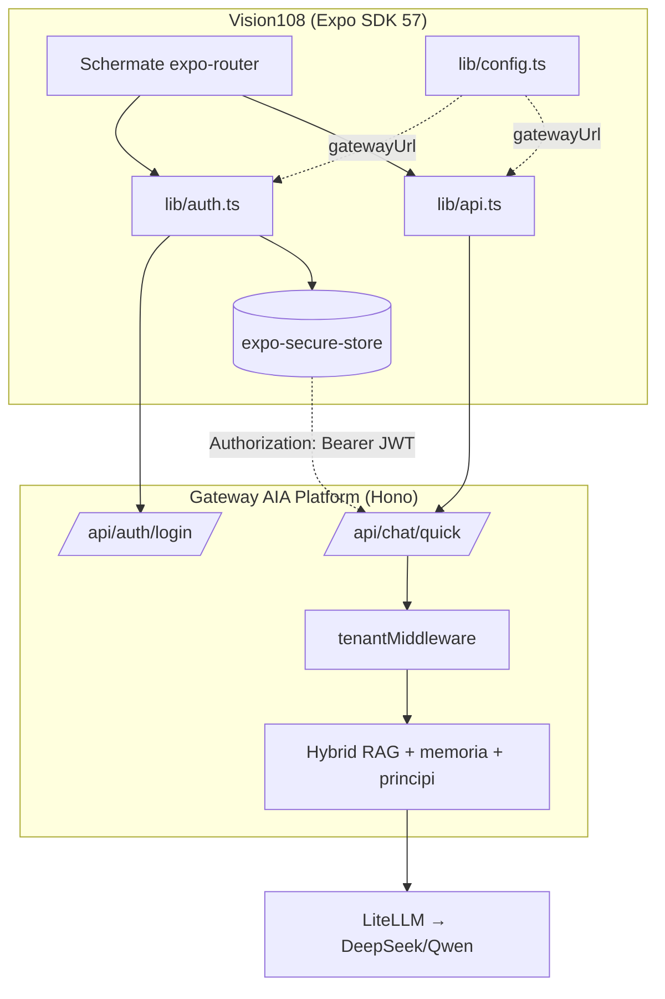
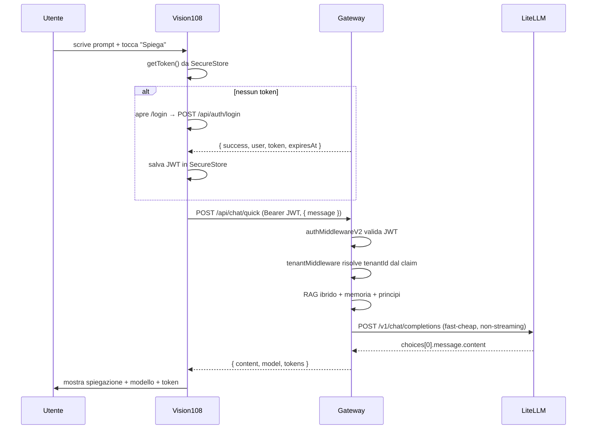

# Vision108 — Manuale Tecnico, Architetturale e Funzionale

> **App mobile (Expo / React Native) del brand 108 Vision: pagine informative (Home, Servizi, Prezzi, Contatti) e Assistente AI, integrata con il gateway AIA Platform.**
> Di Elios Scoglio — 108 Vision

---

## 1. Contesto e scopo

**Vision108** è l'app mobile del brand 108 Vision. Porta su iOS e Android:

1. **Le pagine informative del sito** — Home, Servizi (Direzione Tecnica + Software in Mano), Prezzi e Contatti — con la copia estratta dai content module del sito.
2. **L'Assistente AI** — una singola schermata "input + pulsante Spiega": l'utente scrive una domanda o un concetto, e l'AI lo spiega con parole semplici usando la knowledge base della piattaforma.

Non è un prodotto WellBeing e non c'entra con la WellBeing App: è il punto di accesso mobile al brand 108 Vision.

| Fatto | Valore |
|---|---|
| Repository app | `c:/Code/Documents/Lavoro/Personale/Vision/aia-app` (nel repo Vision, fuori dal workspace pnpm) |
| Stack | Expo SDK 57 · React Native 0.86.2 · React 19.2 · TypeScript strict · expo-router |
| Backend consumato | Gateway **AIA Platform** (Hono) — `apps/gateway/` nel repo `aia-platform/` |
| Lingua v1 | Italiano (copia estratta dai content module del sito) |

---

## 2. Panoramica funzionale

L'app è una **tab navigator** con 5 sezioni, più una schermata di login modale.

| Route | Tab | Contenuto | Fonte copia |
|---|---|---|---|
| `/` | Home | Hero, problema, canali (Direzione Tecnica / Software in Mano), fit, entry point, Assistente | `home.ts` |
| `/servizi` | Servizi | Direzione Tecnica (Strategico, Operativo time-boxed, Team building) + Software in Mano (Discover, Build, Run & evolve) | `direzione-tecnica.ts`, `software-in-mano.ts` |
| `/pricing` | Prezzi | Piani per canale: Tech Assessment / Direzione mensile, Discovery / Build & evolve | `direzione-tecnica.ts`, `software-in-mano.ts` |
| `/contact` | Contatti | Percorsi di ingresso, partnership, email e LinkedIn, prenotazione | `ui.ts` → `contact` |
| `/prompt` | Assistente | Input + "Spiega" + risposta AI + stato sessione | testuale (sez. §2.2) |
| `/login` | modale | Email + password contro `/api/auth/login` | — |

### 2.1 Flusso dell'Assistente AI

1. L'utente apre la tab **Assistente**.
2. Se non è autenticato vede un invito ad accedere; il tap su "Spiega" senza sessione apre la modale `/login`.
3. Dopo il login, il **JWT** (con claim `tenantId`) è salvato in `expo-secure-store`.
4. "Spiega" invia `POST /api/chat/quick` con `Authorization: Bearer <JWT>` e body `{ message }`.
5. Il gateway risolve il tenant dal token, esegue RAG + principi + memoria, chiama LiteLLM (tier `fast-cheap`) e risponde `{ content, model, tokens }`.
6. L'app mostra la risposta, il modello usato e i token consumati.

### 2.2 Dispositivi di copia

La copia italiana è **statica** in `src/lib/content.ts`, estratta a mano dai content module del sito (`aia-website/src/i18n/pages/home.ts`, `direzione-tecnica.ts`, `software-in-mano.ts`, `ui.ts`). Nessuna libreria i18n in v1: il sito è bilingue, l'app è volutamente monolingua (§7).

---

## 3. Architettura

### 3.1 Struttura del progetto

```
aia-app/
├── app.json                      # name, slug "vision108", scheme, plugins, extra.gatewayUrl
├── package.json                  # name "vision108", Expo SDK 57
├── tsconfig.json                 # strict, alias @/* → ./src/*
└── src/
    ├── app/
    │   ├── _layout.tsx           # Stack radice: (tabs) + modale login
    │   ├── login.tsx             # modale di autenticazione
    │   └── (tabs)/
    │       ├── _layout.tsx       # Tabs con 5 schermate
    │       ├── index.tsx         # Home
    │       ├── servizi.tsx       # Servizi (DT + SiM)
    │       ├── pricing.tsx       # Prezzi
    │       ├── contact.tsx       # Contatti
    │       └── prompt.tsx        # Assistente AI
    ├── components/
    │   └── ui.tsx                # Screen, Card, SectionTitle, PrimaryButton
    └── lib/
        ├── config.ts             # gatewayUrl da expo-constants → app.json extra
        ├── auth.ts               # login/logout + SecureStore (JWT + utente)
        ├── api.ts                # explain() → /api/chat/quick con timeout
        ├── content.ts            # copia italiana
        └── theme.ts              # palette, spacing, radius
```

### 3.2 Diagramma dei componenti



### 3.3 Flusso di una richiesta "Spiega"



---

## 4. Integrazione con il backend

L'app **non parla mai direttamente con LiteLLM**. Parla con il gateway AIA Platform, che possiede il master key e applica auth + tenant isolation.

### 4.1 Autenticazione — `POST /api/auth/login`

- Body: `{ email, password }`.
- Risposta 200: `{ success: true, user, token, expiresAt }` — `token` è un **JWT HS256** firmato con `JWT_SECRET`.
- Claim del JWT (fonte: `apps/gateway/src/routes/auth.ts` → `createSessionToken`): `{ sub, email, role, tenantId, name, iat, exp, aud: "aia-platform" }`.
- Il client salva JWT + utente in `expo-secure-store` (Keychain/Keystore); su web ripiega su `localStorage`.

### 4.2 Risposta AI — `POST /api/chat/quick`

- Header: `Authorization: Bearer <JWT>`, `Content-Type: application/json`.
- Body: `{ message }` (1–32000 caratteri).
- Server: `/api/chat/quick` carica prompt di sistema + principi, esegue **RAG ibrido** (vector + graph) sulla KB del tenant, recupera le memorie persistenti, chiama LiteLLM con tier `fast-cheap` (non-streaming) e traccia l'utilizzo per tenant.
- Risposta 200: `{ content, model, tokens }`.
- Timeout client: 90 s (allineato al `AbortSignal.timeout(90_000)` lato server).

### 4.3 Errori

Il gateway risponde in formato **RFC 7807** (`application/problem+json`): `{ type, title, status, detail, instance }`. L'app mappa `title` → codice e `detail` → messaggio, e distingue timeout (`AbortError`) da errori di rete.

---

## 5. Sicurezza e multi-tenancy

**Regola d'oro implementata:** il master key di LiteLLM **non esce mai dal server**. Il dispositivo possiede solo un JWT di sessione; il gateway possiede i segreti dei provider.

| Preoccupazione | Dove è gestita |
|---|---|
| **Isolamento tenant** | `tenantMiddleware` (gateway) — risolve `tenantId` dal claim JWT, valida UUID + stato attivo, e lo allega al contesto. Ogni query tenant-scoped filtra per `tenant_id` server-side. |
| **Selezione tenant client** | Assente per design: l'app non sceglie il tenant. Il tenant deriva dall'utente autenticato (claim JWT). `X-Tenant-ID` è accettato solo per `platform_admin`. |
| **Persistenza token** | `expo-secure-store` (Keychain/Keystore) su native; `localStorage` solo su web come fallback. |
| **Timeout/retry** | Timeout 90 s lato client; nessun retry automatico su operazioni non idempotenti. |
| **PII nei log** | Nessun log di email/token lato app. L'email è mostrata solo come stato sessione. |

**Residuo noto (non bloccante in v1):** il JWT ha scadenza 7 giorni e non c'è refresh automatico lato app. Alla scadenza il gateway risponde 401 e l'utente deve ri-accedere.

---

## 6. Configurazione e ambienti

L'unico parametro di configurazione runtime è `gatewayUrl`, iniettato via **`app.json` → `expo.extra`** e letto con `expo-constants`.

```json
{
  "expo": {
    "extra": {
      "gatewayUrl": "http://localhost:3000"
    }
  }
}
```

| Ambiente | `gatewayUrl` |
|---|---|
| Emulatore iOS / Android | `http://localhost:3000` |
| Dispositivo fisico (Expo Go) | `http://<IP-LAN-del-PC>:3000` |
| Produzione | `https://<dominio-gateway>` (Traefik, TLS) |

**Nota:** il gateway espone `/api/chat/quick` dietro CORS ristretto ai domini configurati del tenant; su dispositivo fisico va usato l'IP LAN (il `localhost` del telefono non è il PC). Su web serve che il dominio dell'app sia tra quelli autorizzati.

---

## 7. Decisioni e trade-off

| Decisione | Perché | Alternativa scartata | Rischio |
|---|---|---|---|
| **Nome e scope "Vision108", niente WellBeing** | L'app è il punto di accesso mobile al brand 108 Vision, non un prodotto WellBeing. Servizi e prezzi sono quelli dei due canali (Direzione Tecnica, Software in Mano). | App ibrida 108 Vision + WellBeing | — (allineato alla richiesta) |
| **App in `aia-app/`, fuori dal workspace pnpm** | Evita l'integrazione Metro + pnpm workspace + pacchetti che esportano da `./dist/`; rende `expo export` immediato. | `aia-platform/apps/mobile` consumando `@aia/*` | Perdita di riuso dei tipi `@aia/*` (accettata: l'integrazione è via HTTP) |
| **Nessun `@aia/ai-client` sul client** | `AIClient` è un wrapper server-side che richiede il master key; usarlo in app esporrebbe il segreto | Chiamare LiteLLM direttamente dal dispositivo | — (più sicuro) |
| **Auth via `/api/auth/login` + SecureStore, non `@aia/auth/client`** | `createAuthClient` usa `localStorage` (browser) e dipende dal workspace; la logica server è la stessa | Importare `@aia/auth` nel bundle mobile | Duplicazione di ~60 righe di logica di login |
| **Copia italiana statica, niente i18n** | Il sito è bilingue ma la v1 serve il pubblico Italia; i18n mobile è costoso senza bisogno | `i18next` + file en/es | Rifattorizzazione futura se si attiva en/es |
| **`userInterfaceStyle: "light"`** | Le schermate usano una palette chiara fissa; evitare mismatch tema scuro senza lavoro di design dedicato | Tema scuro automatico | Esperienza dark mancante (roadmap) |

---

## 8. Verifica e comandi

```bash
cd c:/Code/Documents/Lavoro/Personale/Vision/aia-app

# Installazione
npm install

# Avvio (Expo Go / dev server)
npx expo start

# Typecheck (TypeScript strict)
npx tsc --noEmit

# Smoke test di bundling (prova che l'app compila end-to-end)
npx expo export --platform android   # genera dist/
npx expo export --platform ios
```

**Stato di verifica al 2026-08-21:**

- `npx expo export --platform android` → **OK** (bundle generato, `dist/`).
- `npx tsc --noEmit` → **OK** (nessun errore, strict).
- Test end-to-end del flusso "Spiega" richiede un gateway raggiungibile con un utente reale (vedi §6); la chiamata è stata verificata per contratto contro il codice del gateway, non a runtime in questo ambiente.

---

## 9. Limitazioni e roadmap

**Limitazioni v1**

- Solo lingua italiana.
- Nessun refresh token automatico; scadenza 7 giorni → ri-login manuale.
- Nessun rate limiting lato client (il gateway applica il suo).
- La tab Contatti apre il form via `mailto`/sito; non c'è form nativo.

**Roadmap candidata** (non impegnativa)

1. i18n en/es allineata al sito.
2. Refresh token automatico alla scadenza.
3. PWA via `expo export --platform web` per l'uso offline.
4. Selezione tenant esplicita (solo per ruoli `platform_admin`).
5. Streaming SSE della risposta AI (endpoint `/api/chat` al posto di `/quick`).

---

*108 Vision — Costruiamo la direzione, non solo il codice.*
*108vision.it | info@108vision.it*
