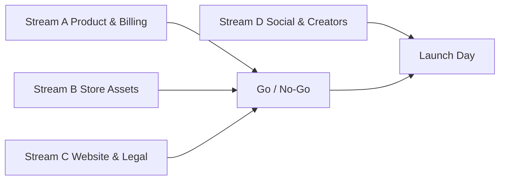

# WellBeing — Piano di lancio Strategie A + C

**Stato:** piano operativo da eseguire  
**Versione:** 1.0 | 2026-08-11  
**Ambito:** App Store / Play Store / sito 108 Vision / landing / creator  
**Fonte docs locali non accessibile in questo workspace:**  
`c:\CodeM\Personal\WellBeingApp\WellBeing\docs\` — le strategie A e C sono
ricostruite dalle tue indicazioni. Se il doc originale differisce, aggiorniamo
solo i delta.

---

## 0. Decisione di prodotto (A + C)

### Cosa fare

1. **Rimuovere** l’abbonamento annuale **senza AI** dal catalogo store e dal
   sito.
2. **Tenere in primo piano** il Consigliere AI come differenziatore.
3. **Non ridurre** le altre feature a “accessori”: visualizzazioni guidate,
   cerchio del respiro, pezzi nelle pause, catalogo esistente restano hero
   features a parità di valore.
4. **Promozione metà prezzo** attiva al lancio / rilancio: tutti i piani a
   pagamento mostrati a −50% rispetto al listino, con scadenza chiara.

### Catalogo prezzi proposto (indicativo IT)

| SKU | Ruolo | Listino | Promo −50% | Note |
|---|---|---|---|---|
| AI Starter | Entry AI | 3,69 € | **1,84 €** | Accesso AI + crediti iniziali |
| Smart | Best seller | 5,99 € | **2,99 €** | Più crediti, highlight |
| Premium+AI | Annuale **con AI** | 8,99 €/anno | **4,49 €/anno** | Unico annuale; include AI |
| Ricarica 20 | Top-up | 4,89 € | **2,44 €** | Crediti senza scadenza |
| ~~Premium senza AI~~ | — | — | — | **RIMOSSO** |

> I prezzi effettivi sono quelli dello store al momento dell’acquisto. Sul sito
> e nei creative: “Promo di lancio −50% — fino al [DATA]”.

### Messaggio unico (tutti i canali)

> **Visualizza. Respira. Ascolta.**  
> Sessioni guidate, cerchio del respiro, pezzi nelle pause — e quando vuoi,
> il Consigliere AI trasforma ciò che scrivi in una visualizzazione audio
> personale.  
> **Ora a metà prezzo.**

### Anti-claim

- Non promettere cura medica / terapia.
- Non dichiarare “unico al mondo” senza prova.
- Non inventare download, rating o utenti.
- Restare vaghi su backend / OS / infrastruttura.

---

## 1. Piano passo-passo fino a pubblicare

Lavoro in **4 stream paralleli**. Go-live quando A+B+C sono verdi; D può
andare live lo stesso giorno o +24/48h.



### Stream A — Prodotto & billing (bloccante)

| Step | Azione | Owner | Done when |
|---|---|---|---|
| A1 | Disabilitare / rimuovere SKU annuale senza AI su Play Console e App Store Connect | Tu | SKU non acquistabile |
| A2 | Confermare SKU AI-only (Starter, Smart, Premium+AI, Ricarica) | Tu | Catalogo allineato |
| A3 | Attivare offerta promo −50% (Introductory / promo code / base plan offer) | Tu | Prezzo promo visibile in sandbox |
| A4 | QA acquisto: nuovo utente, restore, crediti, rinnovo annuale AI | Tu | Checklist QA verde |
| A5 | Verificare deep link store landing e privacy/terms | Tu | Link 200 OK IT/EN/ES |

### Stream B — Asset store (parallelo ad A)

| Step | Azione | Owner | Done when |
|---|---|---|---|
| B1 | Scrivere titoli, sottotitoli, description, what’s new IT/EN/ES | Copy | Testi approvati |
| B2 | Creare screenshot set (6–8) + feature graphic + icon | Design | File esportati |
| B3 | Creare video preview 15–30s (IT, poi EN; ES opzionale) | Video | MP4 store-ready |
| B4 | Caricare listing Play + App Store in bozza | Tu | Preview store OK |
| B5 | Submit review (se serve nuova release) | Tu | In review / approved |

### Stream C — Sito 108 Vision (parallelo)

| Step | Azione | Owner | Done when |
|---|---|---|---|
| C1 | Aggiornare pricing su `/wellbeing` (niente annuale senza AI + promo) | Dev | Build verde |
| C2 | Hero + CTA “Metà prezzo” + link Play/App Store | Dev | Preview OK |
| C3 | Aggiornare store landing Azure se ancora usata | Dev | Landing allineata |
| C4 | SEO/meta e OG image promo | Dev | Share card OK |

### Stream D — Social & creator (parallelo, non bloccante)

| Step | Azione | Owner | Done when |
|---|---|---|---|
| D1 | Pack creativo 7 giorni post-lancio | Content | Cartella asset pronta |
| D2 | Brief 5–10 creator wellbeing / mindfulness / productivity | Tu | Outreach inviato |
| D3 | Hashtag, UTM, landing tracking | Marketing | Link tracciati |
| D4 | Pubblicazione Day 0 / Day 1 / Day 3 / Day 7 | Content | Calendario eseguito |

### Go / No-Go (prima di pubblicare)

- [ ] SKU senza AI rimosso
- [ ] Promo −50% attiva e testata
- [ ] Testi store IT (minimo) approvati
- [ ] Screenshot + icon + feature graphic caricati
- [ ] Video preview caricato (almeno IT)
- [ ] Pagina sito aggiornata
- [ ] Privacy / Terms / Support link validi
- [ ] Disclaimer benessere presente
- [ ] Link Play Store funzionante; App Store se già live, altrimenti “in arrivo”

---

## 2. Testi store (pronti da usare)

### 2.1 Google Play — IT

**Titolo app (≤30):** `WellBeing: AI & Visualizzazioni`  
**Descrizione breve (≤80):**  
`Visualizzazioni, respiro e Consigliere AI. Ora a metà prezzo.`

**Descrizione completa:**

```text
WellBeing — Visualizza. Respira. Ascolta.

Un’app per praticare il benessere quotidiano con sessioni guidate e, quando
vuoi, un Consigliere AI che trasforma ciò che scrivi in una visualizzazione
audio personale.

COSA PUOI FARE
• Visualizzazioni guidate per obiettivi, meditazione, sonno e trasformazione
• Cerchio del respiro con tempi di inspiro, trattenimento ed espiro
• Pezzi nelle pause e musica di sottofondo per ripetere lo stimolo al tuo ritmo
• Consigliere AI: scrivi come ti senti → anteprima testo → audio con voce
  femminile o maschile

PROMO DI LANCIO
Per un periodo limitato, accesso e crediti a metà prezzo. I crediti non scadono.

PERCHÉ WELLBEING
Non è solo un timer del respiro. Non è solo un catalogo audio. È un’esperienza
completa: ascolti percorsi già pronti oppure crei la tua sessione personale
con l’AI.

Lingue: italiano, inglese, spagnolo.
WellBeing by 108 Vision.

I contenuti supportano il benessere quotidiano e non sostituiscono il parere
di un medico o di uno specialista.
```

**What’s new:**  
`Promo lancio −50%. Focus su Consigliere AI + visualizzazioni, respiro e pause.`

### 2.2 App Store — IT

**Name (≤30):** `WellBeing`  
**Subtitle (≤30):** `AI, visualizzazioni, respiro`  
**Promotional text (≤170):**  
`Ora a metà prezzo: visualizzazioni guidate, cerchio del respiro, pezzi nelle pause e Consigliere AI da testo ad audio personale.`

**Description:** riusa il testo Play (App Store accetta stile simile; spezza in
paragrafi corti).

**Keywords (≤100 caratteri, virgole, no spazi inutili):**  
`meditazione,respiro,visualizzazione,AI,rilassamento,sonno,mindfulness,audio,benessere`

### 2.3 EN (Play + App Store)

**Short:** `Guided visuals, breath & AI Counselor. Half price for a limited time.`  
**Subtitle:** `AI, visuals & breath`  
**Body lead:**  
`Visualize. Breathe. Listen. Guided sessions for goals, meditation, sleep and
transformation — plus an AI Counselor that turns what you write into personal
audio.`

### 2.4 ES (minimo)

**Corta:** `Visualizaciones, respiración y Consejero IA. Ahora a mitad de precio.`  
**Subtitle:** `IA, visualizaciones, respiración`

---

## 3. Immagini da creare (checklist file)

Cartella consigliata: `WellBeing/docs/launch-assets/`

### 3.1 Brand base

| File | Size | Contenuto |
|---|---|---|
| `icon-1024.png` | 1024×1024 | Logo WellBeing, no testo piccolo |
| `feature-graphic-play.png` | 1024×500 | Claim + “Metà prezzo” + AI badge soft |
| `og-share-1200x630.png` | 1200×630 | Per sito / social link preview |

### 3.2 Screenshot phone (obbligatori, 6–8)

Formato: 1290×2796 (iPhone) + export Android 1080×1920.

| # | Scene | Overlay testo IT |
|---|---|---|
| 01 | Home / catalogo | `Visualizzazioni guidate` |
| 02 | Player visualizzazione | `Ascolta. Rilassati. Trasforma.` |
| 03 | Cerchio del respiro animato | `Respira al tuo ritmo` |
| 04 | Pezzi nelle pause | `Pause che contano` |
| 05 | Consigliere AI — prompt | `Scrivi come ti senti` |
| 06 | Consigliere AI — anteprima | `Leggi, poi genera l’audio` |
| 07 | Audio generato / voce | `Da te all’audio personale` |
| 08 | Pricing promo | `Ora a metà prezzo` |

Regole visual:
- Sfondo dark teal/navy WellBeing (come sito), non viola generico.
- Una frase per frame, font grande, niente badge flottanti multipli.
- Mostra UI reale o mock fedele; niente collages.

### 3.3 Tablet / iPad (se supportato)

2–3 frame chiave: catalogo, respiro, AI.

### 3.4 Social crops

| Canale | Size | Varianti |
|---|---|---|
| Instagram feed | 1080×1080 | 01–08 + promo |
| Instagram/TikTok story | 1080×1920 | 4 verticali |
| LinkedIn / X | 1200×675 | 2 promo |
| YouTube thumb | 1280×720 | 1 hero “Metà prezzo” |

---

## 4. Video da creare

### 4.1 Store preview (priorità 1)

| File | Durata | Audio | Contenuto shot-by-shot |
|---|---|---|---|
| `preview-it-30s.mp4` | 25–30s | Voce IT soft + ambient | 0–3s brand+claim · 3–8s catalogo · 8–14s respiro · 14–20s AI prompt→audio · 20–26s pause pieces · 26–30s CTA metà prezzo |
| `preview-en-30s.mp4` | 25–30s | EN | Stessa struttura |
| `preview-it-15s.mp4` | 15s | Cut corto | Brand → respiro → AI → promo |

Specs tipici:
- Play: 30s max, landscape o portrait secondo policy corrente.
- App Store: 15–30s, portrait preferito per iPhone.

### 4.2 Social / creator (priorità 2)

| Video | Durata | Uso |
|---|---|---|
| Hook “scrivi e ascolta” | 20–35s | Reels / TikTok |
| “3 pratiche in 30 secondi” | 30s | Feed |
| Demo respiro ASMR-lite | 15–20s | Stories |
| Promo metà prezzo | 10–15s | Ads / boost |
| UGC brief template | 30–45s | Creator |

Script hook IT (Reels):

```text
[VOCE]
Non ti serve un altro timer del respiro.
Ti serve una sessione che parte da come stai davvero.

Scrivi. Guarda l’anteprima. Genera l’audio.
Oppure apri una visualizzazione e respira.

WellBeing — ora a metà prezzo.
Link in bio.
```

---

## 5. Canale per canale — cosa pubblicare

### 5.1 Google Play

1. Aggiornare scheda con testi §2.1
2. Caricare icon, feature graphic, screenshot, video
3. Categoria: Salute e fitness / Benessere
4. Tag: meditazione, respiro, AI
5. Promo subscription/IAP −50%
6. Pubblica / aggiorna produzione

### 5.2 App Store

1. Testi §2.2 + keywords
2. Screenshot + preview video
3. Subscription Premium+AI only (no annuale senza AI)
4. Promotional offer / intro offer −50%
5. Submit review se cambia metadata/binario

### 5.3 Sito `108vision.it/wellbeing`

Aggiornamenti contenuti:

- Hero: claim + “Promo lancio −50% fino al [DATA]”
- Features: 4 card uguali (visualizzazioni, respiro, pause, AI)
- Pricing: rimuovere annuale senza AI; badge “−50%” su piani
- Download: link Play reale; App Store se disponibile
- Disclaimer medico invariato

### 5.4 Store landing Azure

Allineare claim, feature e CTA promo. Evitare prezzi discordanti.

### 5.5 Social organici (calendario 7 giorni)

| Giorno | Post | Formato |
|---|---|---|
| 0 | Lancio / rilancio metà prezzo | Reel + carosello |
| 1 | Feature respiro | Story + post |
| 2 | Feature visualizzazioni | Carosello 4 frame |
| 3 | Demo Consigliere AI | Reel |
| 4 | Social proof soft / “come la uso io” | Post testo+video |
| 5 | Pause pieces | Story |
| 6 | Reminder promo scadenza | Reel corto |
| 7 | Recap + CTA store | Post link |

Canali minimi: Instagram, TikTok (o Reels only), LinkedIn (tono prodotto 108
Vision / maker), WhatsApp status / Telegram se hai community.

### 5.6 Content creator

**Brief one-pager da inviare:**

- Prodotto: WellBeing by 108 Vision
- Hook: da testo a visualizzazione audio + catalogo guidato + respiro
- Offerta: metà prezzo per periodo limitato
- Cosa mostrare obbligatoriamente: 1) AI flow 2) una visualizzazione 3) respiro
- Cosa non dire: claim medici, numeri utenti inventati
- Asset: link store, codice promo se esiste, pack screenshot
- Deliverable richiesti: 1 Reel 20–40s + 3 stories + link in bio 7 giorni
- Compenso: prodotto free Premium+AI / fee creatore (da definire)

Target creator: mindfulness, breathwork, productivity soft, sleep, journaling,
donne 25–45 IT, micro (5k–50k) prima dei macro.

---

## 6. Tracking e metriche (primi 14 giorni)

| Metrica | Target lancio (indicativo) |
|---|---|
| Store listing impressions | baseline + trend |
| Conversion visit→install | monitorare |
| Install → primo acquisto | obiettivo primario |
| Mix SKU | Smart e AI Starter dominanti |
| Refund rate | basso |
| Crash-free | stabile |
| Video completion social | >30% |

UTM esempio:  
`?utm_source=instagram&utm_medium=reel&utm_campaign=wb_halfprice_launch`

---

## 7. Parallelizzazione operativa (chi fa cosa oggi)

### Subito in parallelo

1. **Billing:** rimuovere annuale senza AI + attivare −50%
2. **Copy:** approvare testi IT store (EN/ES dopo)
3. **Design:** screenshot 01–08 + feature graphic
4. **Video:** riprese UI per preview 30s
5. **Sito:** patch pricing + badge promo
6. **Creator:** shortlist + outreach

### Sequenza pubblicazione consigliata

1. Soft-fix sito + landing (promo visibile)
2. Play Store update live
3. App Store update (se review più lenta, non bloccare Play)
4. Social Day 0 entro 2 ore dallo store live
5. Creator wave entro 48–72h

---

## 8. Open points da confermare (non bloccano il piano)

1. Data fine promo −50%
2. App Store già live o solo Play?
3. Prezzi promo esatti per paese (IT/EN/ES store)
4. Codice promo creator vs offerta store nativa
5. Allineamento con eventuali dettagli in
   `WellBeing/docs` strategia A/C originali

---

## 9. Prossimo passo concreto

Se approvi questo piano:

1. Confermi data fine promo e prezzi.
2. Io preparo in parallelo:
   - patch copy sito `/wellbeing` (pricing A+C + metà prezzo)
   - file testi store IT/EN/ES pronti da copiare
   - brief immagine/video + checklist export
3. Tu esegui A1–A4 su console store mentre gli asset vengono prodotti.

> **Nota:** in questo ambiente cloud non ho accesso a
> `c:\CodeM\Personal\WellBeingApp\WellBeing\docs\`. Se mi incolli le
> definizioni ufficiali di Strategia A e C, allineo eventuali delta.
